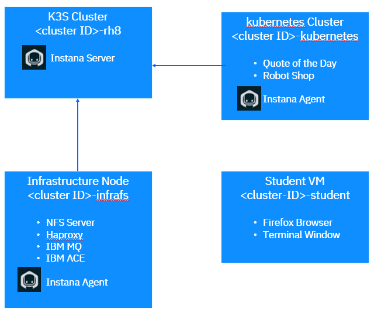

# Lab Architecture
This lab consists of several virtual machines that are setup with the software necessary to execute the lab. 

The virtual machines can be seen below. 

The virtual machines are:
# • [ENV ID]-infranfs
This is the Infrastructure node for the OpenShift cluster. It provides NFS filesystems for the OpenShift storage and is running an haproxy. 
All traffic into the OpenShift cluster flows through the haproxy. In addition, we have an IBM MQ and IBM App Connect Enterprise server running on this virtual machine. In the lab guide, we will refer to this node as the “Infrastructure Node”.

# • [ENV ID]-student:
 This is the primary VM that you will be using to access the Instana user interface, run commands from a terminal window, etc. You will
 access the other VMs via ssh. In the lab guide, we will refer to this node as the “student VM”

# • [ENV ID]-rh8:
This is RHEL VM running an instance of K3s cluster with pre-installed Instana backend.

# • [ENV ID]-kubernetes: 
This virtual machine is a single node Kubernetes cluster. We have a couple of different applications installed into the Kubernetes cluster. 
In the lab guide, we will refer to this virtual machine as the “Kubernetes” node.

The following picture shows the various applications and components that are setup within the lab environment. During some of the labs you will be installing additional components.

