# Troubleshoot an issue

---

## 

In this section of the lab, you will learn how Instana can help you get to root cause of a problem in a quick and intuitive manner.

In order for the events to show as incident, you have to create a **smart alert** which are already created in the **"Quote of the day"** application. 

On the left side, select **“Applications”** and then click on the **"Quote of the day"** link. 

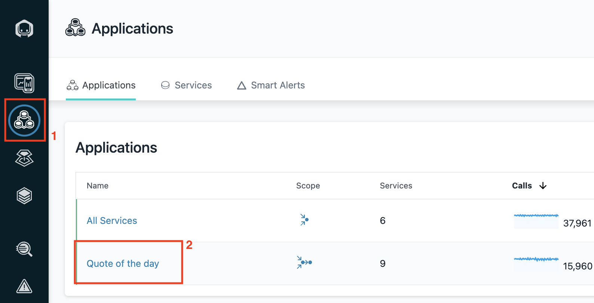

In the **"Quote of the day"** dashboard, click on the **smart alert** tab as shown in the below image - step 1
Then click the  **"QOTD High Erroneous Call Rate"**  as shown in step 2

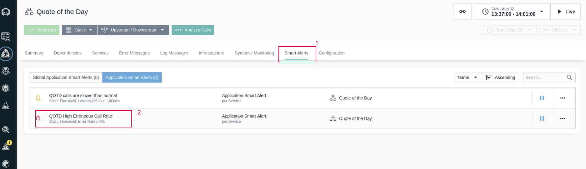

Click the Edit icon as shown in the below image. 

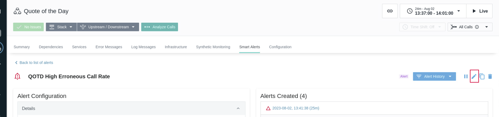

Explore the smart alert options on the right side.
**DO NOT Change any settings** This step in the lab is  only for viewing and understanding.

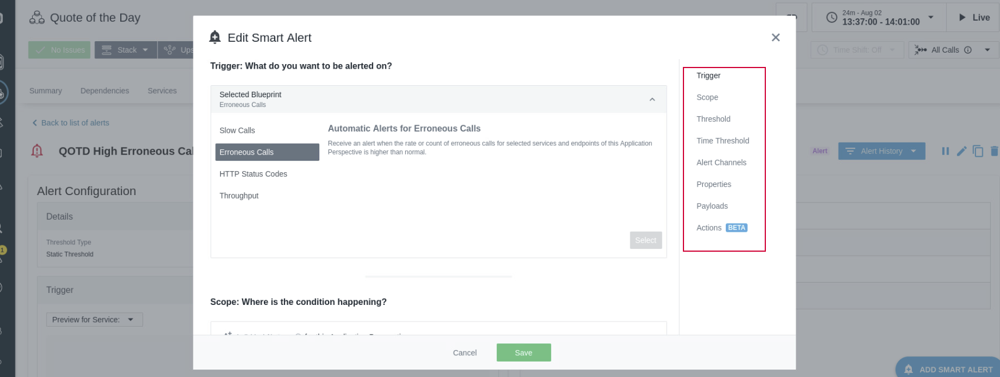

Select  "Scope" and explore each from the list and at the end cancel if any changes were made to this section. 

 ** Note **
 The scope of a Smart Alert in Instana is the application perspective from which the alert is created. 
 The user can configure the scope of where to apply checks, such as a URL or service name. 
 The application perspective is selected by default as the initial scope. 
 The user can filter the overall calls to a subset by using the query language. 

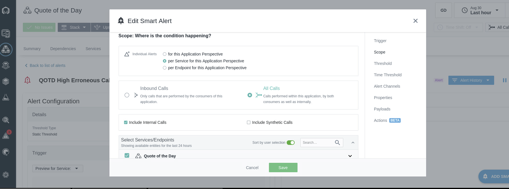

For further details on the Smart Alert creation and details referr to the other lab 
https://ibm.github.io/instana-techxchange/labs/instana-v2/administer-instana/administer/#32-create-an-analytics-based-smart-alert

## Evaluate the Events via an Incident

** The problmes are generated / simulated  in the lab environment once per hour. Therefore you need to change the time interval to "Last Hour" or greater  to view the problems/ incidents triggered by the smart alert setup  **

On the left side, select **“Events”**

Make sure that the time selection in the upper right corner is set to **“Last hour”** as shown in the picture below.

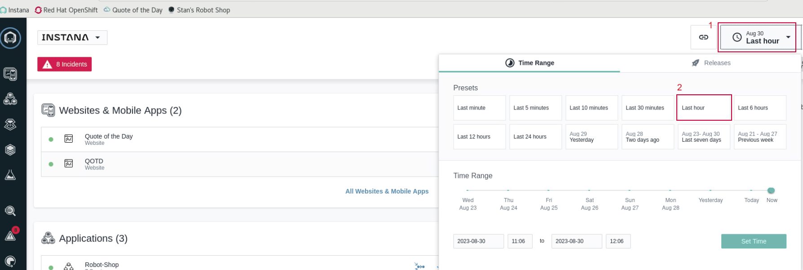

This will open up a panel showing all of the Incidents that are affecting the monitored systems and applications. Incidents are the raw Events that have been correlated via Analytics into an Incident.
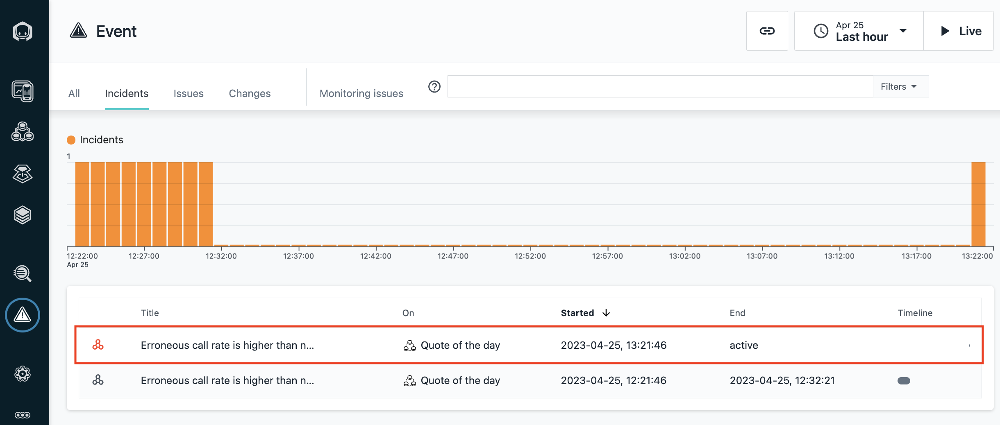

As seen in the above picture, select the Incident that is triggering on the **“QOTD Calls are slower than normal”**  It indicates that there are large numbers of calls slower than usual.

You will see the details related to raw Events that were correlated via analytics into an Incident.

 An incident indicates that a critical infrastructure issue or a KPI breach has occurred. 
 An incident can indicate that a user experience or service is degraded or will be degraded soon. Instana can correlate related issues and changes to an incident to help with root cause analysis.

 An issue is an event that occurs when an application, service, or part of it becomes unhealthy. 
 Instana has hundreds of health signatures that can detect problems such as service quality degradation, complex infrastructure issues, and disk saturation

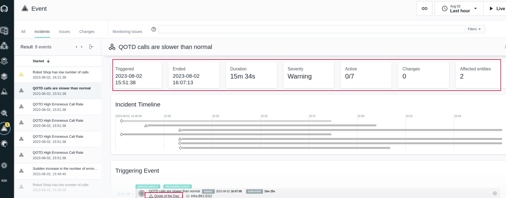
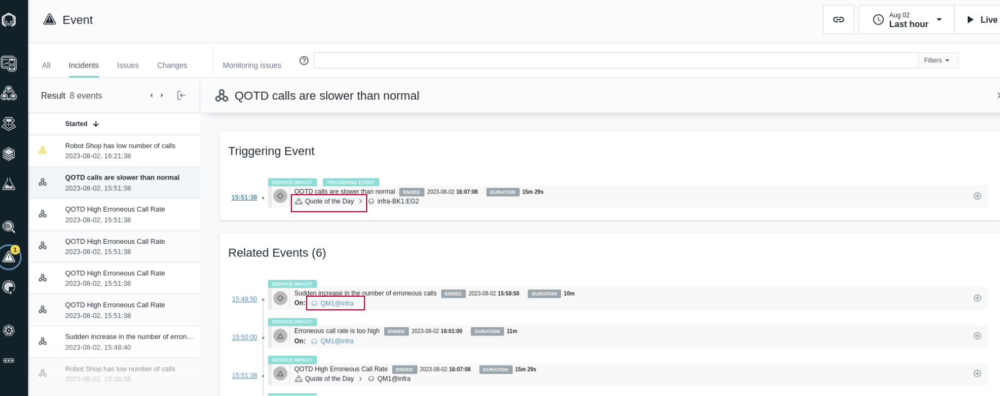

In this case, you should see the Triggering Event and a few Related Events. The Triggering Event is the first event that starts to impact a service or a website. The Related Events are events that Instana determined are related by leveraging analytics including the relationships that exist between the various entities, services, and endpoints.
With Instana analytics in action, you see 7 issues corelated to 1 incident to (A) Reduce noise, (B) Provide the user with additional context. 
The issues listed in the above example shows the  the incident consists of issues from different components of that service.

Within the Incident, you can see when the Incident opened and in some cases, when it closed. And, you can see the Incident Timeline. This is the time when each event opened and closed. If the event is still open, it will be color coded with the event severity.

On the right side, click on the **”+”** symbol to expand the Triggering Event.

You can see in the historical graph that there are periods of time where erroneous (failed) calls are high.

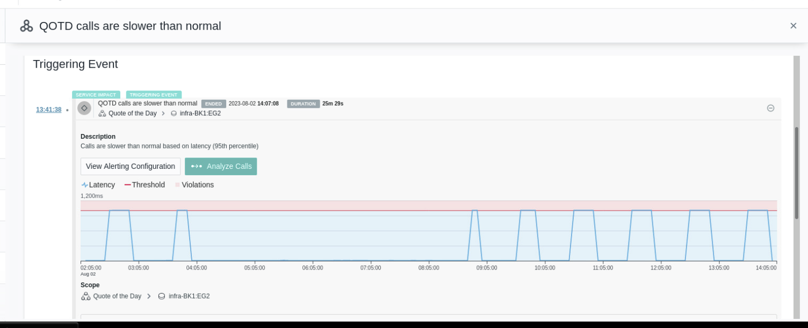

## Analyze the Calls
Next, click on the **”+”** symbol to expand the event for a specific event like “Erroneous call rate is too high on QM1@infra” typically the **First Related Events (X)** and then click on the **“Analyze Calls”** button to analyze the calls.

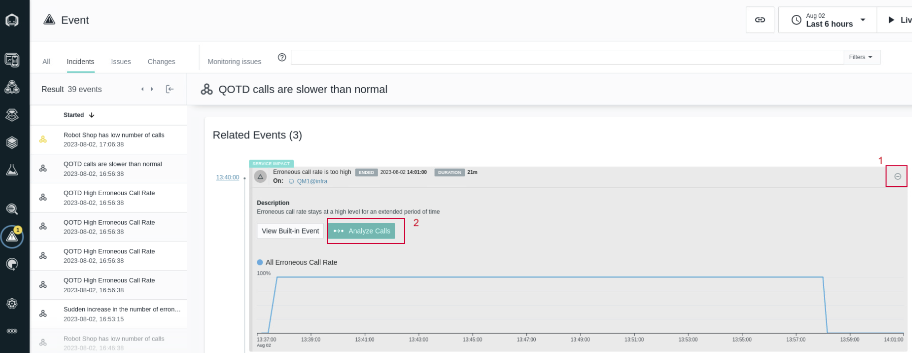

You will be taken to an analytics screen where you can see all of the failed calls for the endpoint **“CP4I.DEMO.API.Q”**. 
The ACE flow is putting a message on the CP4I.DEMO.API.Q queue and that is being invistigated further.
  
  IBM App Connect Enterprise (ACE) is a cloud-based data integration platform. 
  It allows businesses to connect applications and data across their business systems. 
  ACE can connect any application or service over multiple protocols, including SOAP, HTTP, and JMS.

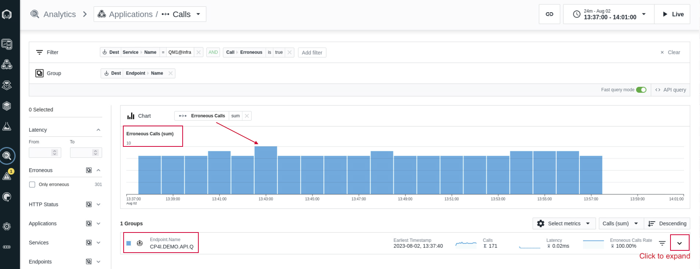

 After clicking on the **”expand”** symbol, You can also see the list erroneous calls.

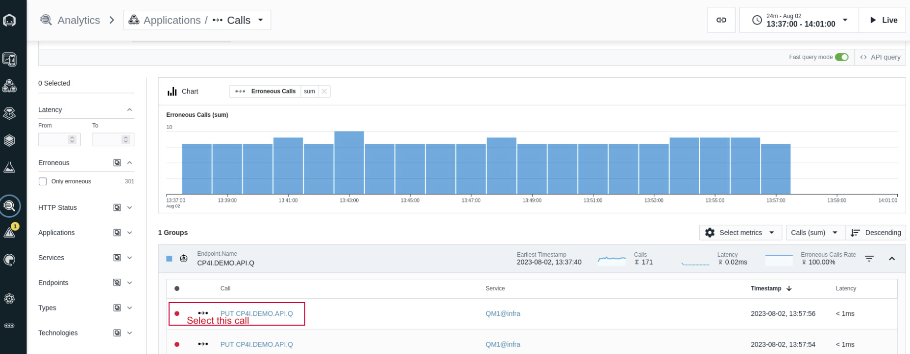

Select one of the failing **“PUT CP4I.DEMO.API.Q”** calls

We are investigating one of the ACE calls here. 
Here you will see the User information of the session and other metadata. on the Right side you will see the detials of the failed call.
Scroll down to the Timeline section. 

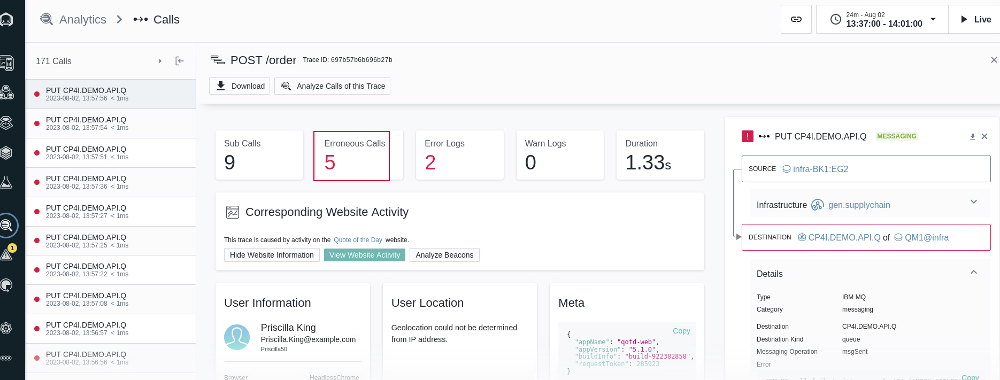
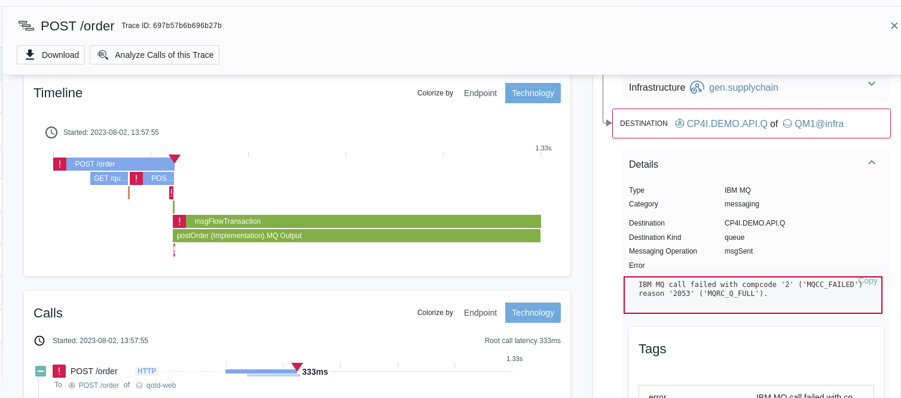

Scroll to the bottom of the page where you see the **“Calls”**. This shows you the timeline of the calls for this single transaction.

You’ll notice that there are plus signs. Click on the plus signs to expand the call stack.

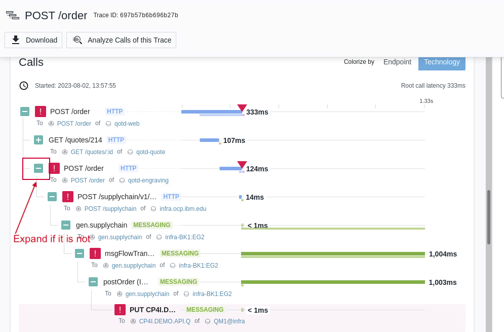

When you select the **msgFlowTra.** call, the right side of the screen gets updated with context for that call. 
The context provides the tags, Error Codes from IBM ACE and the actual error message for this failed call.

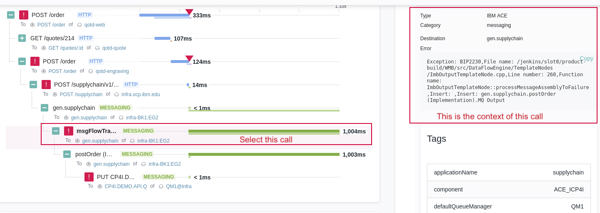

When you see errors, normally you go to the bottom of the call stack. That’s because the error in the last call is likely affecting the upstream calls.

Click on the last call and examine the information on the right side. You will see the following error message: “IBM MQ call failed with compcode ‘2’ (‘MQCC_FAILED’) reason ‘2053’ (‘MQRC_Q_FULL’)”
One can look up google or IBM documentatons for this Error code "MQ Erors code 2053"  which indicates that "MQ error code 2053 (MQRC_Q_FULL) means that a command or call failed because the queue is full. The queue is full because it already contains the maximum number of messages possible, as specified by the MaxQDepth queue attribute"

!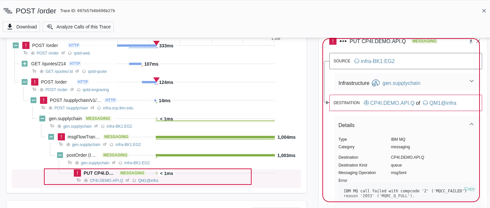

In your spare time, you can click on other types of transactions in the Call Stack, but for now, let’s focus on the diagnostic scenario.

This error message indicates that the MQ Queue is full and new messages can’t be put on the queue.

At this point, we believe we have a diagnosis for our problem. The MQ Queue is full and the transactions are failing because they can’t post a message to the queue.

## Confirm Your Diagnosis
In many cases, you can confirm the root cause of the problem by analyzing the call stack and stack trace, but sometimes you need to investigate further.

In this case, you may want to examine the queue that is causing this error. Or, you may want to confirm whether the problem has been resolved.

Instana automatically puts a link to the queue in the lower right corner. For other technologies, there are similar links.

Scroll all the way to the bottom on the right side of the screen. You’ll see that there is a link that will link to the MQ Queue named CP4I.DEMO.API.Q. This is the queue that is being used for this application transaction.

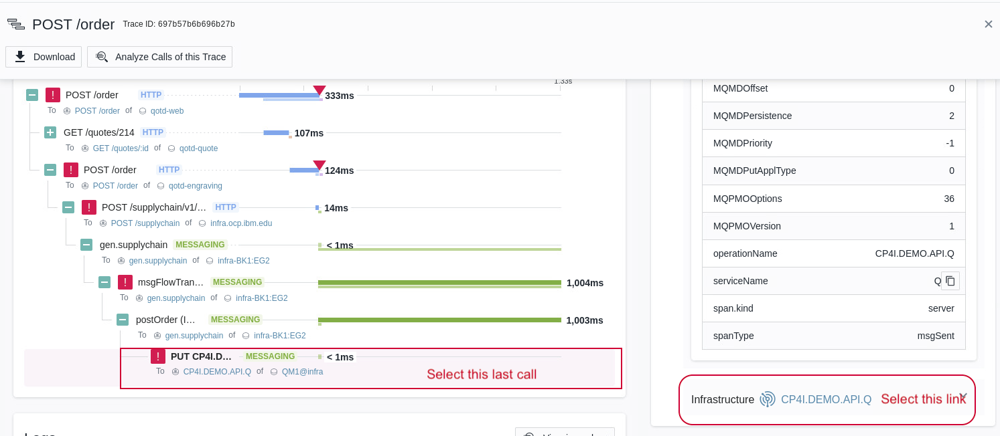

Click on the link to navigate to the queue details.

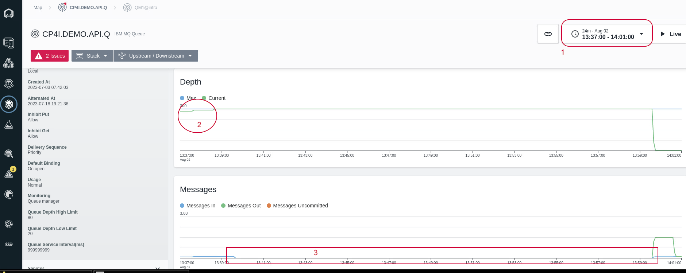

On this screen, you’ll notice a few important things.

* In the upper right corner, you’ll notice that the time range is specifically set to the timeframe when the Incident was open. **(1)**
* The queue depth reached 100% **(2)**
* The Messages In rate is zero during the timeframe that the queue is full. **(3)**

Clearly there is a problem with this queue. The queue is full and transactions won’t work properly because new messages can’t be placed on the queue. We need to resolve the queue depth problem in order to fix the application.

From here, if you wanted to investigate further, you could use the **bread crumbs** at the top of the screen or the Stack to navigate to the related resources. For example, examine the **IBM MQ Queue Manager**.

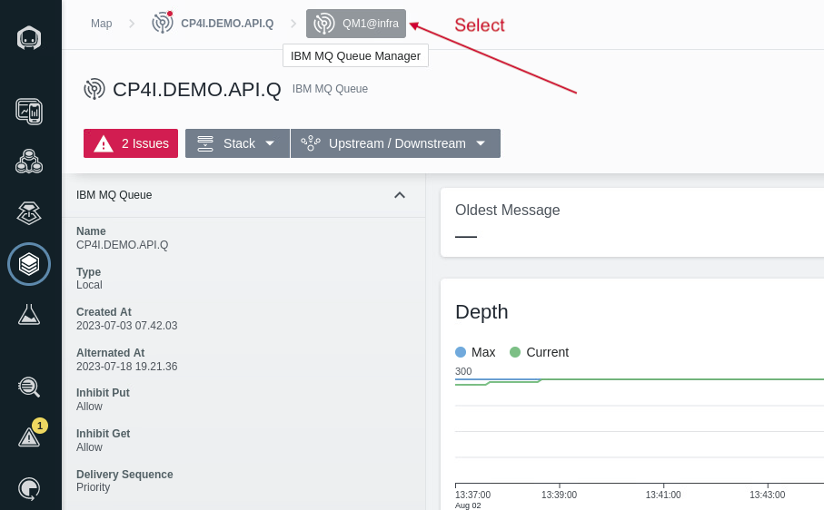

That completes this section of the lab.

## Optional - Simulate failures manually and troubleshoot "Ratings Endpoint Service Failures"
We are going to simulate the following (Ratings Endpoint Failures) failures in the system using Anomaly Generator running at http://10.100.1.60:32001
Please visit the URL: http://10.100.1.60:32001 or navigate to the tab(bookmarked) which was already opened in your firefox browser.

Click on Rating Service Failures as shown below.

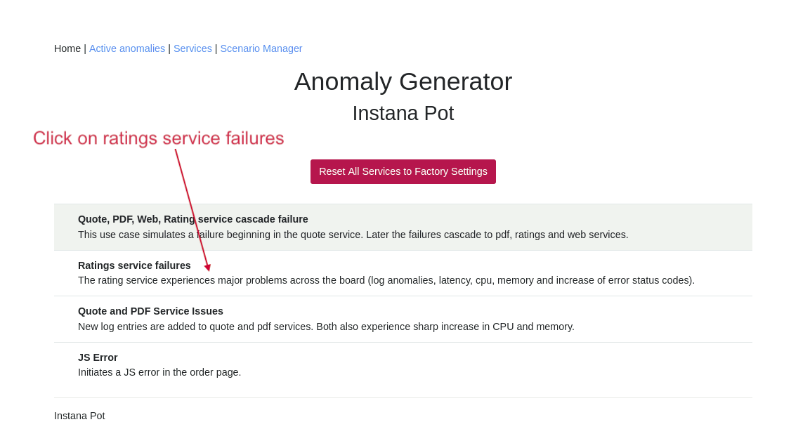

Now Click on "Start" whenever you are ready to inject the following failures as shown below in the picture.

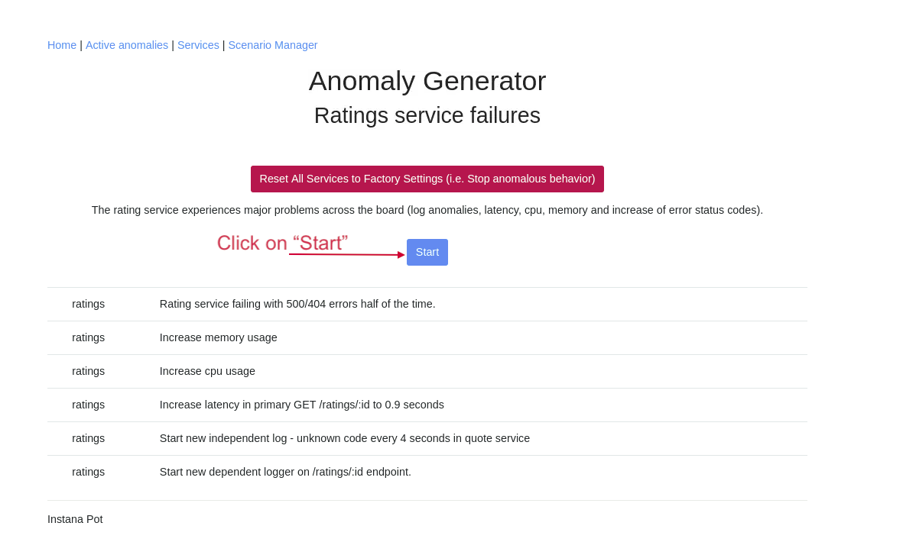

Now the system will take time to simulate the failures. Please give atleast 3-5 minutes for the system to simulate the failures.

All of these failures will be in the qotd-rating service. There are going to be 6 failure scenarios in the qotd-rating service.

1. Rating service failing with 500/404 errors half of the time.
2. Increase memory usage
3. Increase cpu usage 
4. Increase latency in primary GET /ratings/:id to 0.9 seconds
5. Start new independent log - unknown code every 4 seconds in quote service
6. Start new dependent logger on /ratings/:id endpoint.

Our troubleshooting can start with looking at the qotd-rating service in Applications. Please set the time duration to the last 10 minutes and go to Ratings service in Applications view.

Our goal is to show you the steps to troubleshoot this scenario. Please click on Applications as shown in the picture below. 

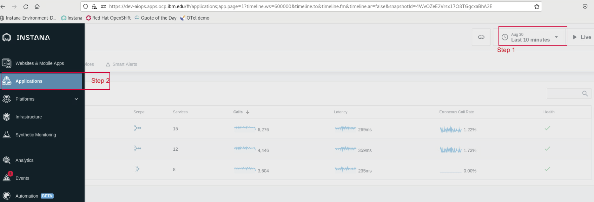

Please click on qotd-rating application as shown in the picture below. 

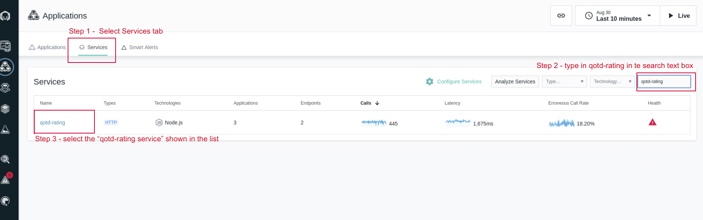

Now surface only the 4XX and 5XX errors by clicking/de-selecting on 1XX, 2XX, 3XX from these services as shown in the picture below.

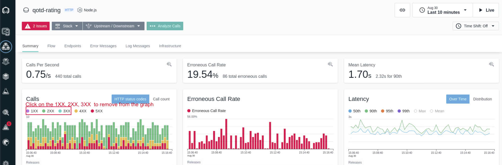

Now try to drag and drop into the time period (Highlight a specified area in the graph) as shown in the below picture and select "Zoom to time range" where the errors were being produced and the time period on the top right corner will get changed on its own from 10 minutes to the highlighted time period as shown below. We are trying go back in time to see the errors. 

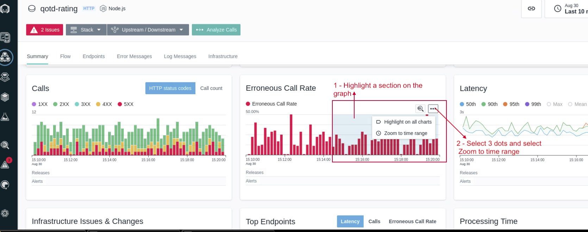

Now look at qotd-rating application and verify all the simulated failure conditions based on the information we see in the graphs. For example: we can see the latency spike to 2.15 seconds as shown in below pictures. This proves Condition 2 in the failures section. You can see this from the picture below. 

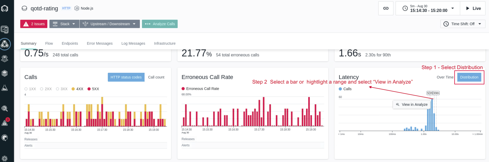
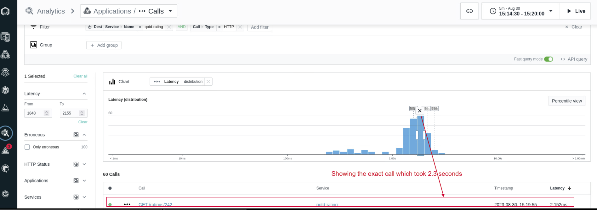

Click back browser button to return  to to previous summary section.
Now explore all the end points getting errors as shown in the picture below which satisfies Condition 1. 
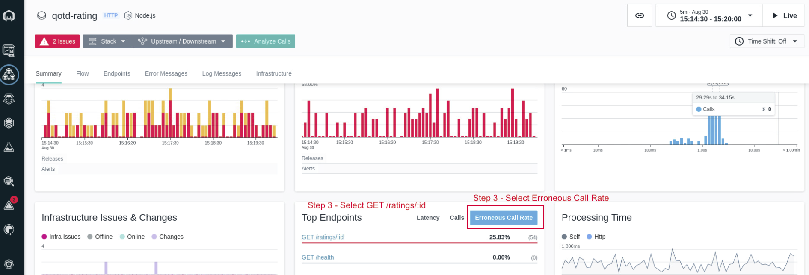

Next, we will analyze all the failures in the qotd-rating service by clicking "Analyze Calls" as shown in the picture below.

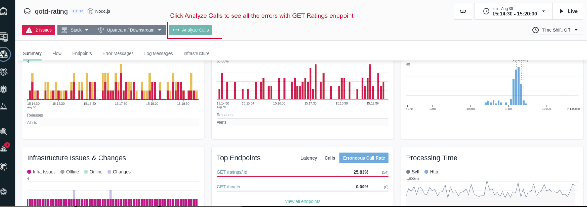

In this Analytics screen you can see that we are automatically looking at qotd-rating service and trying to expose only the 4XX and 5XX response codes as shown in the picture below.

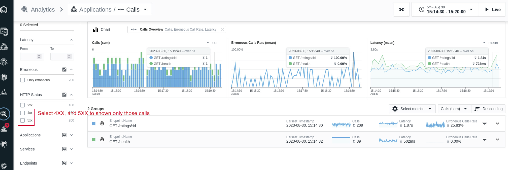

Next, select the top group which has the most 4XX and 5XX errors. Notice you did not have to type any SQL query to get to this result since Instana automatically knows the context of your troubleshooting scenario.
By default the list is sorted by # of calls high to low and Instana also allows to sort by other options as shown below.

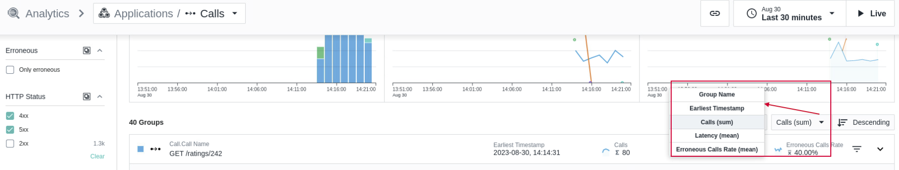

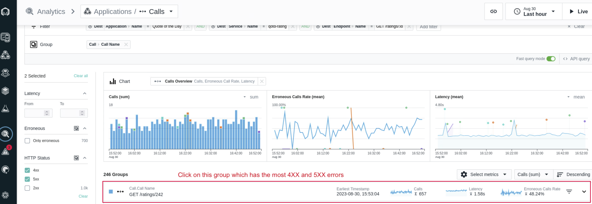

Now there is a list of all the traces with 4XX and 5XX response codes and select any one of them to see what is going on inside our code.

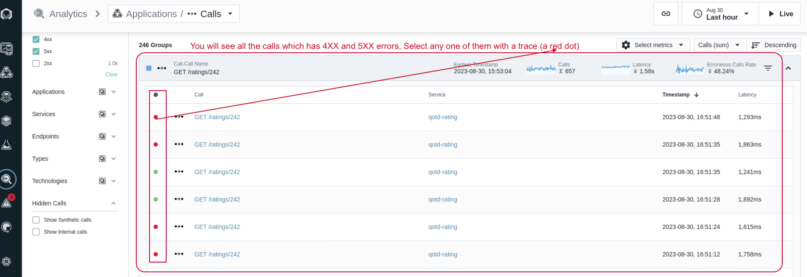

Note - There are 2 Scroll bar sections to n this page as shown in the picture below.
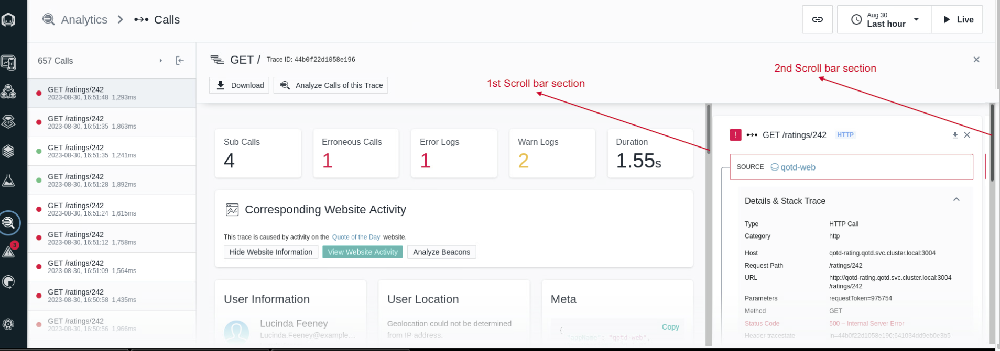

As you scroll down both sections, You can see the 500 response code and Log messages below along with the stack trace which will tell you the exact code with the line number responsible for the problem as shown in below 3 pictures for this particular 500 error.

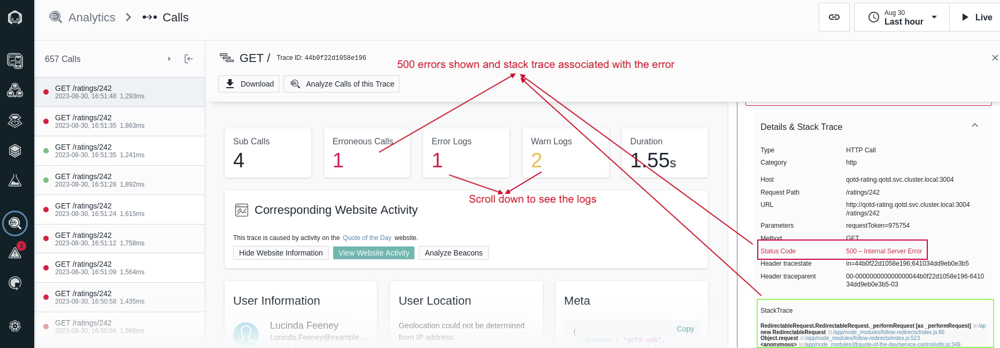
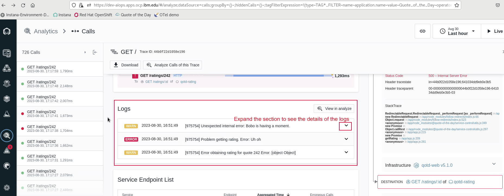

Lastly you can see the log message which the simulation injected. 
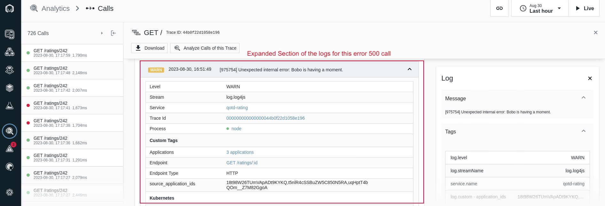

## Summary
In this lab, you learned how to diagnose a problem in Instana, determining that the queue was full and preventing transactions from completing.

Also successfully in this lab, you learnt how to successfully troubleshoot some other common issues by simulating failures.

Continue to next Lab of **"End User Monitoring(EUM) / Real-User Monitoring(RUM)"**

