# Administer Instana with API's


In this section of the lab we will create an API Token that will be used for executing the Instana Rest API calls. The Instana web REST API allows for retrieval of data such as traces and metrics, as well as configuration, such as service extraction and user management.
In order to use the web REST API, you need to create an API token and assign permissions.


From the Bastion host open the Firefox browser and select the **Instana**
bookmark.

:::tip

If you are unsure how to get access to the Bastion host (Guacamole) see
[Accessing a Lab Environment](/instana-techxchange/labs/jam-in-a-box/#accessing-a-lab-environment)
:::


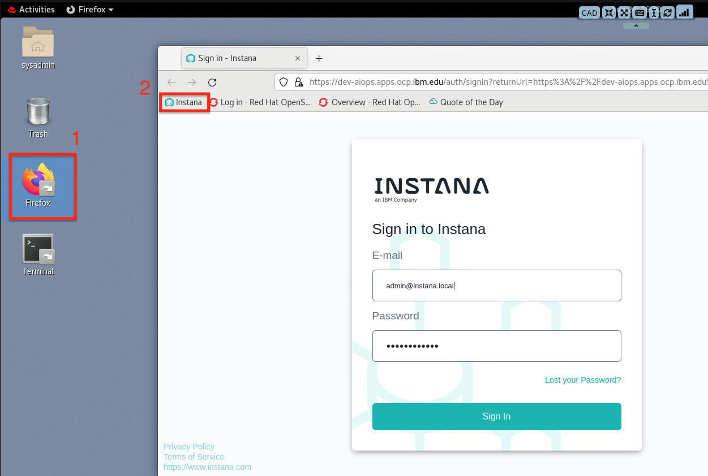


:::info

You can safely ignore the warning about the certificate being untrusted.


:::

When prompted, enter the username and password from teh credentials file.


## 4.1: Create an Instana API Token

1. Logon to the Instana and select the Settings on the left menu

>>>

2. Select API Tokens menu item in **ACCESS CONTROL** and Select **Add API Token** on the right to add a new toekn

>>>


3. Enter a name for the token, for example **RestAPILab**

>>>

4. In the **Permissions** section enable the following permissions

>>> User management\
Configuration of applications\
Service & endpoint mapping\
Configuration of automation actions\
Execution of automation actions\
Configuration of alert channels\
Configuration of Events, Alerts and Smart Alerts\
Configuration of global custom payload for alerts\
Configuration of global Smart Alerts\
Configuration of releases\
Configuration of agents\
Website monitoring configuration\

>>>

5. Select the **Save** button at the bottom of the page to save the API Token

>>>

6. Select the token to copy it to the clipboard. The Token will be used in the subsequent section of the lab to execute the API's 
   

>>>

7. Create a **HOST** and **API_TOKEN** environment variables on the bastion host

    Open the Terminal window on the Bastion host by selecting the Terminal icon on the desktop

    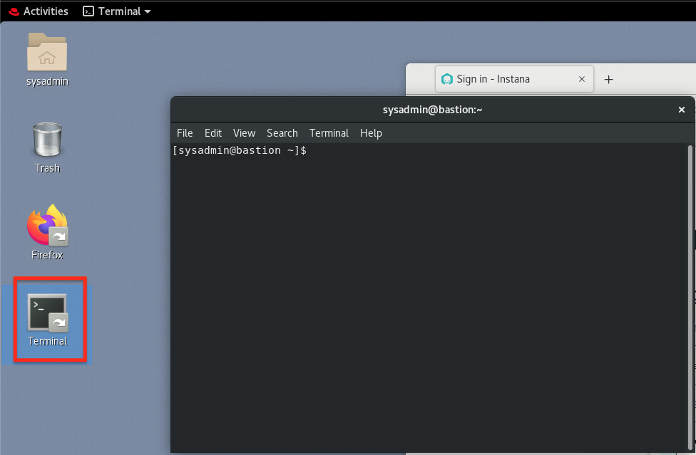


    export host=dev-aiops.apps.ocp.ibm.edu  <br /> 
    export apiToken=<Token from step #6>


:::tip
To copy and paste from teh lab guide to the bastion host window, use the Insert Text icon at the top of the window.

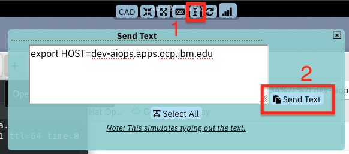
:::

## 4.2: Application Metrics


The API calls will be done in the same terminal Window. Copy and Paste the request curl command to the Terminal window.

### List all applications

Request:

```json
 curl -k --silent -X GET -H "authorization: apiToken $apiToken"  "https://$host/api/application-monitoring/applications?pretty"
```

Response 

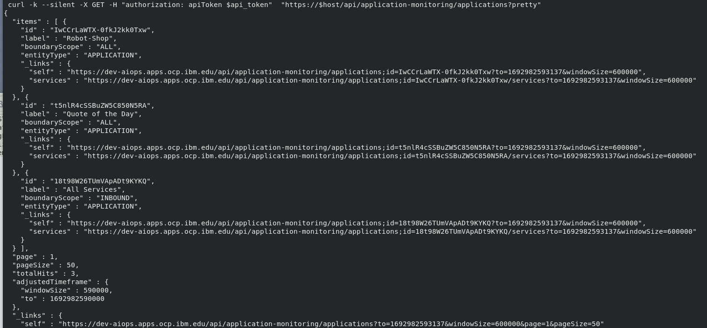


### List applications with errors

The request will list all applications monitored by the Instana agent that are throwing http 5xx errors. The **metric** attribute in the request object can be changed to http.4xx or http.3xx as needed.

Request:

```json
 curl -k -X POST  -H "Accept: application/json" -H "Content-Type: application/json" -H "Authorization: apiToken $apiToken" \
  "https://$host/api/application-monitoring/metrics/applications?pretty" \
  -d '
{
  "applicationBoundaryScope": "ALL",
  "label": "Robot-Shop",
  "metrics": [
    {
      "aggregation": "SUM",
      "granularity": 0,
      "metric": "http.5xx"
    }
  ]
}'
```

Response:

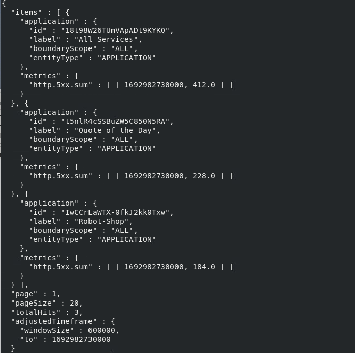


### Query application services by application name

The request will list all applications monitored by the Instana agent that are throwing http 5xx errors. The nameFilter attribute in the request can be changed to the **qotd** applciaiton.

Request:

```json
curl -k --silent -X GET -H "authorization: apiToken $apiToken"  "https://$host/api/application-monitoring/applications/services?pretty" -d 'nameFilter=Robot-Shop'
```

Response:

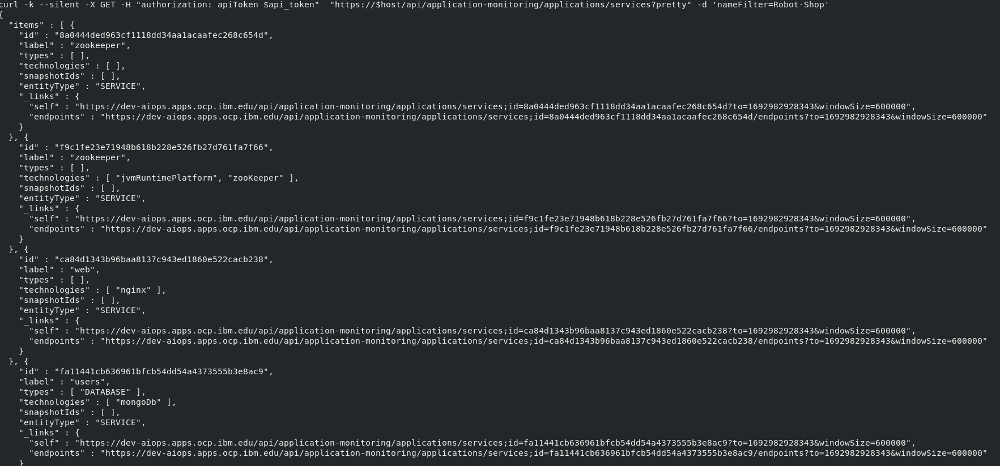

## 4.3: Infrastructure-level metrics


In this section we will use the Instana applciation interface to help build the API calls required to fetch Infrastucture information for an application. 


### List hosts monitoried by Instana

1. From the Instana applciation, Select the Analytics icon 


  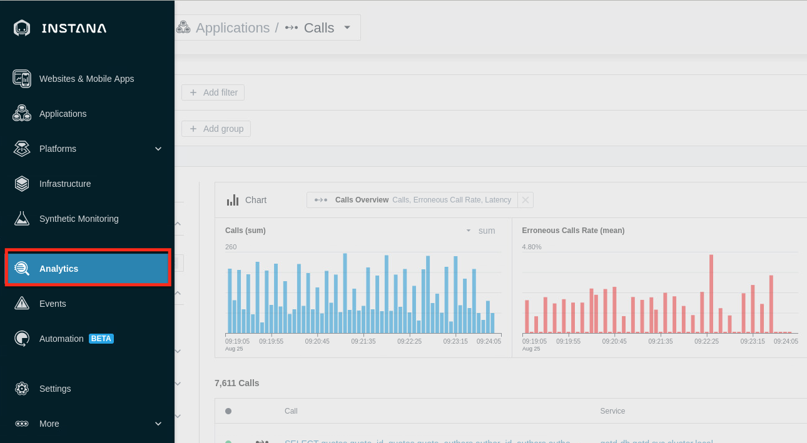


2. From the drop-down menu, select Infrastructure

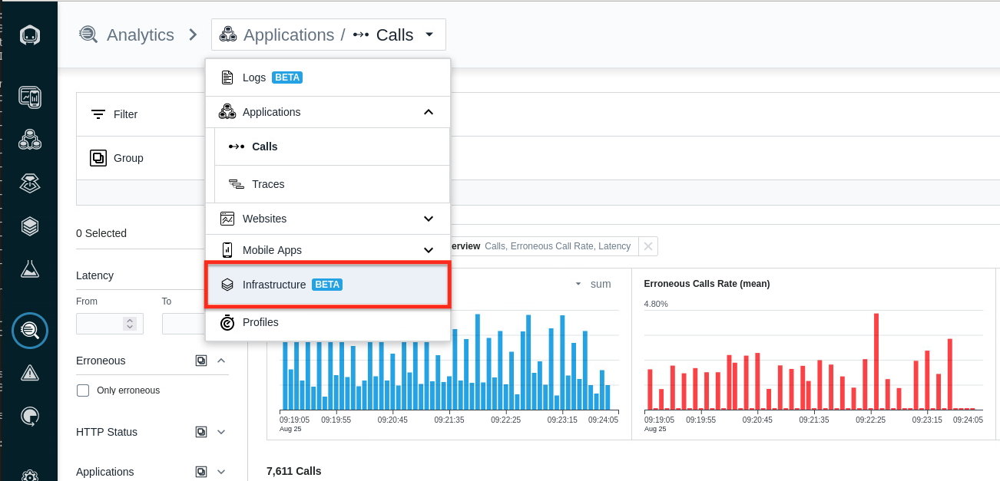


3. In the search field, enter Host to filter the results and select the **Host** Entity Type

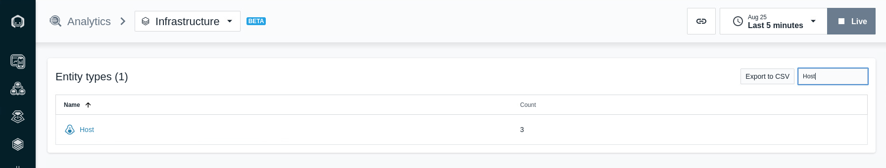

4. Select the API query option on the left to view the API curl command

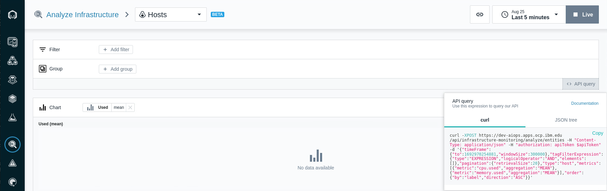


5. We will use a Text Editor to make minor updates to the API query before we run it on the Terminal window. To open the text editor, select the Activities icon on the left and Type Text Editor in the searcd box

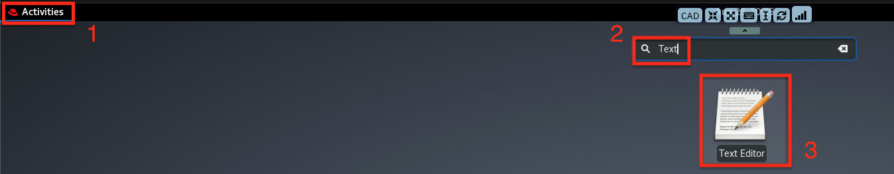


6. Copy the curl command from the API query


7. Paste the curl command to the text Editor

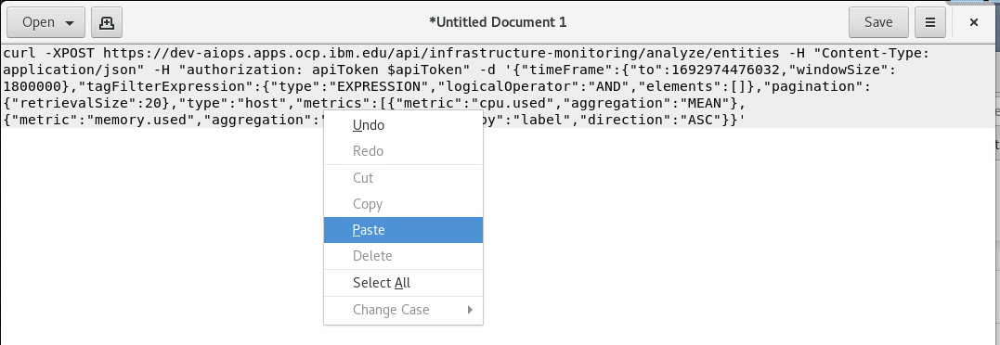

8. Make the following changes ot he curl command before running it in the Terminal window

   1. Add **-k** after the curl command to bypass the SSL certificate
   2. Add **?pretty** to make the output more readable


9. The final query will look like this:

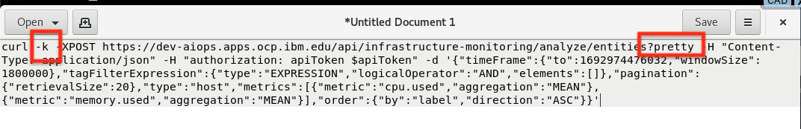

10. Run the Curl command by copying and pasteing it to the Terminal window

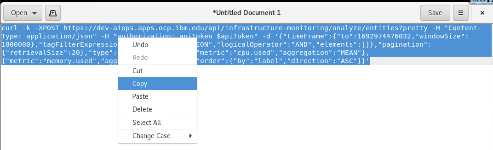

11. Right click on the Terminal window and select **paste*

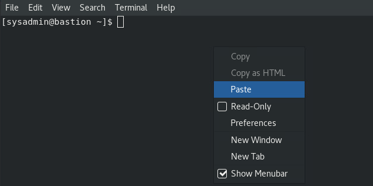

12. Run the curl command that will list the hosts

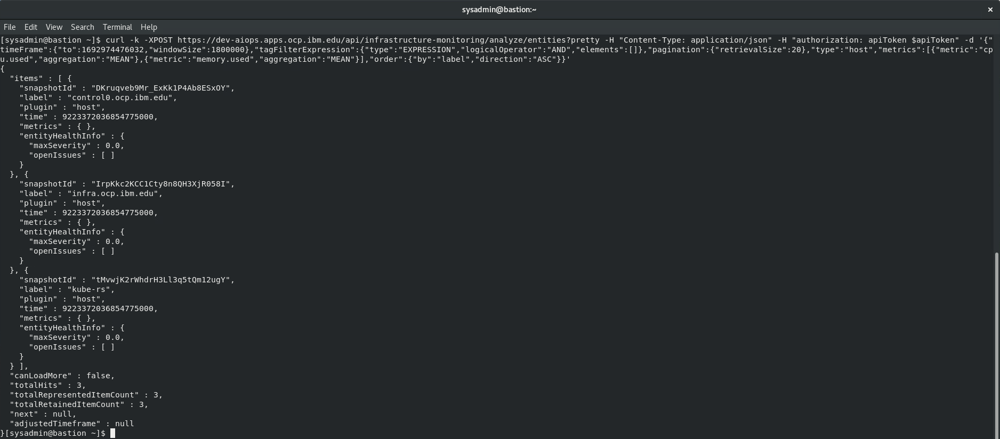

### List the services running on a host

We will now use the Response Output from the previous curl command. The **snapshotId** in the response will be used in the next curl command to list services running on a host.

Use the follwoing steps to copy the curl command to the Terminal and update the snapshotId for the host labeled **kube-rs**

1. Copy the snapshotId from the response of the curl command in step 12. 
   
   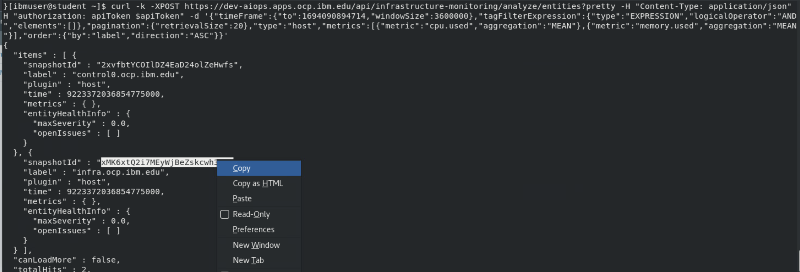
   
2. Copy the curl command below and paste it to the terminal
   
Request:

```json
 curl -k --silent -X GET -H "authorization: apiToken $apiToken"  "https://$host/api/infrastructure-monitoring/snapshots/<snaphostId>?pretty"
```

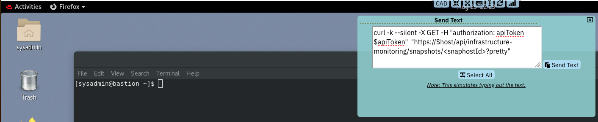


3. Update the snapshotId in the commend with the snapshotId by removing the **snapshotId** and pasting the coppied id. 
   
   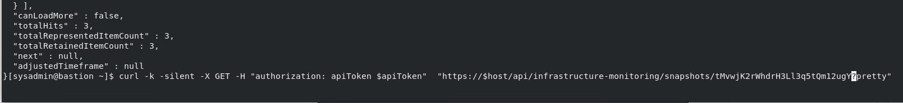

4. Run the Curl command to list services running on the host kube-rs

The service routes are listed with their ip, subnet and Fully Qualified Domain Name

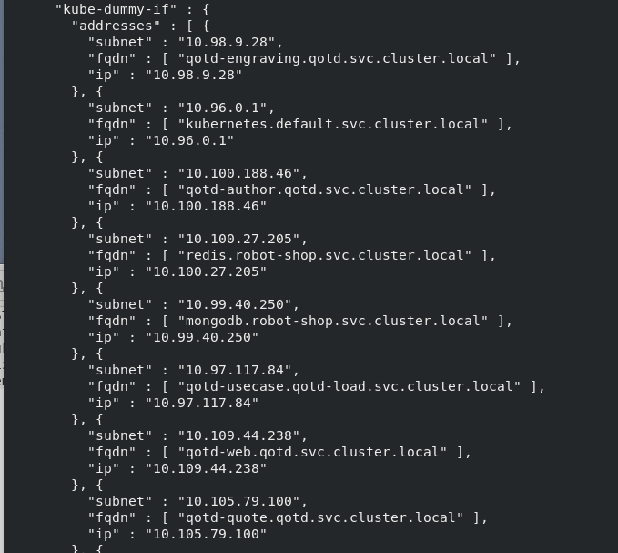

The Host information includes filesystem, OS and Machine id. This is typically helpful for mapping host informaiotn with external data sources.

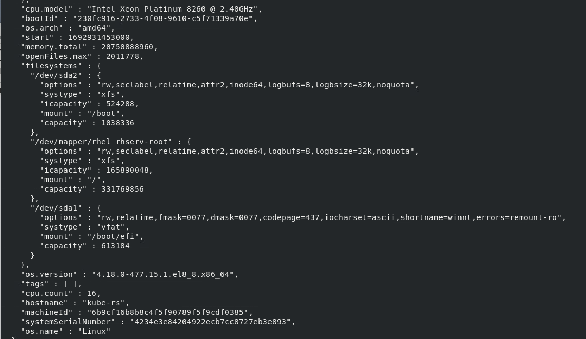

## 4.4: Summary

At this point, you have used the APIs to fetch both Application and Infrasturcture metrics. 

Instana OpenAPI documentation : https://instana.github.io/openapi/


---
