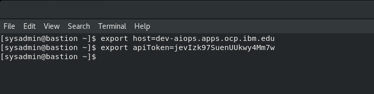
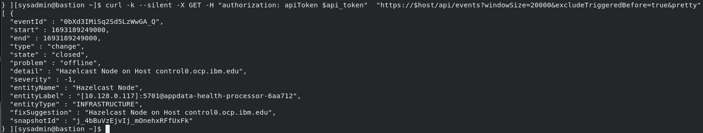
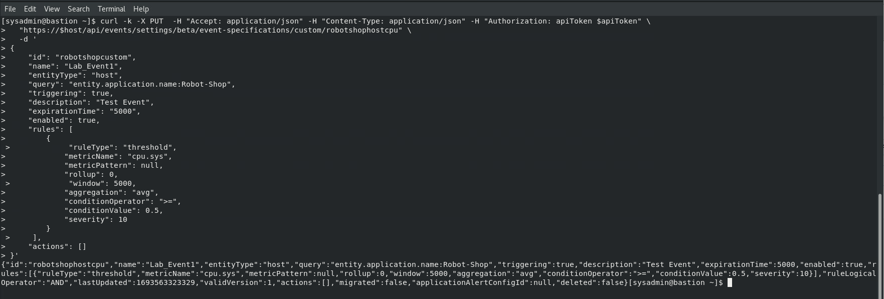
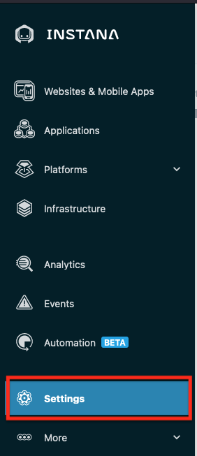
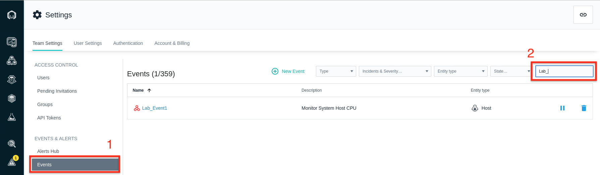
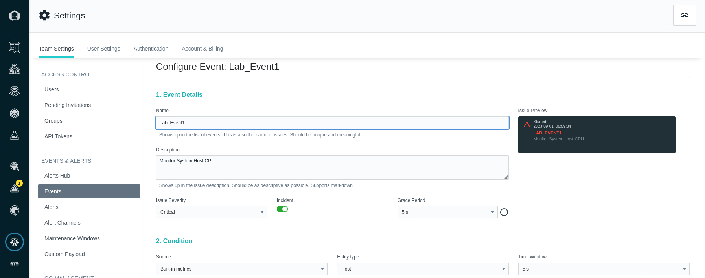

# Administer Instana with API's


In this section of the lab we will create an Personal API Token that will be used for executing the Instana Rest API calls. The Instana web REST API allows for retrieval of data such as traces and metrics, as well as configuration, such as service extraction and user management.


From the Student host open the Firefox browser and select the **Instana**
bookmark.

:::tip

If you are unsure how to get access to the Student host see
[Accessing a Lab Environment](/instana-techxchange/labs/jam-in-a-box/#accessing-a-lab-environment)
:::


:::info

You can safely ignore the warning about the certificate being untrusted.


:::

When prompted, enter the username and password from the credentials file.


## 4.1: Create an Instana API Token

In this section of the lab we will create an Personal API Token that will be used for executing the Instana Rest API calls. Personal tokens can be created Settings > User settings > Personal API tokens and only require a name to be set. This token "inherits" the permission of the creating user. 

1. Select **Settings** on the left menu

>>>

2. Select API Tokens menu item in **ACCESS CONTROL** and Select **Add API Token** on the right to add a new toekn

>>>


3. Enter a name for the token, for example **RestAPILab**

>>>

4. the following set of **Permissions** are required for executing the API's in this lab.

>>>Configuration of applications <br/>
Service & endpoint mapping <br/>
Configuration of Alert Channels <br/>
Configuration of Events, Alerts and Smart Alerts for APs and websites <br/>
Configuration of global Smart Alerts <br/>

>>>

1. Select the **Save** button at the bottom of the page to save the API Token

>>>

6. Select the token to copy it to the clipboard. The Token will be used in the subsequent section of the lab to execute the API's 
   

>>>

7. Create a **host** and **apiToken** environment variables on the bastion host

    1. Open the Terminal window on the Bastion host by selecting the Terminal icon on the desktop

    

    2. Copy and paste the follwoign export commands to the terminal window
   
        export host=dev-aiops.apps.ocp.ibm.edu  <br /> 
        export apiToken=<Token from step #6>

      

:::tip
To copy and paste from the lab guide to the bastion host window, use the Insert Text icon at the top of the window. You will be using this method to Copy and Paste Curl commands from the documentation to the Terminal window in the bastion host.


:::

## 4.2: Application Metrics


The Application Metrics API calls will be run in the terminal Window. To Run the Curl commands, copy and paste the request curl command to the Terminal window.

### List all applications

Request:

```json
 curl -k --silent -X GET -H "authorization: apiToken $apiToken"  "https://$host/api/application-monitoring/applications?pretty"
```

Response 


### List applications with errors

The request will list all applications monitored by the Instana agent that are throwing http 5xx errors. The **metric** attribute in the request object can be changed to http.4xx or http.3xx as needed.

Request:

```json
 curl -k -X POST  -H "Accept: application/json" -H "Content-Type: application/json" -H "Authorization: apiToken $apiToken" \
  "https://$host/api/application-monitoring/metrics/applications?pretty" \
  -d '
{
  "applicationBoundaryScope": "ALL",
  "label": "Robot-Shop",
  "metrics": [
    {
      "aggregation": "SUM",
      "granularity": 0,
      "metric": "http.5xx"
    }
  ]
}'
```

Response:


### Query application services by an application name

The request will list all applications monitored by the Instana agent that are throwing http 5xx errors. The nameFilter attribute in the request can be changed to the **qotd** applciaiton.

Request:

```json
curl -k --silent -X GET -H "authorization: apiToken $apiToken"  "https://$host/api/application-monitoring/applications/services?pretty" -d 'nameFilter=Robot-Shop'
```

Response:


:::info
Note, the screenshot does not list the complete set of services and the data may look different in your environment.
:::

## 4.3: Infrastructure-level metrics


In this section we will use the Instana applciation interface to help build the API calls required to fetch Infrastucture information and correlate it to an Applciation. 


### List hosts monitoried by Instana

1. From the Instana applciation, Select the Analytics icon


  


2. Select Infrastructure from the drop-down menu


3. In the search field, enter **Host** to filter the results and select the **Host** Entity Type


4. Select the API query option on the left to view the API curl command


5. We will use a Text Editor to make minor updates to the API query before we run it on the Terminal window. To open the text editor, select the Activities icon on the left and Type Text Editor in the searcd box


6. Copy the curl command from the API query


7. Paste the curl command to the text Editor


8. Make the following changes to the curl command before running it in the Terminal window

   1. Add **-k** after the curl command to accept the self-Signed certificate
   2. Adding **?pretty** will make the output more readable


9. The final query will look like this


10. Run the Curl command by copying and pasting it to the Terminal window


11. Right click on the Terminal window and select **paste**


12.  The API will list hosts monitored by Instana


:::info
A **snapshot** represents static information about an entity as it was at a specific point in time. To clarify: Static information is any information which is seldom changing, e.g. process IDs, host FQDNs or a list of host hard disks. The counterpart to static information are metrics which have a much higher change rate, e.g. host CPU usage or JVM garbage collection activity. Snapshots only contain static information.
:::

### List the services running on a host

We will now use the Response output from the previous curl command. The **snapshotId** in the response will be used in the next curl command to list services running on a host.

Use the follwoing steps to copy the snapshotId for one of the hosts, for example **infra.ocp.ibm.edus**

1. Copy the snapshotId from the response of the curl command in step 12. 
   
   

2. Copy the curl command below and paste it to the terminal
   
Request:

```json
 curl -k --silent -X GET -H "authorization: apiToken $apiToken"  "https://$host/api/infrastructure-monitoring/snapshots/<snaphostId>?pretty"
```
3. Paste the command to the Send text option in the Bastion host window


4. Update the snapshotId in the commend with the snapshotId by removing the **snapshotId** and pasting the coppied id. 
   
   

5. Run the Curl command to list services running on the host


:::info
The service routes are listed with their ip, subnet and Fully Qualified Domain Name


:::

:::info
The Host information includes filesystem, OS and Machine id. This is typically helpful for mapping host informaiotn with external data sources.


:::

## 4.4: Events and Alerts

In this section we will fetch Events from applications monitored by Instana using API's

### Get a list of all Open Events opened within the last 20 seconds minutes

The request will list all application Events in the last 20 seconds.

Request:

```json
curl -k --silent -X GET -H "authorization: apiToken $apiToken"  "https://$host/api/events?windowSize=20000&excludeTriggeredBefore=true&pretty"
```

Response:





:::info
Adjust the windowSize if you do not see any Events returned. For example to view Events that occured in the past 1 minute use 60000 as the value for **windowSize**
:::


### Create a new Custom Event

In this section we will use an API to create a new Custom Event and verify it in the Instana user interface. <br />

:::info
Here is a description of a few of the attributes in the request <br />
**id** : The unique name of the custom event. Note this value is the same as the value in the PUT request URL. The name of the event we have used is **robotshopcpu** <br />
**name** : The name of the Event. In thsi example we named the Event **Lab_Event1** <br />
**query** : The dynamic query that spefifies the name of the applicaiton. In this example the application name is **Robot-Shop**  <br />
**rules** : The rules that will trigger the event. In this example, the event will trigger when the host CPU is greater than or equal to **90%** <br />
:::

Request:

```json
 curl -k -X PUT  -H "Accept: application/json" -H "Content-Type: application/json" -H "Authorization: apiToken $apiToken" \
  "https://$host/api/events/settings/event-specifications/custom/robotshopcpu" \
  -d '
{
    "id": "robotshopcpu",
    "name": "Lab_Event1",
    "entityType": "host",
    "query": "entity.application.name:Robot-Shop",
    "triggering": true,
    "description": "Monitor System Host CPU",
    "expirationTime": "5000",
    "enabled": true,
    "rules": [
        {
            "ruleType": "threshold",
            "metricName": "cpu.sys",
            "metricPattern": null,
            "rollup": 0,
            "window": 5000,
            "aggregation": "avg",
            "conditionOperator": ">=",
            "conditionValue": 0.9,
            "severity": 10
        }
    ],
    "actions": []
}'
```
Response:





Use the following steps to verify the event has been created in the Instana application

1. Select the **Settings** icon on the left navigation



2. Select **Events** from the menu and enter the Event name specified in the request **Lab_**



3. Select the event to view the event configuration



## 4.5: Summary

At this point, you have used the API's to perform various tasks such as monitoring applciation metrics, getting a list of Events and creating new Events. API's are helpful when automating tasks such as migrating configuration between environments or exporting metrics data to external systems.

Reference Link:

Instana OpenAPI documentation : https://instana.github.io/openapi/


---
