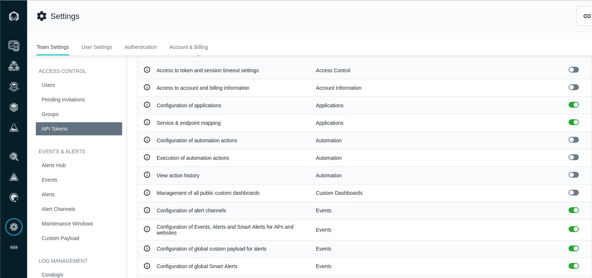

# Administer Instana with API's

In this section of the lab we will create an API Token that will be used for executing the Instana Rest API calls. The Instana web REST API allows for retrieval of data such as traces and metrics, as well as configuration, such as service extraction and user management.
In order to use the web REST API, you need to create an API token and assign permissions.

From the Bastion host open the Firefox browser and select the **Instana**
bookmark.

:::tip

If you are unsure how to get access to the Bastion host (Guacamole) see
[Accessing a Lab Environment](/instana-techxchange/labs/jam-in-a-box/#accessing-a-lab-environment)

:::

:::info

You can safely ignore the warning about the certificate being untrusted.

:::

When prompted, enter the username and password that you updated earlier.

- Username: **admin@instana.local**
- Password: **Passw0rd**

## 4.1: Create an Instana API Token

1. Logon to the Instana and select the Settings on the left menu

>>>

2. Select API Tokens menu item in **ACCESS CONTROL** and Select **Add API Token** on the right to add a new toekn

>>>

3. Enter a name for the token, for example **RestAPILab**

>>>

4. In the **Permissions** section enable the following permissions

>>> User management\
Configuration of applications\
Service & endpoint mapping\
Configuration of automation actions\
Execution of automation actions\
Configuration of alert channels\
Configuration of Events, Alerts and Smart Alerts\
Configuration of global custom payload for alerts\
Configuration of global Smart Alerts\
Configuration of releases\
Configuration of agents\
Website monitoring configuration\

>>>

5. Select the **Save** button at the bottom of the page to save the API Token

>>>

6. Select the token to copy it to the clipboard. The Token will be used in the subsequent section of the lab to execute the API's 
   

>>>

7. Create an environment variable **API_TOKEN** on the bastion host

## 4.2: Application Metrics

### List all applications

### List all applications in critical health

### List applications with by host

### Query application services by application name

## 4.3: Event Management 

### List of open Events

### List of open Events in the last 10 minutes

## 4.4: User Management 

### Get list or users

### Invite a user

### Remove a user

---
