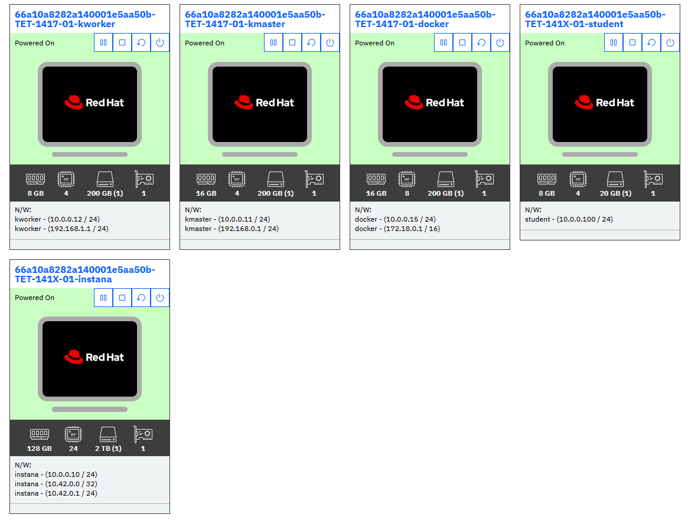

# Lab Environment
The lab environment includes the below virtual machines:

Kubernetes clusters:

1. **kmaster** - Kubernetes VM - An instance of Kubernetes cluster whith pre-installed OpenTelemetry Collector and Instana Agent
2. **Instana** - RH8 VM - An instance of K3s cluster with pre-installed Instana backend.

Virtual Machines:

1. **Student VM** - A RHEL VM that will be used as the _bastion_ host into the lab network. Student VM has access to all lab VM's and clusters and will be your primary workstation for these labs.
2. **Docker VM** - A RHEL VM that contains the pre-installed OpenTelemetry Demo Application

