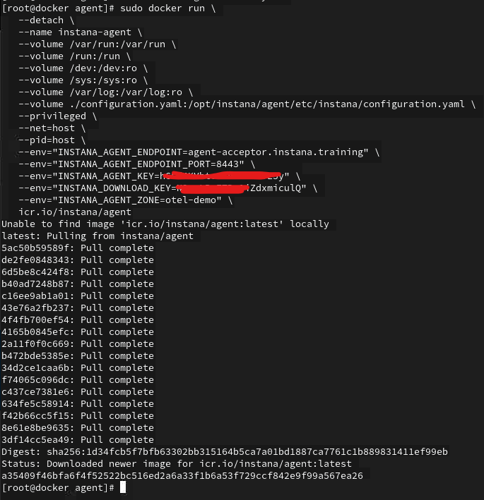
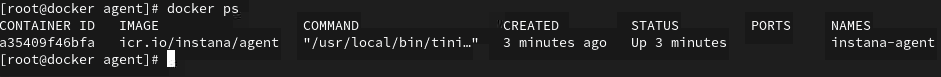
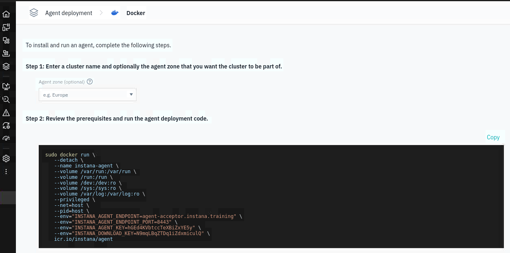
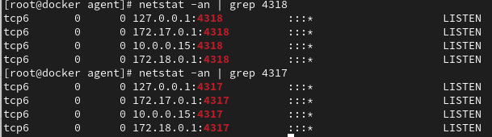
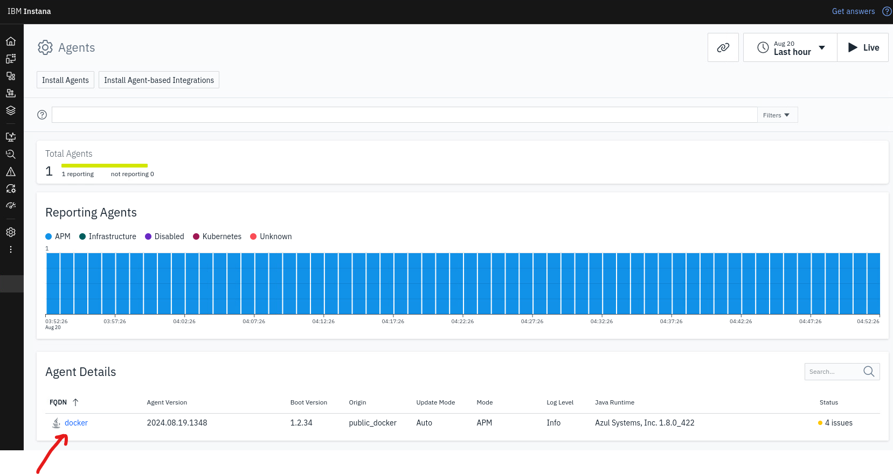

# Agent configuration

The Instana agent can directly receive OpenTelemetry traces, metrics, and logs in OpenTelemetry format. Then, the Instana agent forwards the data to the Instana backend. 

In this section of the lab, you will complete the following configurations:

- Enable the OpenTelemetry data ingestion in the configuration.yaml file
- Start the Instana agent with OpenTelemetry configuration

## How to collect Otel data?

There are two options you can use in order to send Otel data to the Instana backend:
1. Through the Instana Agent
2. Directly to the Instana backend 

For this lab, we will focus on point 1 - we will be sending data to the Instana backend using Instana Agent.

:::note
Sending Otel data through the Instana Agent can be useful for some implementations with more strict firewall rules
:::

## Enabling the OpenTelemetry data ingestion

By default, the OpenTelemetry data ingestion in the Instana host agent is deactivated. That is why, you have to enable the OpenTelemetry configuration. 

Please use the "Student" VM, open the "Terminal" application and login to the "docker" Virtual Machine by using the following command:

```sh
ssh root@docker
```

Password is "Passw0rd"

next, proceed to the opentelemetry-demo directory

```sh
cd /root/opentelemetry-demo/instana/agent
```

next, edit the configuration.yaml file

:::note
Please note, that the default location for the configuration.yaml file is in the Instana agent directory - for example
/opt/instana/agent but in the case of this Lab, we have prepared ready-to-use configuration with pre-configured Otel settings
:::

```sh
vim configuration.yaml
```

To enable the reception of the OpenTelemetry data in the host agent, make sure, these two "enabled: true" values are populated in the configuration.yaml file of the host agent. Please change the values from "false" to "true"

```bash
com.instana.plugin.opentelemetry:
  grpc:
    enabled: true
  http:
    enabled: true
```

After the OpenTelemetry data ingestion is activated, the host agent activates a collector for OpenTelemetry's default OTLP exporter on the ports 4317 for gRPC and 4318 for HTTP or HTTPS connections.

:::info
You might noticed, that there are other values populated within the configuration.yaml - do not change these. The lines below the OpenTelemetry configuration are required for the next steps in the Labs!
:::

## Starting the Agent 

Now, the configuration.yaml file is ready to be used. The next step is to start the Instana agent using the altered configuration. Please run below command:

```bash
vim instana-agent-docker.yaml
```

which will display the docker command allowing to run the Instana agent on the "docker" virtual machine. The snippet looks like the below:

```bash
sudo docker run \
   --detach \
   --name instana-agent \
   --volume /var/run:/var/run \
   --volume /run:/run \
   --volume /dev:/dev:ro \
   --volume /sys:/sys:ro \
   --volume /var/log:/var/log:ro \
   --volume ./configuration.yaml:/opt/instana/agent/etc/instana/configuration.yaml \
   --privileged \
   --net=host \
   --pid=host \
   --env="INSTANA_AGENT_ENDPOINT=agent-acceptor.instana.training" \
   --env="INSTANA_AGENT_ENDPOINT_PORT=443" \
   --env="INSTANA_AGENT_KEY=XXXX" \
   --env="INSTANA_DOWNLOAD_KEY=XXXX" \
   --env="INSTANA_AGENT_ZONE=otel-demo" \
   icr.io/instana/agent
```

please note below options:

- --volume ./configuration.yaml:/opt/instana/agent/etc/instana/configuration.yaml \ - this line is required in order to pass the new configuration file into the agent. The configuration file keeps the OpenTelementry settings enabled,
- --env="INSTANA_AGENT_KEY=XXXX" \- this can vary, depending on your agent key,
- --env="INSTANA_DOWNLOAD_KEY=XXXX" \ - this can vary, depending on your download key,
- --env="INSTANA_AGENT_ZONE=otel-demo" - optional parameter, which will help to configure the proper zone in Instana

Copy the command from the "instana-agent-docker.yaml" file and paste it into the terminal. After instana-agent image and container setup, you will similar screen as below



Please confirm the Instana Agent docker container is running correctly, by the below command

```bash
docker ps
```

The effect of the command should be similar to the below screen 



:::info
Optional step (not required for this Lab)

Alternative way of installing Instana Agent is to use the Instana UI. Login to the Instana UI, then navigate to -> Deploy Agent -> search for Docker -> copy the snippet. In this case, please remember about the configuration.yaml file appendix.


:::

## Verifying the Agent

Once the agent is started, there are two steps required to be sure, the agent is working fine and it's accepting the OpenTelemetry traffic.

### Check OpenTelemetry ports

Run these two commands to make sure the OpenTelemetry ports are opened:

```bash
netstat -an | grep 4317
netstat -an | grep 4318
```

The results of these commands should confirm, that ports 4317 and 4318 are listening and waiting for the OpenTelemetry traffic 



### Check Instana UI 

Please go back to the "Student" VM, open a Firefox browser and let's move to the Instana UI (you will find the link in the bookmark bar). 

Make sure, the agent is reporting content to the Instana backend. Open the Instana UI in the browser and navigate to Settings -> Agents as shown on the below screen:



This is the confirmation, that the Instana Agent is sending data to the backend.

Please proceed to the next section of the lab.