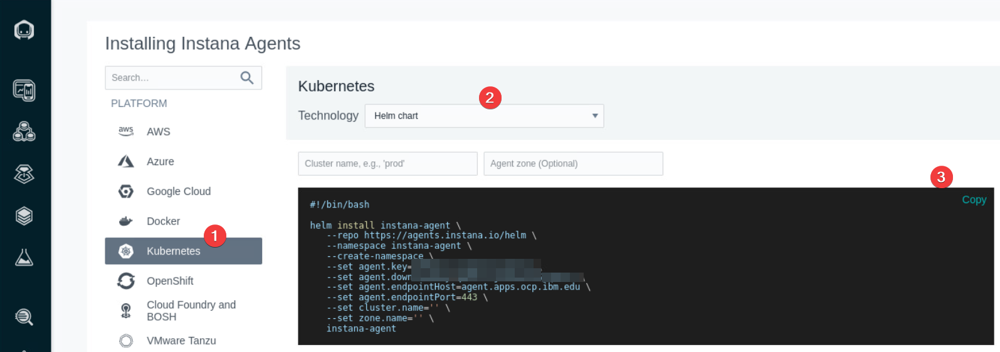

# Instana agent installation
In this section you will install Instana Agent to monitor your Kubernetes cluster.

## Environment login

Open your Student virtual machine, open Terminal, use ssh to connect to the Bastion node. You will need the Terminal later during the lab.


## Helm chart 

Open the Firefox browser, click on the Instana bookmark and log in to your Instana UI. 


Click on "Deploy agent" link as described on the below picture


Select Kubernetes and choose Helm installation option. Copy the helm chart installation script.



Go back to your Terminal console, ssh to your Kubernetes cluster


paste the copied helm chart installation script and hit enter

```bash
helm install instana-agent \
   --repo https://agents.instana.io/helm \
   --namespace instana-agent \
   --create-namespace \
   --set agent.key=xxx \
   --set agent.downloadKey=xxxx \
   --set agent.endpointHost=xxx \
   --set agent.endpointPort=443 \
   --set cluster.name='YourClusterName' \
   --set zone.name='YourZoneName' \
   instana-agent
```

Make sure the installation was done by checking the below command output

```sh
kubectl get all -n instana-agent

NAME                        READY   STATUS    RESTARTS   AGE
instana-agent-xxx           1/1     Running   0          27h
k8sensor-xxx-6rddc          1/1     Running   0          3d
k8sensor-xxx-btll6          1/1     Running   0          3d
k8sensor-xxx-qvn2s          1/1     Running   0          3d
```


## Verify Kubernetes monitoring

Go to your Instana UI, click on "Kubernetes" left side menu. Ensure you are getting the metrics from your cluster.

