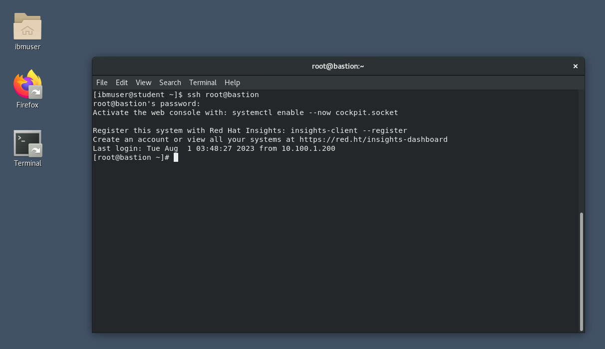
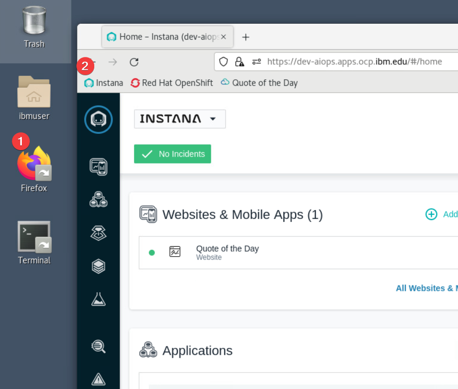
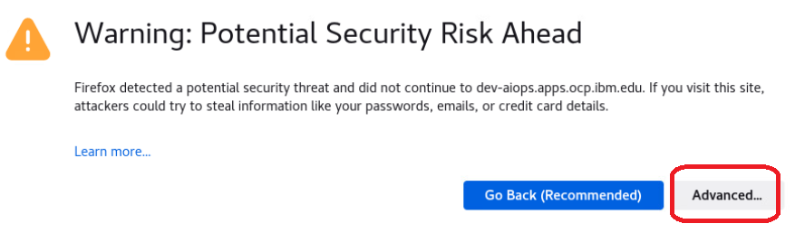
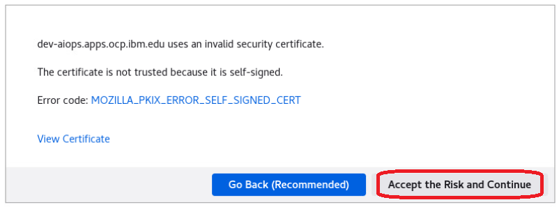
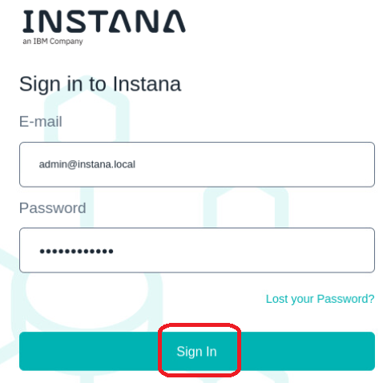
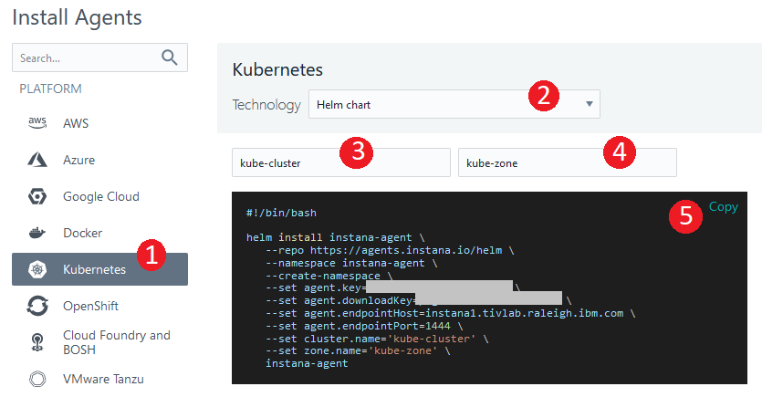
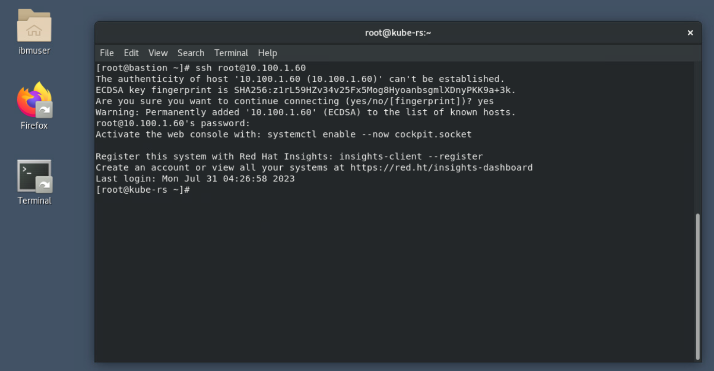
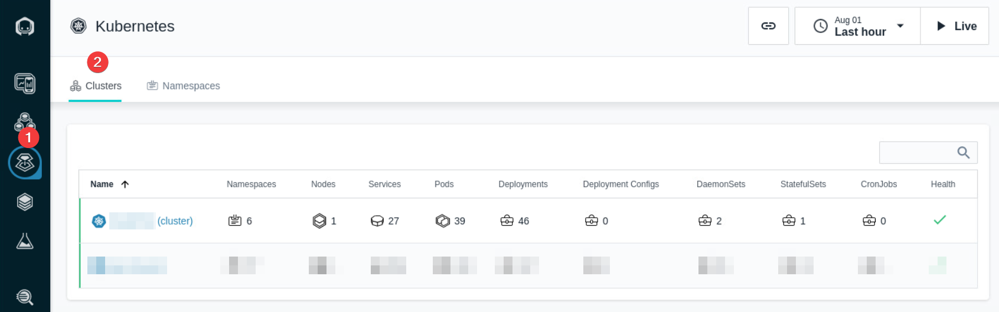

# Instana agent installation
In this section you will install Instana Agent to monitor your Kubernetes cluster.

## Environment login

Open your Student virtual machine, open Terminal, use ssh to connect to the Bastion node. You will need the Terminal later during the lab.



## Helm chart 

Open the Firefox browser, click on the Instana bookmark and log in to your Instana UI. 



When opening the browser, you may receive a security warning.   If you do, click the "Advanced" button.



Then, select "Accept the Risk and Continue"



Then, click "Sign In" to log into the Instana user interface.



Click on the "Stan" icon in the upper left corner (1). Then, Click on the "Deploy agent" link (2) as shown below.


- In the "Install Agents" dialog, select Kubernetes (1).
- Then, choose Helm installation option (2). 
- Enter a Cluster Name (3).  In the example, we have specified "kube-cluster".
- Enter a Zone Name such as "kube-zone" (4).  
- Finally, copy the helm chart installation script (5).



Go back to your Terminal console, ssh to your Kubernetes cluster by typing:
```bash
ssh root@10.100.1.60
```

When prompted, enter the root password.




paste the copied helm chart installation script and hit enter

Note:   Do Not copy the example shown below.  It does not contain a valid downloadKey and agent.key.  This information must be obtained from your Instana server.

```sh
helm install instana-agent \
   --repo https://agents.instana.io/helm \
   --namespace instana-agent \
   --create-namespace \
   --set agent.key=xxx \
   --set agent.downloadKey=xxxx \
   --set agent.endpointHost=xxx \
   --set agent.endpointPort=443 \
   --set cluster.name='kube-cluster' \
   --set zone.name='kube-zone' \
   instana-agent
```

Make sure the installation was completed successfully by checking the below command output

```sh
kubectl get all -n instana-agent

NAME                        READY   STATUS    RESTARTS   AGE
instana-agent-xxx           1/1     Running   0          27h
k8sensor-xxx-6rddc          1/1     Running   0          3d
k8sensor-xxx-btll6          1/1     Running   0          3d
k8sensor-xxx-qvn2s          1/1     Running   0          3d
```


## Verify Kubernetes monitoring

Go to your Instana UI, click on "Kubernetes" left side menu. Ensure you are getting the metrics from your cluster.

