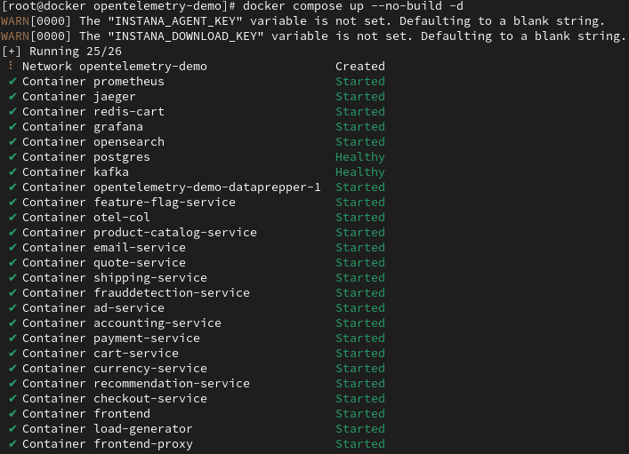
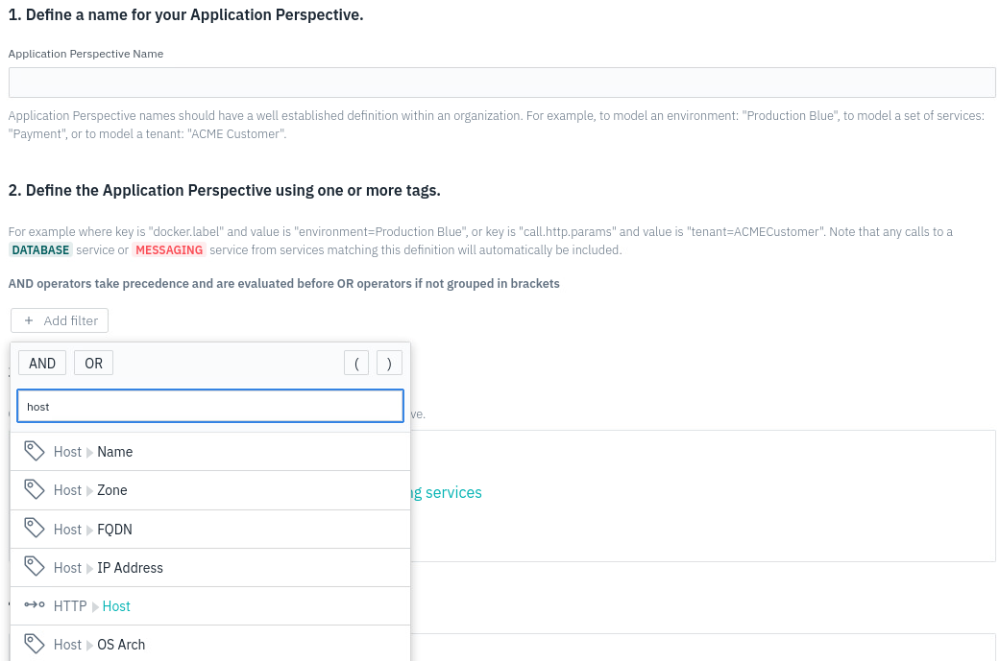
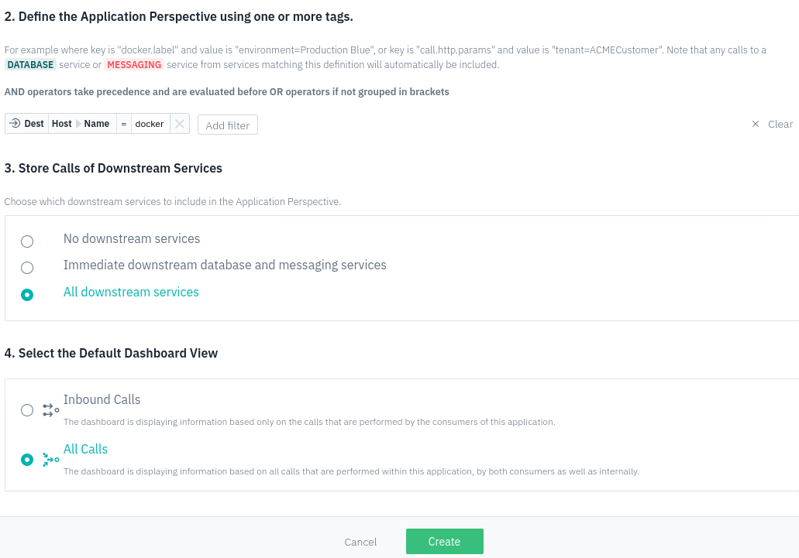

# OpenTelemetry instrumentation
For the purpose of this lab, we will use [Instana OpenTelemetry Demo Application](https://github.com/instana/opentelemetry-demo/tree/main)
which is the fork of generic [OpenTelemetry Demo Application](https://github.com/open-telemetry/opentelemetry-demo).

Instana's custom fork of the OpenTelemetry Demo Application is a microservice-based application, integrated with an Instana backend. 
The demo shows the native Instana OpenTelemetry data collection, correlation of OpenTelemetry tracing and the underlying monitored infrastructure, 
and an example of trace continuity between Instana tracing and OpenTelemetry.

OpenTelemetry Demo Application was already installed for you in the lab environment. 

OpenTelemetry is an open-source observability framework with a collection of software development kits (SDKs), vendor-neutral or vendor-agnostic APIs, and tools for instrumentation. 
This technology can generate, collect, export, and instrument telemetry data to analyze your platform's behavior and performance. Opentelemetry includes Traces, Metrics, and Logs.
Opentelemetry is also known as OTel. 
OpenTelemetry is included into Instana license, there's no additional payment required, but the monitored servers need to be licensed.

:::info
During these labs, we will be focusing on Otel Traces and Logs. Instana can also accept the Otel Metrics, but this is not a part of these labs.
:::

## Start the OpenTelemetry Demo Application

The OpenTelemetry Demo Application was already installed for you as a docker container. In order to start it, please follow the below steps:

Make sure your are logged into the Docker VM (the same as we used for the previous section)

In the terminal, navigate to the OpenTelemetry Demo Application directory

```sh
cd /root/opentelemetry-demo/
```

run the docker compose by using the below command

```sh
docker compose up --no-build -d
```

after few minutes, all of the components should be up and running as described below




## Verify OpenTelemetry Demo Application

Once the OpenTelemetry Demo Application was started, it is now time to verify
if the applications works and delivers metrics as expected.

Your instance of OpenTelemetry Demo Application is available under the http://docker:8080/, please copy the http://docker:8080/ url and paste it into the browser's address bar.
Please note the http in the address bar (not the HTTPS). 


Exercise the application to ensure it is working properly.

:::info
The OpenTelemetry Demo Application has an automated load running that will generate monitored transactions within Instana.
:::

## Create an Application in Instana

Within Instana, it is possible to view the OpenTelemetry Demo Application transactions via the "Analytics" tab or via the "All Services" view within "Applications", 
but normally, you want to have a view that is specifically tailored to your business application.

To create that customized view of the OpenTelemetry Demo Application, let's create an application perspective in Instana. Log in to your Instana instance and create new application perspective.


Switch to "Advanced mode"


As seen in the screen capture below: 
- First, provide application name of your choice (for example "My Demo Application")
- 2nd, select the "Add filter" button.
- 3rd, in the dialog, type the word "host" to filter the list.
- 4th, select Host -> Name" from the filtered list.



Continue defining the "Application Perspective" as seen in the dialog below.
- After selecting "Host -> Name", you will see a text box. If you click on the box, it should provide a list of your hosts. You can either select your host name ("docker") or you can type the name of the host.
- Next, select the "All downstream services" radio button.
- Select the "All Calls" radio button.
- Finally, click the "Create" button to create the application perspective.



The Instana UI will automatically switch your context to the new "Application Perspective". Initially, there will not be any data in the new "Application Perspective".  
Data will begin to be populated within a couple of minutes.

## Generate OpenTelemetry Demo Application traffic

Now that the "Application Perspective" has been defined and the demo application is up and running, you can either generate traffic via the UI or allow the automated load to execute. 
To manually generate traffic, go back to the OpenTelemetry Demo Application in the browser, click through the site and explore the page, add products to the cart, make some orders.


Once you have purchased some of the products, let's go back to the Instana UI, open your Application Perspective to see 
the captured traffic.


This view concludes this chapter. You are now able to see the traffic from your instance of the OpenTelemetry Demo Application captured by Instana. 
Let's move to the next sections.