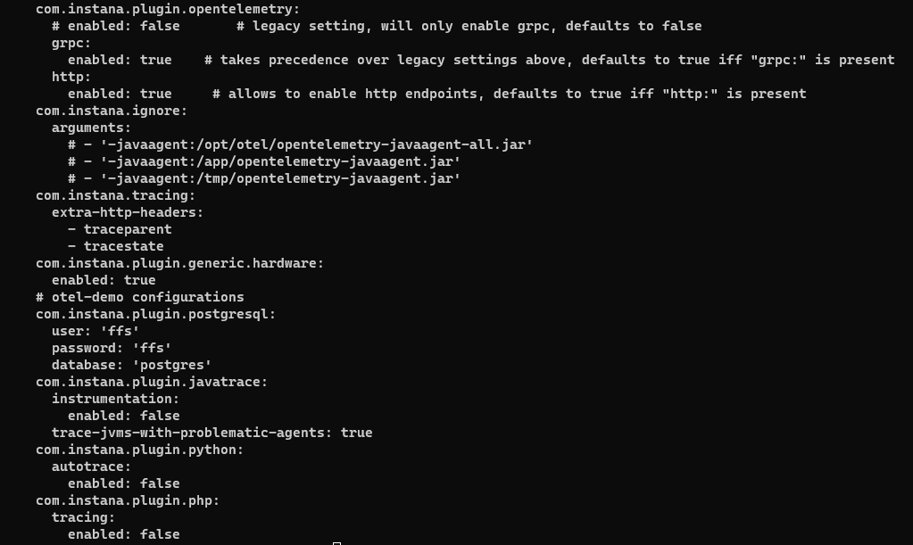
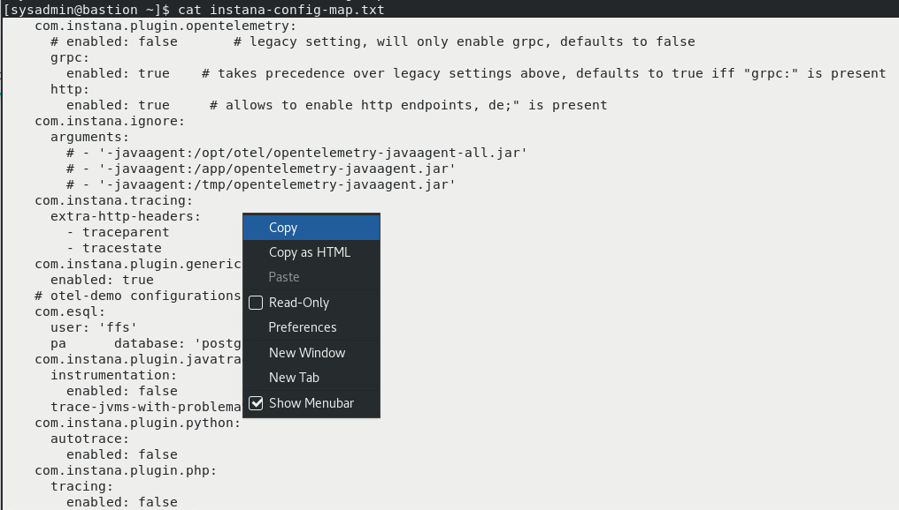
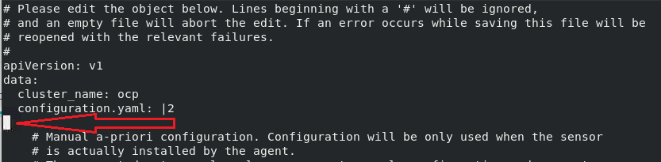
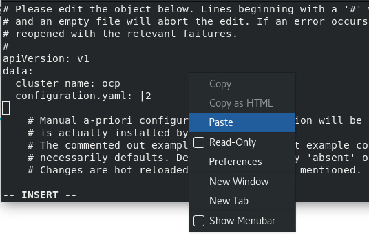
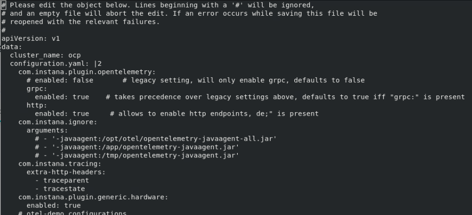
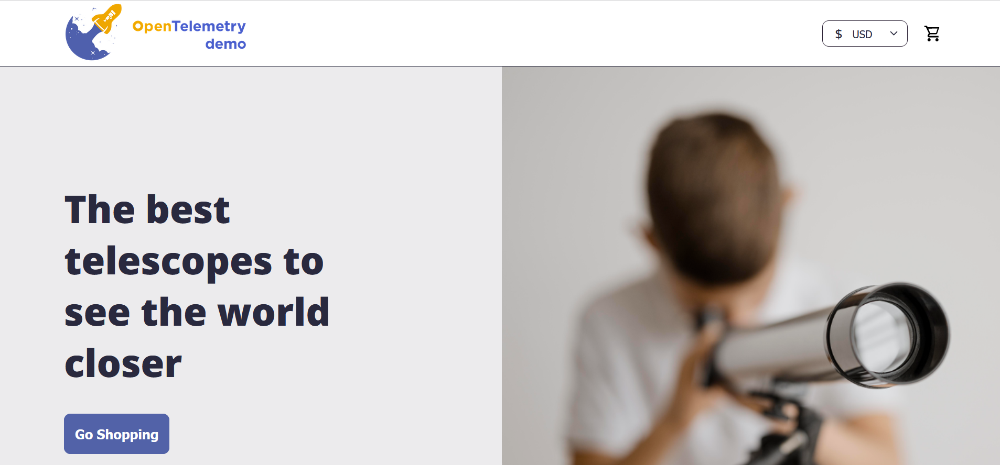
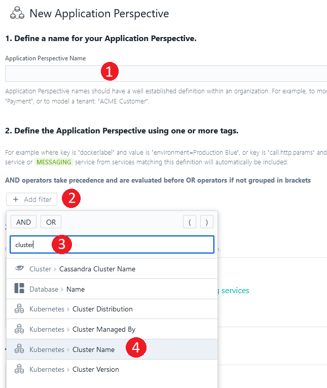
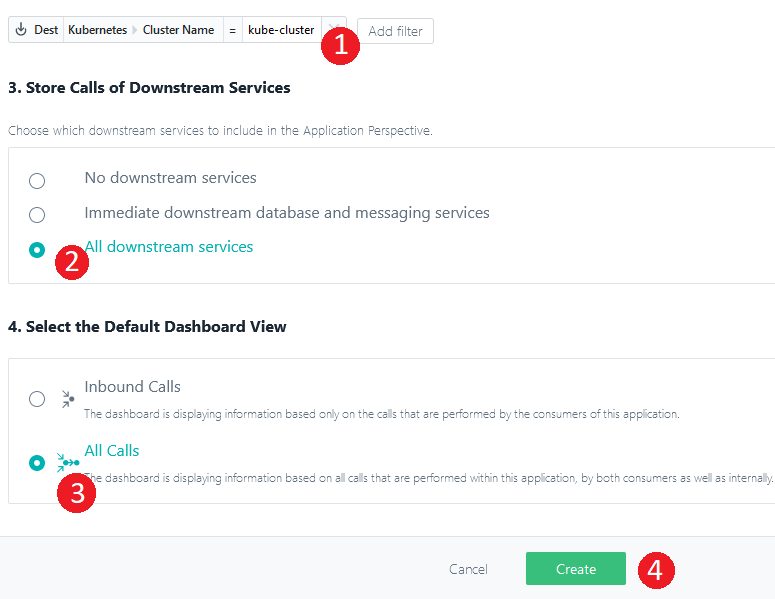

# OpenTelemetry instrumentation
For the purpose of this lab, we will use [Instana OpenTelemetry Demo Application](https://github.com/instana/opentelemetry-demo/tree/main)
which is the fork of generic [OpenTelemetry Demo Application](https://github.com/open-telemetry/opentelemetry-demo).

Instana's custom fork of the OpenTelemetry Demo Application is a microservice-based application, integrated with an Instana backend. 
The demo shows the native Instana OpenTelemetry data collection, correlation of OpenTelemetry tracing and the underlying monitored infrastructure, 
and an example of trace continuity between Instana tracing and OpenTelemetry.

OpenTelemetry Demo Application was already installed for you in the lab environment. The following steps are required to enable OpenTelemetry 
in the Instana agent.

OpenTelemetry is an open-source observability framework with a collection of software development kits (SDKs), vendor-neutral or vendor-agnostic APIs, and tools for instrumentation. 
This technology can generate, collect, export, and instrument telemetry data to analyze your platform's behavior and performance. Opentelemetry is also known as OTel. 
OpenTelemetry is included into Instana license, there's no additional payment required, but the monitored servers need to be licensed.

## Enable OpenTelemetry in Instana

Let's edit the configmap of instana-agent. We need to enable the OpenTelemetry settings within the instana-agent. They are not enabled by default.  
:::info
It is also possible to enable the Agent OpenTelemetry settings during the Helm Install by providing optional configuration parameters that can be found here: https://github.com/instana/helm-charts/tree/main/instana-agent
:::

Before editing the configmap, let's copy the content that needs to be added into your buffer.

Login to you Kubernetes cluster 
```sh
ssh root@10.100.1.60
```

In the terminal window, ensure your in the right directory (/root) and type "ls instana*".  You will see a file named "instana-config-map.txt" as seen below. The file is located in the /root folder
```sh
cd /root
ls instana*
instana-config-map.txt
```

Next, cat the file to view the content that needs to be added to the configmap.

```sh
cat instana-config-map.txt
```



Highlight all of the text and then right-click and select "Copy" as shown below.



Next, edit the configmap by typing the command shown below. Do NOT copy/paste this command or you will lose the configmap content from your clipboard.

```sh
kubectl edit configmap instana-agent --namespace instana-agent 
```

Within the configmap, move your mouse directly below the configuration.yaml line as seen below.




Then, type the letter "i" to change to "insert" mode.

Finally, right-click and select "Paste" to paste the additional text into the configmap.




The final structure of the configmap should look like the below example



:::warning
Please make sure the indentations are exactly as shown above. YAML file format is very sensitive when it comes to the white characters. Your input should look exactly like above.
:::


Save the file by typing ":wq" 

## Restart cluster workload

Restart all of the instana agents pods to ensure that configmap change was implemented.

```sh
kubectl rollout restart daemonset instana-agent --namespace instana-agent 
```

Restart will prompt with a message

```sh
daemonset.apps/instana-agent restarted
```

Restart all of the Otel Demo app pods to ensure the Instana injection was done.

```sh
kubectl -n otel-demo rollout restart deploy 
```

Restart will prompt with a message

```sh
deployment.apps/my-otel-demo-accountingservice restarted
deployment.apps/my-otel-demo-adservice restarted
deployment.apps/my-otel-demo-cartservice restarted
deployment.apps/my-otel-demo-checkoutservice restarted
deployment.apps/my-otel-demo-currencyservice restarted
deployment.apps/my-otel-demo-emailservice restarted
deployment.apps/my-otel-demo-featureflagservice restarted
deployment.apps/my-otel-demo-ffspostgres restarted
deployment.apps/my-otel-demo-frauddetectionservice restarted
deployment.apps/my-otel-demo-frontend restarted
deployment.apps/my-otel-demo-frontendproxy restarted
deployment.apps/my-otel-demo-kafka restarted
deployment.apps/my-otel-demo-loadgenerator restarted
deployment.apps/my-otel-demo-paymentservice restarted
deployment.apps/my-otel-demo-productcatalogservice restarted
deployment.apps/my-otel-demo-quoteservice restarted
deployment.apps/my-otel-demo-recommendationservice restarted
deployment.apps/my-otel-demo-redis restarted
deployment.apps/my-otel-demo-shippingservice restarted
```

## Verify OpenTelemetry Demo Application

Once the instana-agent and OpenTelemetry Demo Application were restarted, it is now time to verify
if the applications works and delivers metrics as expected.

Your instance of OpenTelemetry Demo Application is available under the https://otel-demo.ocp.ibm.edu/
Let's use a browser to open that page. Please note the https in the address bar. 
Also, do not worry about the security message - accept the self-signed certificate.



Exercise the application to ensure it is working properly.

:::info
The OpenTelemetry Demo Application has an automated load running that will generate monitored transactions within Instana.
:::

## Create an Application in Instana

Within Instana, it is possible to view the OpenTelemetry Demo Application transactions via the "Analytics" tab or via the "All Services" view within "Applications", 
but normally, you want to have a view that is specifically tailored to your business application.

To create that customized view of the OpenTelemetry Demo Application, let's create an application perspective in Instana. Log in to your Instana instance and create new application perspective.


Switch to "Advanced mode"


As seen in the screen capture below: 
- First, provide application name of your choice
- 2nd, select the "Add filter" button.
- 3rd, in the dialog, type the word "cluster" to filter the list.
- 4th, select "Kubernetes -> Cluster Name" from the filtered list.



Continue defining the "Application Perspectiv" as seen in the dialog below.
- After selecting "Kubernetes -> Cluster Name", you will see a text box.   If you click on the box, it should provide a list of clusters.  You can either select your cluster name or you can type the name of the cluster.
- Next, select the "All downstream services" radio button.
- Select the "All Calls" radio button.
- Finally, click the "Create" button to create the application perspective.



The Instana UI will automatically switch your context to the new "Application Perspetive".  Initially, there will not be any data in the new "Application Perspetive".  
Data will begin to be populated within a couple of minutes.


## Generate OpenTelemetry Demo Application traffic

Now that the "Application Perspective" has been defined and the demo application is back up and running, you can either generate traffic via the UI or allow the automated load to execute. 
To manually generate traffic, go back to the OpenTelemetry Demo Application in the browser, click through the site and explore the page, 
add products to the cart, make some orders.


Once you have purchased some of the products, let's go back to the Instana UI, open your Application Perspective to see 
the captured traffic.


This view concludes this chapter. You are now able to see the traffic from your instance of the OpenTelemetry Demo Application captured by Instana. 
Let's move to the next sections.