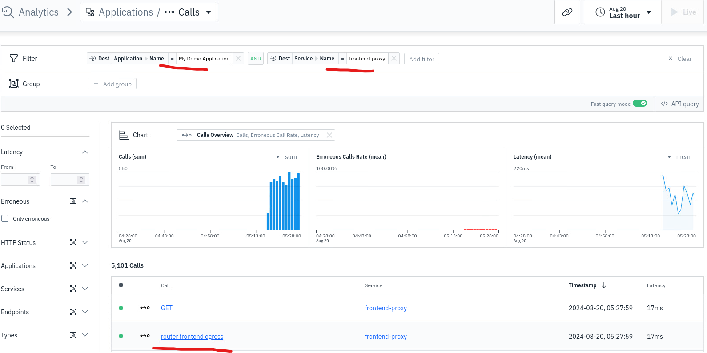
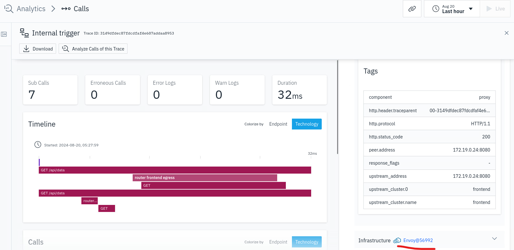
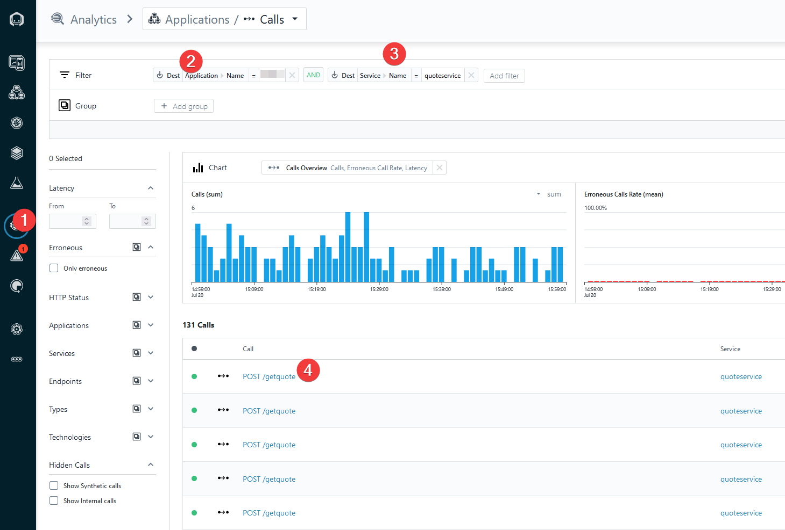
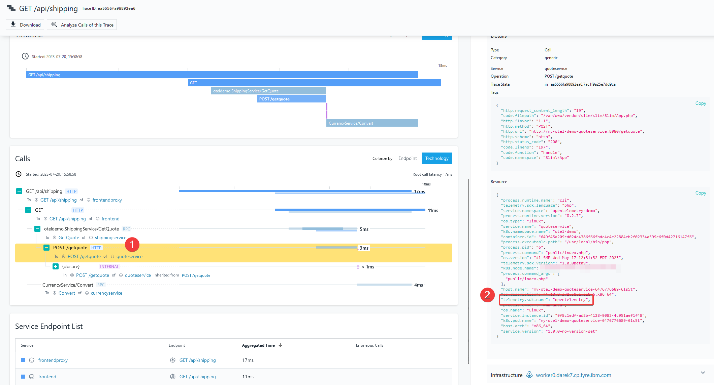
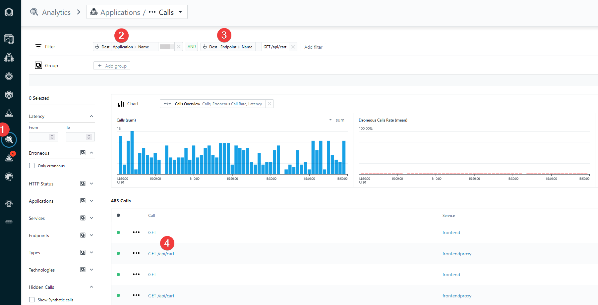
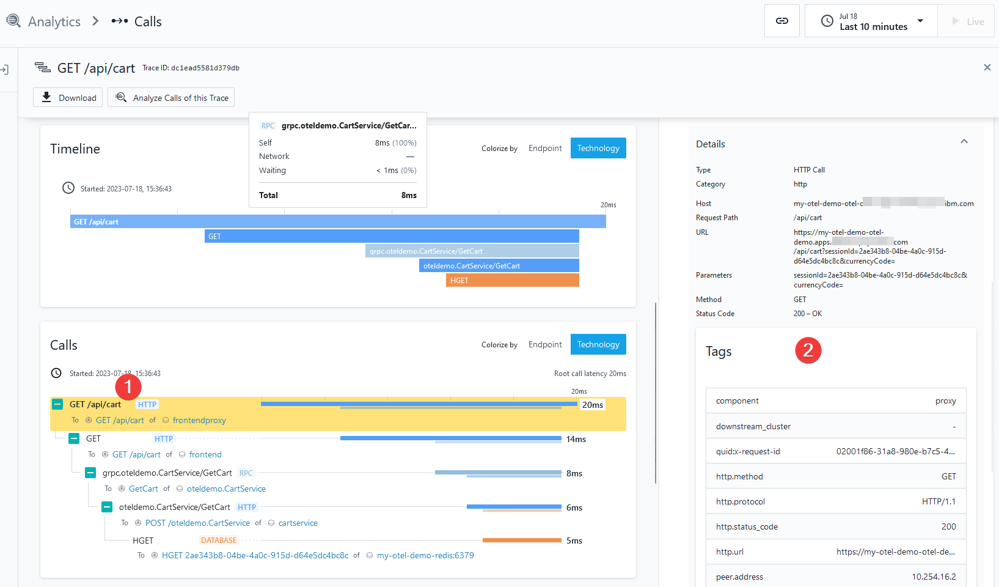
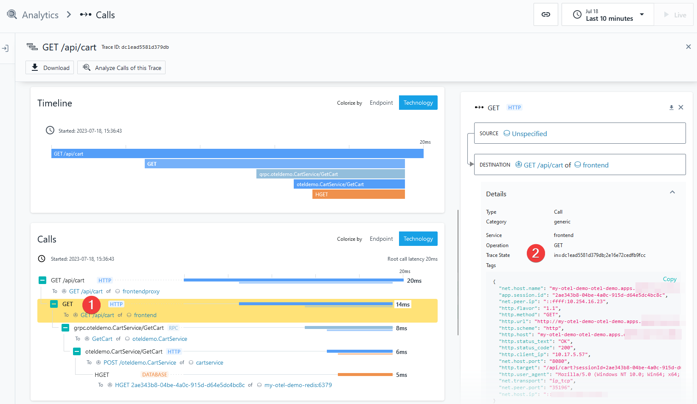

## Explore Instana and OpenTelemetry traces

Now, once the Instana and OpenTelemetry Demo Application are in sync, you can start exploring the captured data.

## Instana native tracing

In this section you will focus on exploring Instana's native tracing capabilities. 

:::note
Please note, that we could explore the OpenTelemetry traces via the Application Perspective created earlier, but in this section, we want to show how to use "Analytics" within Instana
:::

Within the Instana UI, select Analytics. Then, add two Filter criteria as shown below.

- Application name: your application name
- Service name: frontend-proxy

You'll need to specify an "AND" condition between the two filter parameters.

:::info
Please note, that you can change the time window in the top right corner of the Instana UI. For the purpose of the lab, let's use "one hour" view

:::

Click on the "router frontend egress" as shown on the below screen



On the right side of the screen you will notice tags and call parameters, together with an Infrastructure information - EnvoyProxy. 
This means that Instana injected its own tracing libraries into the proxy application.

:::note
Instana native traces tags are always represented as a well-formated table
:::



:::note
Worth to notice: filtered view shows 100% of the transaction traces that are going through the application. This is one of the key Instana's strengths - Instana will capture 100% of transactions.
:::

## OpenTelemetry tracing

Using Instana agent, you can also receive OpenTelemetry based traces. Let's find an example in your environment.
Go to Instana UI/Analytics (1) and search for calls which meet these criteria: 

- Application name: your application name (for example: "My Demo Application") (2)
- Service name: quoteservice (3)

Click on the call link (4) to see the transaction details.



You can select different calls within the call stack and the context on the right will change.  

Select the "POST /getquote" call and then look at the right side of the screen. You will find there a list of json attributes captured by Instana. One of them is called 
"telemetry.sdk.name" with a value "opentelemetry", which proves that the content is coming from the OpenTelemetry tracer.

Notice that the trace context is quite different from the formatting when looking at a native Instana trace.



:::note
Instana Otel traces tags are always represented as a JSON-structured content
:::

## Instana and OpenTelemetry combined traces

One of the key capabilities within Instana is the ability to stitch together traces using Instana's proprietary tracing and OpenTelemetry traces into a single application trace.
Without this unique capability, you would be "required" to instrument your entire application with OpenTelemetry. This can be a significant challenge, 
particularly when there are shared services. That means, ALL of applications that use the shared service, would need to be converted to OTEL simultaneously (otherwise, there could be a gaps in the monitoring).

Please follow the below instructions to find an example of such a transaction in your environment.

Go to the UI and add "Filters" to filter an application and add an "AND" condition to filter an endpoint name /api/cart like presented below.
Click on /api/cart to see the details of the call.



Click on the first call as highlighted on the below screen in a point (1). The point (2) represents the captured data. 
The content was delivered by a native Instana tracing.  You can tell based on the formatting of the Tags.



Click on the second call within the call stack as described below in a point (1). The details on the right (2) represents the captured data which comes 
from the OpenTelemetry tracer.



The above example shows how Instana can combine traces from both OpenTelemetry and Instana tracing and stitch them together into a single application transaction.

## Instana native tracing - code examples

:::info
Code examples section of this lab is strictly informational - there's no need to implement or run the code during the labs
:::

Instana can provide combined traces from the OpenTelemetry and Instana native tracing. In the below example, you can see, how to 
use native Instana instrumentation techniques. In the below snippet, we follow [Envoy tracing configuration described here](https://www.ibm.com/docs/en/instana-observability/current?topic=technologies-monitoring-envoy-proxy#configuring-distributed-tracing)

As an outcome, Instana will inject its code and capture tracing of a calls, which were processed by the Envoy proxy.

```bash
FROM envoyproxy/envoy:v1.25-latest
RUN apt-get update && apt-get install -y gettext-base wget ca-certificates && apt-get clean && rm -rf /var/lib/apt/lists/*

USER envoy
WORKDIR /home/envoy
COPY ./src/frontendproxy/envoy.tmpl.yaml envoy.tmpl.yaml

# Instana tracing
ARG ARTI_PATH='https://artifact-public.instana.io/artifactory/shared/com/instana/libinstana_sensor/'
ARG INSTANA_AGENT_KEY
ARG INSTANA_DOWNLOAD_KEY
RUN access_key=$([ ! -z "${INSTANA_DOWNLOAD_KEY}" ] && echo "${INSTANA_DOWNLOAD_KEY}" || echo "${INSTANA_AGENT_KEY}") \
    && wget --user _ --password ${access_key} --output-document=./list.html ${ARTI_PATH} \
    && sensor_version=$(grep -o "href=\"[0-9]\+\.[0-9]\+\.[0-9]\+/\"" ./list.html | tail -n1 | cut -d'"' -f2) \
    && echo "Using sensor version ${sensor_version}" \
    && wget --user _ --password ${access_key} --output-document=/home/envoy/libcxx-libinstana_sensor.so ${ARTI_PATH}${sensor_version}linux-amd64-libcxx-libinstana_sensor.so

ENTRYPOINT ["/bin/sh", "-c", "envsubst < envoy.tmpl.yaml > envoy.yaml && envoy -c envoy.yaml;"]
```

Please note the use of libcxx-libinstana_sensor.so library.

[The source code is available here](https://github.com/instana/opentelemetry-demo/blob/main/src/frontendproxy/Dockerfile)

## OpenTelemetry tracing - code examples

:::info
Code examples section of this lab is strictly informational - there's no need to implement or run the code during the labs
:::

If you wish to use OpenTelemetry in your application, here is the example snippet which can show, how to build the proper instrumentation. 

```php
use OpenTelemetry\API\Common\Instrumentation\Globals;
use OpenTelemetry\API\Trace\Span;
use OpenTelemetry\API\Trace\SpanKind;
use Psr\Http\Message\ResponseInterface as Response;
use Psr\Http\Message\ServerRequestInterface as Request;
use Slim\App;

function calculateQuote($jsonObject): float
{
    $quote = 0.0;
    $childSpan = Globals::tracerProvider()->getTracer('manual-instrumentation')
        ->spanBuilder('calculate-quote')
        ->setSpanKind(SpanKind::KIND_INTERNAL)
        ->startSpan();
    $childSpan->addEvent('Calculating quote');

    try {
        if (!array_key_exists('numberOfItems', $jsonObject)) {
            throw new \InvalidArgumentException('numberOfItems not provided');
        }
        $numberOfItems = intval($jsonObject['numberOfItems']);
        $quote = round(8.90 * $numberOfItems, 2);

        $childSpan->setAttribute('app.quote.items.count', $numberOfItems);
        $childSpan->setAttribute('app.quote.cost.total', $quote);

        $childSpan->addEvent('Quote calculated, returning its value');
    } catch (\Exception $exception) {
        $childSpan->recordException($exception);
    } finally {
        $childSpan->end();
        return $quote;
    }
}

return function (App $app) {
    $app->post('/getquote', function (Request $request, Response $response) {
        $span = Span::getCurrent();
        $span->addEvent('Received get quote request, processing it');

        $jsonObject = $request->getParsedBody();

        $data = calculateQuote($jsonObject);

        $payload = json_encode($data);
        $response->getBody()->write($payload);

        $span->addEvent('Quote processed, response sent back', [
            'app.quote.cost.total' => $data
        ]);

        return $response
            ->withHeader('Content-Type', 'application/json');
    });
};
```

Please note the use of OpenTelemetry/API and further use of the span builders.

[The source code can be found here](https://github.com/instana/opentelemetry-demo/blob/main/src/quoteservice/app/routes.php)

## Section summary

To summarize, you have seen how Instana can ue both proprietary tracing and OpenTelemetry to instrument application transactions. 
And, it has the unique ability to combine those traces into a single application transaction that can be traced end-to-end. 
This allows customers to gradually transition their applications and shared services over to OpenTelemetry without losing end-to-end visibility.