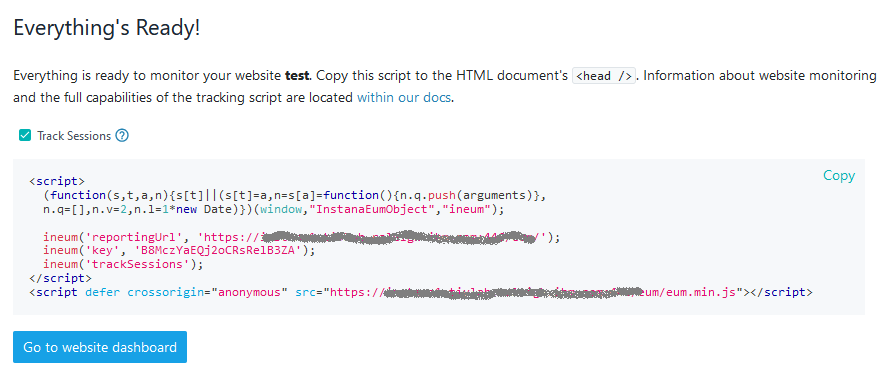
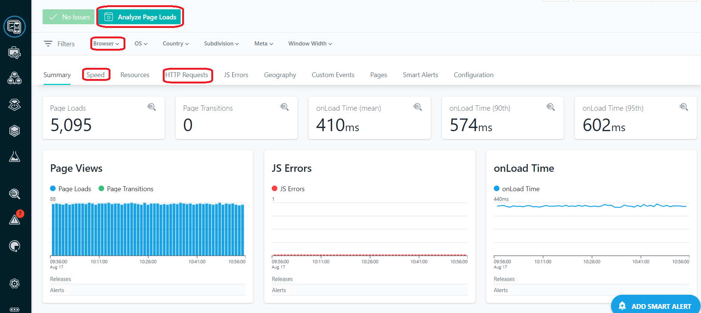

## Instana web-application end-to-end monitoring

In this section we will learn how to create a Web Application in Instana, 
which will allow us to capture end-to-end web transactions.

## Create a Web Application in Instana
Log in to your Instana UI, click on Web application and Add Website


Provide a name of your choice, click Next to get the screen with reportingURL and key. Please save the key value, 
we will be using this later during the lab.  The key value is unique for every website that is defined within Instana.  
The reporting URL will also be used to configure the EUM monitoring in the application.



Once the above step is ready, we can move to the next and edit the OpenTelemetry settings.

## Update the OpenTelemetry with a new reportingURL and key

Go back to your terminal and run the following commands

```sh
kubectl edit deploy my-otel-demo-frontend -n otel-demo
```

Find the string "EUM" (you can use "/EUM" command in your text editor)


Apply the values as described on the below: 

Set the INSTANA_EUM_URL to https://eum.apps.ocp.ibm.edu (no trailing slash!)

Notice that in the yaml, you must add a new line of text with the word "value:" and specify the URL for the value as seen below.

Do the same for the INSTANA_EUM_KEY.  Use the key value that you obtained from the Instana UI.  Again, add an additional line to the yaml and specify "value: &lt;key value&gt;" as seen below.

Pay careful attention to the spacing since this is yaml.  The word "value" must line up with the word "name" from the previous line of text.


Save the file by entering ":wq"

## Generate traffic on the OpenTelemetry Demo Application

Go back to your OpenTelemetry Demo Application and refresh the page, then please run test traffic through the page (view products, add to cart, checkout, etc.)
Thanks to this, Instana will capture the end-to-end traffic starting from the web activity, down to the services and databases level.

View the web traffic in the newly created "website" within the Instana UI.  Feel free to click on some of the tabs and "Analyze Page Loads" button to view the website details.

