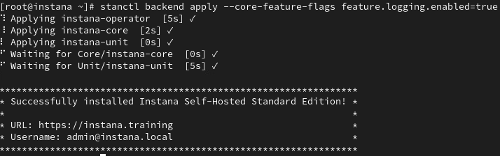
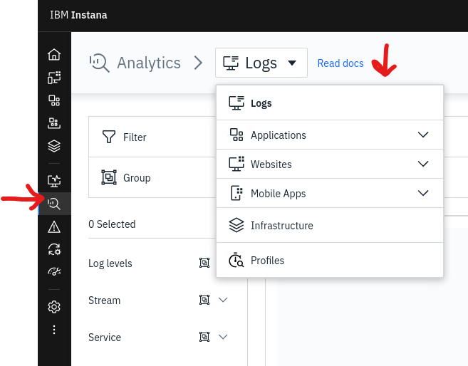
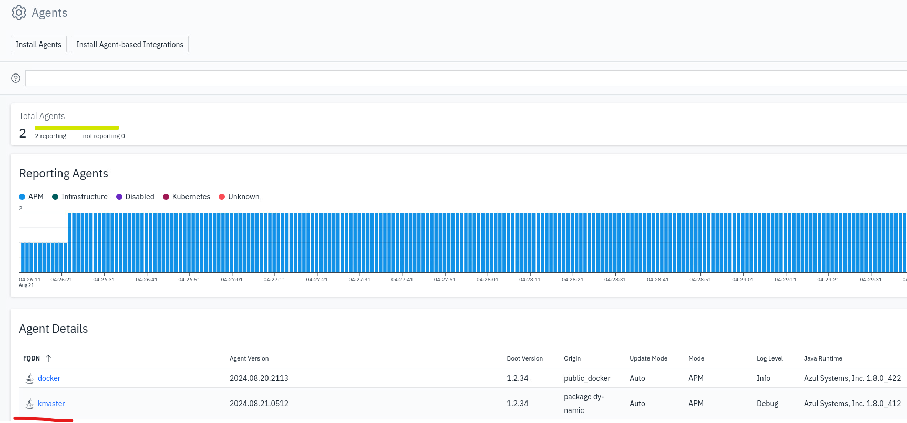
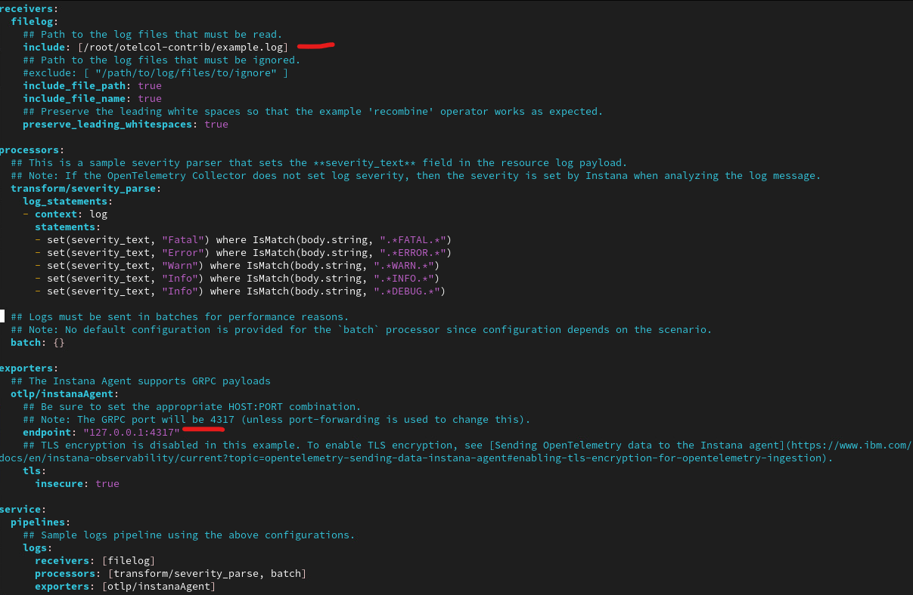
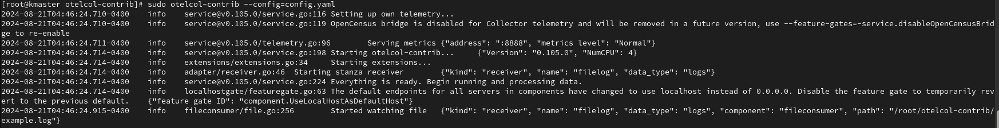
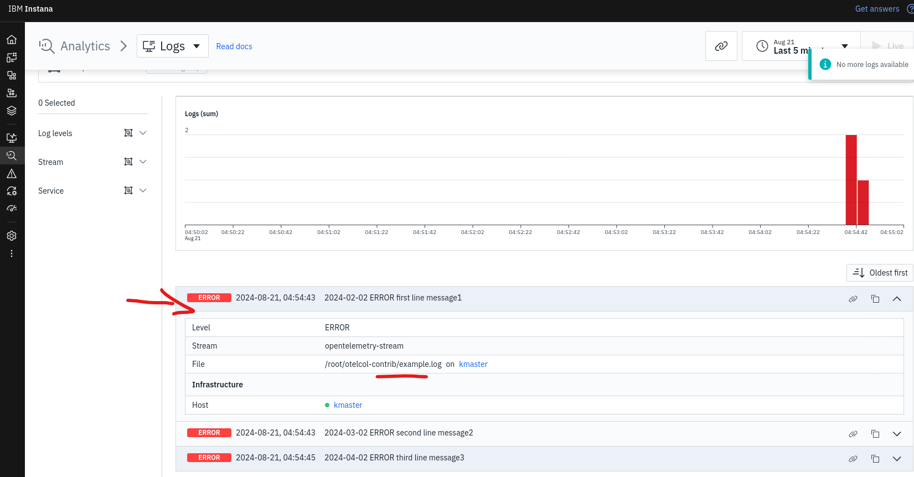

## Introduction

Besides the application metrics and tracing, OpenTelemetry standard also supports ingesting log content. In this scenario, you will learn how to deliver logs to the Instana backend using OpenTelemetry Contrib Collector.

## OpenTelemetry Collector

The OpenTelemetry Collector offers a vendor-agnostic implementation of how to receive, process and export telemetry data. It removes the need to run, operate, and maintain multiple agents/collectors. This works with improved scalability and supports open source observability data formats (e.g. Jaeger, Prometheus, Fluent Bit, etc.) sending to one or more open source or commercial backends. The local Collector agent is the default location to which instrumentation libraries export their telemetry data.

OpenTelemetry collector objectives:

- Usability: Reasonable default configuration, supports popular protocols, runs and collects out of the box.
- Performance: Highly stable and performant under varying loads and configurations.
- Observability: An exemplar of an observable service.
- Extensibility: Customizable without touching the core code.
- Unification: Single codebase, deployable as an agent or collector with support for traces, metrics, and logs.

## Instana backend - configuration

Instana Logging feature is available as a beta functionality, which means, it requires additional configuration inside the Instana backend. In order to enable logging feature, please follow the below steps:

Use the ssh terminal and login to the instana backend server

```bash
ssh root@instana
```

Enable the logging feature by running the below command

```bash
stanctl backend apply --core-feature-flags feature.logging.enabled=true
```

after the changes, you should see the below message 



you can close this terminal window by running the below command:

```bash
exit
```

## Instana backend - verification 

After applying backend changes, please navigate to the Instana UI / Analytics / Logs - if the Logs section is visible, it means the Instana backend is ready to accept the OpenTelemetry log content. Please confirm your Instana instance with the below screenshot




## Instana agent - configuration

In this scenario, you will configure OpenTelemetry Collector to send OpenTelemetry data to Instana backend through the Instana agent. First, you need to make sure, the Instana agent is up and running on the "kmaster" host. 

The agent was pre-installed into your Lab environment.

Open a new terminal window and login to the "kmaster" host using the below command:

```bash
ssh root@kmaster
```

Please run the following command to start the agent on "kmaster" host:

```bash
systemctl start instana-agent
```

After few minutes, please check the Instana UI and confirm the new agent is reporting data to the Instana backend. You should see similar content to the screen below:




## OpenTelemetry Collector - configuration

Once the Instana agent is up and running, you can configure the OpenTelemetry Collector. 

OpenTelemetry Collector was already pre-installed into your environment. Please check the below information about the installation, but remember you don't need to install the collector during this Lab

:::note
Please review this installation steps https://opentelemetry.io/docs/collector/installation/. 

During this scenario, we will be using OpenTelemetry Collector Contrib https://github.com/open-telemetry/opentelemetry-collector-contrib, which is more advanced version of the standard Collector.
:::

Let's review the OpenTelemetry Collector configuration file, by viewing config.yaml:

```bash
cd /root/otelcol-contrib
vim config.yaml
```

There are two key elements of the configuration file:
- log file which will be monitored (in our case - /root/otelcol-contrib/example.log)
- OTLP endpoint (in our case - 127.0.0.1:4317)



The file is ready to be used by the OpenTelemetry collector, let's close the configuration file:

```bash
<escape> q!
```

and start the OpenTelemetry Collector service 

```bash
sudo otelcol-contrib --config=config.yaml
```

after a moment you should be able to see information about the service waiting for the events like on below screen



The service is now ready to accept the log changes. Please keep this terminal window open (do not stop the service) and move to the next section.

## Log content creation

Now, let's simulate new log entries creation - the goal is to be sure that OpenTelemetry Collector will send the log data, throught the Instana agent to the Instana backend.

Please open a new terminal and login (again) to the "kmaster" host. We need two active sessions, because the previous one keeps the OpenTelemetry Collector up and running. Please login to the "kmaster" host:

```bash
ssh root@kmaster
```

navigate to the OpenTelemetry directory

```bash
cd /root/otelcol-contrib
```

run these commands, which will add new lines into the existing log file

```bash
echo "2024-02-02 ERROR first line message1" >> example.log
echo "2024-03-02 ERROR second line message2" >> example.log
echo "2024-04-02 ERROR third line message3" >> example.log
```

## Instana verification

After a short moment, please navigate to the Instana UI / Analytics / Logs section and confirm, you can see three logs entries delivered by the Agent using the OpenTelemetry standard. You should be able to see similar content to the below screenshot:



It was shown, that Instana can accept custom log content, using external OpenTelemetry Collector.

## Summary

This section concludes the Lab.

:::info
Please review additional information about OpenTelemetry Collector filelog receiver https://github.com/open-telemetry/opentelemetry-collector-contrib/tree/main/receiver/filelogreceiver
:::