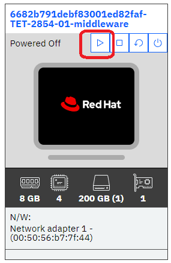

# Lab Environment

The lab environment includes 4 virtual machines.

1. **k8control** - This is a single node kubernetes cluster.  During the lab, students will be setting up monitoring for the kubernetes cluster.
2. **student** - This is a Linux VM with a GUI interface.  Students will be using this VM to do their work.
3. **middleware** - This is a traditional Linux virtual machine that students will be intrumenting with a monitoring Agent. The VM includes IBM DB2 UDB.
4. **Instana** - This is a Red Hat VM where students will be installing the Standard Edition Instana server.

All key passwords including the root password and DB2 password for the db2inst1 user are **Passw0rd**

:::note

- Some of the prereqs for installing the Instana server have already been executed.  But, the lab will document the key requirements.
- The IP addresses are shown at the bottom of each virtual machine in the diagram below.

:::

## Prerequisites

To complete this lab you will require the following:

- Instana License
  - Download/Agent Key 
  - Sales Key

  You can obtain the Download/Agent Key and Sales Key from the box folder that is reference in the PDF introduction.  
  Within the Box folder, you will see file named **TechXchange Download & Sales Key.boxnote**  Open this file.
  It is best to open the box folder within the student VM to make it easier and more reliable to copy/paste.

## Accessing the Environment

Once you are given access to a lab environment, you will see four virtual machines.  They should all be green, indicating that they are running.
If the VMs are not green, click on the start arrow to start the VM(s).

Next, click on the **student** VM to bring up the Linux desktop.  Within the desktop, you will see icons where you can launch firefox
as well as terminal windows.

## Copy/Paste in the Lab Environment

During the lab, it will be necessary to copy and paste text from the installation documentation into a terminal window on the virtual machine.  There are two ways to achieve this.
- Option 1: The lab guide is bookmarked within the **student** VM.  You can copy/paste directly within the VM by highlighting text, doing a right click and selecting **Copy**

Then, right click and **paste** where you want to paste the text.

- Option 2: The other option is to use the lab environment to paste text from your desktop machine into the lab VM.   The lab environment provides a tool for doing that.
As seen in the image below, first click on the 4th icon on the menu bar.   A dialog will open.  2nd, paste the text into the dialog box.   
Finally, click the **Send Text** button.  The text will be pasted into the VM window that currently has focus.