# Agent Installation

## 4.1: Instana Agent Deployment Options

Instana has a variety of agent installation options including the mirror
repository and static agents that allow customers to meet strict change control
processes. Some of the available options are listed below:

- OS specific installer (Linux, MacOS, Windows, UNIX)
- Container setup
- Docker (and other container managers)
- Kubernetes
- OpenShift
- Hosted Cloud Services
- Serverless component

All above mentioned methods are accessible via the wizard on the Instana UI

:::caution Important

The Instana agent install requires **root** privileges in order to gain the full benefits of the monitoring capabilities, including auto-discovery and auto-instrumentation.

:::

When installing Instana agent you have to select if you want the agent to be
**dynamic** or **static** based on whether it can update itself or not. Here is
the excerpt from the
[Instana agent documentation](https://www.ibm.com/docs/en/SSE1JP5_current/src/pages/setup_and_manage/host_agent/index.html).

- A **Dynamic** host agent downloads on startup the latest set of sensors from
  repositories. By default, a dynamic agent updates itself daily with the latest
  and greatest capabilities that are released. It is also possible to tightly
  control the updating of dynamic host agents by
  [pinning a version](https://www.ibm.com/docs/en/instana-observability/current?topic=agents-configuring-updates-dynamic-host#version-pinning)

  By default, dynamic host agents use the Instana repository to pull updates,
  but it is possible to
  [set up your own managed mirror](https://www.ibm.com/docs/en/instana-observability/current?topic=agents-setting-up-agent-repositories-dynamic-host).
  Currently, the mirror must be a Nexus repository. This is probably the best
  option for must customers because it allows them the benefits of automatic
  updates, while at the same time controlling the content that is in the
  repository.

- A **Static** host agent is a self-contained host agent that includes all the
  latest available components at the time of its release, and has no dynamic
  update capabilities. The static host agent has a stable "bill of materials"
  that never changes after the host agent's installation.

:::tip

Static host agents require no internet connection to the Instana repository, and
are recommended in restrictive network setups or strict change control processes.

:::

---

## 4.2: Installing Instana Agent on a Linux VM

We will start by installing the Instana Agent on the middleware Linux VM that is running
IBM DB2

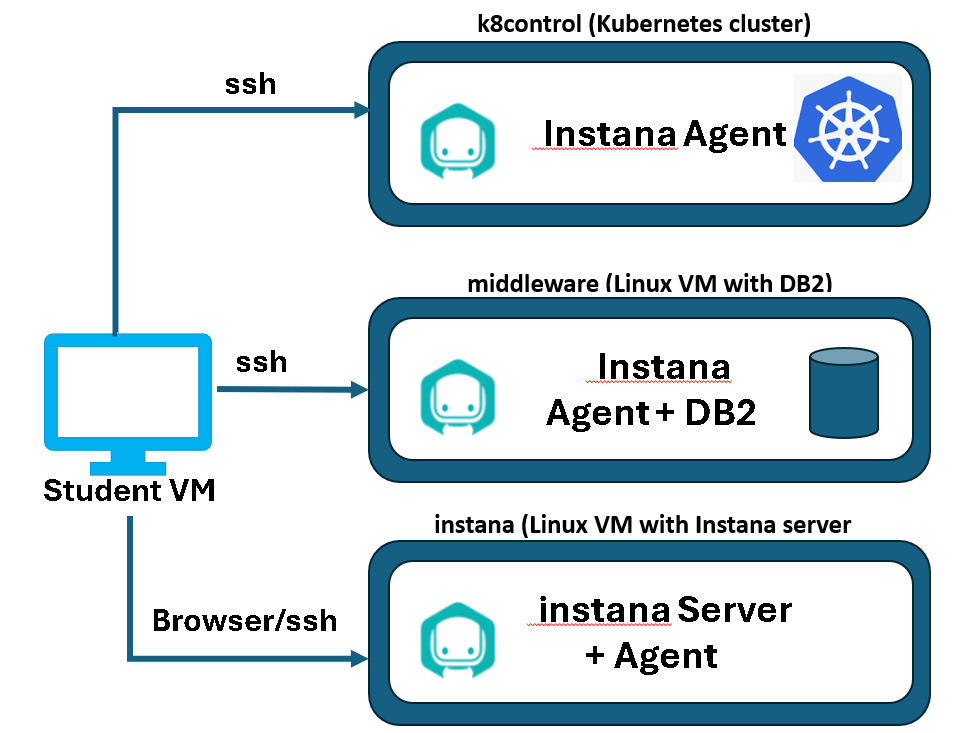

Open a new terminal tab by selecting **File** -> **New Tab** or launch a new terminal window.

SSH to the middleware server as follows:

```sh
ssh root@middleware
```

When prompted, type **Passw0rd** for the root password.

Assuming you haven't clicked on anything, your Firefox browser should be showing the welcome screen.
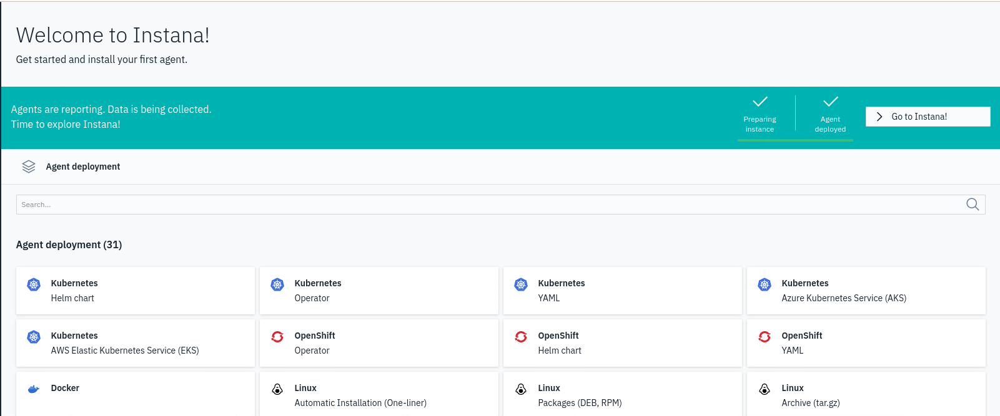

:::tip

If you aren't on the **Welcome** screen or **Installing Instana Agents** screen you can get there by
selecting the **"Home"** icon in the upper left corner and then clicking
the **"Deploy Agent"** button near the upper right corner.

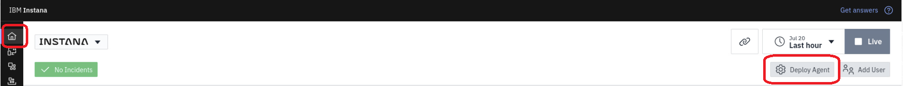

:::

On this screen, you will see all of the Installation options that can be used to install the Instana Agent.  
Look at the boxes labeled **Linux**.  You will see a few options including the **Automatic Installation (One-liner)**, **Packages (DEB, RPM)**, and **Archive tar.gz**.
All of these options will work. It just depends on your preferences.  However, the easiest and suggested option for is to use the **Automatic Installation (one-liner)**. 

This installation option requires access to an Agent and sensor repository.  The repository can be mirrored internally or is available externally.  For this lab, we will use the external repository.

Click on the box labeled **Automatic Installation (one-liner)**.  

You will see a configuration panel as seen below.  There are a few key options that are highlighted.  With one exception, you should be able to use the defaults and simply copy/paste the curl command.  

The one option that you do want to change is to select the checkbox to **Install and start as a service**.  This will ensure that the Agent starts automatically when the server reboots.

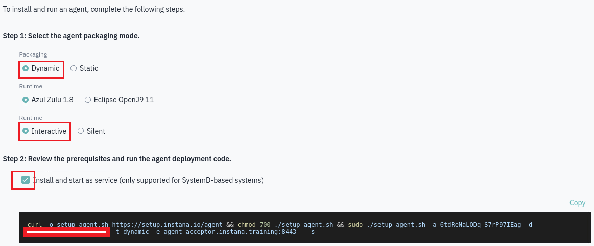


You are now ready to begin the install.   Copy the curl command from the Instana user interface and paste it into the terminal window where you are logged into the **middleware** virtual machine.

Next, you will be prompted to confirm the install.  Answer **`y`** when prompted.

Once complete you will see the below:

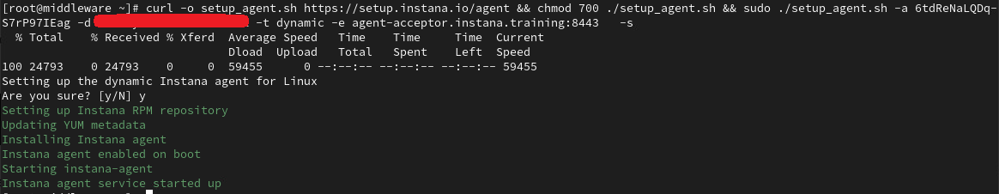

At this point the Agent is installed and up and running. You can confirm this by
running:

```sh
ps -ef | grep instana
```

You should see a process running, the short version looks like this:

```sh
root       22012       1 99 12:35 ?        00:00:11 /opt/instana/agent/jvm/bin/java
```

The Agent will automatically start monitoring the operating system and start
discovering key processes and middleware. In many cases it will automatically
instrument those technologies. In the case of some technologies (eg. IBM App Connect Enterprise and DB2), there are manual configuration steps required due to
the need to provide credentials for accessing those applications.

Let's configure one of those technologies that require configuration.  In this case, the DB2 sensor requires some configuration parameters.

From the terminal window on the middleware VM, edit the Instana configuration.yaml file by typing:

```sh
vi /opt/instana/agent/etc/instana/configuration.yaml
```

This configuration.yaml file has a number of parameters that can be configured.  For example, you can define a **zone** where the VM will appear in the Infrastructure view.

Please remember that yaml files are very sensitive to spacing.  Each line must be indented by 0, 2, 4, 6, spaces, etc. and must be indented with spaces and not tabs.

Search for **Hardware & Zone** by typing:
```sh
/Hardware
```
You will be taken to the **Hardware & Zone** section.  Uncomment the last 3 lines in the section and change the value for the availability-zone to **lab**.

The file should now look like this:

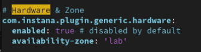

Next, let's edit the configuration for the DB2 sensor.  DB2 requires key configuration information such as the port and credentials in order to monitor the databases.

For more information on configuring the DB2 sensor see the [DB2 sensor documentation](https://www.ibm.com/docs/en/instana-observability/current?topic=technologies-monitoring-db2#configuring-ibm-db2-sensor).

Within the configuration.yaml file, type the following to search for the DB2 section.
```sh
/DB2
```

Within this section, you will see many options including both local and remote monitoring.  We will configure local monitoring.
Uncomment the lines shown in the picture below.  You should uncomment 8 lines in the configuration.yaml file.  Then, change the following values:

Change the **port** value to **25010**
Change the **password** value to **Passw0rd**
Change the database name from **database1** to **TEST**

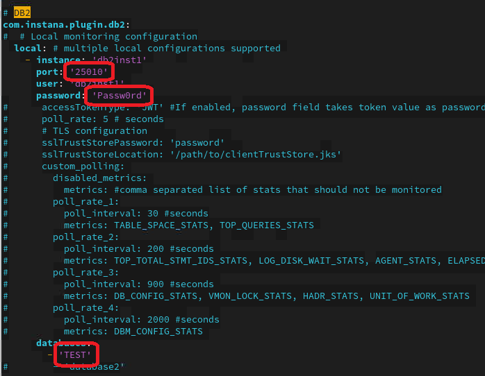

:::info

You may notice that we are putting a password into a configuration file.  Since we don't need our passwords to be secure for this lab, we are entering them directly in the file.

But, Instana does have an option to store sensitive information in kubernetes secrets, [IBM Cloud Secret Manager](https://www.ibm.com/docs/en/instana-observability/current?topic=cha-configuring-host-agents-by-using-agent-configuration-file#ibm-cloud-secrets-manager) or in [Hashicorp vault](https://www.ibm.com/docs/en/instana-observability/current?topic=cha-configuring-host-agents-by-using-agent-configuration-file#hashicorp-vault).

:::

The configuration yaml file contains many other options including monitoring **custom processes**, **filesystems**, **custom java classes** and much more. 

:::info

Updates to the configuration.yaml file are read dynamically by the Instana Agent.  As soon as you save your changes to the file, the Instana Agent will read the changes use the configuration settings that you made.

:::

---

## 4.3: Installing Instana Agent on the Kubernetes Cluster

The next step is to install the Instana Agent into the **k8control** Single Node
kubernetes cluster.  This cluster has **Robot Shop** application installed and running with automated application traffic.


:::tip

Throughout this lab, we will be using the **kubectl** command to run commands within
the kubernetes cluster. We will also be using the **helm** command to perform the Agent install.  


:::

**Open another tab in your terminal** or open a new **terminal** window. 

From the terminal window, ssh to the k8control server by typing:

```sh
ssh root@k8control
```

If prompted, type **Passw0rd** for the root password.

You should now be logged into the virtual machine that is running kubernetes.   

Check to make sure you are in the right place by running the following:

```sh
kubectl get pods -A
```

You should see a list of pods that are running in the cluster, including the robot-shop pods.

:::tip

In some kubernetes clusters, permissions are locked down fairly tight and may require additional configuration to enable the Instana Agent to monitor the entire cluster.
In the lab environment, no additional configuration is necessary.

:::


From the **Installing Instana Agents** screen we will be selecting an option to Install the Agent in a kubernetes environment.

:::tip

If you aren't on the **Installing Instana Agents** screen you can get there by
selecting the **"Home"** icon in the upper left corner and then clicking
the **"Deploy Agent"** button near the upper right corner.


:::

You will see a number of tiles for Installing the Instana Agent into different environments.  For Kubernetes environments, you will see options for
- Kubernetes helm chart
- Kubernetes Operator
- Kubernetes yaml
- And specific options for Kubernetes in AWS and Azure.

Our general recommendation is to use the helm install.  While there are benefits to Operator based installs, it is more complex than the helm install.

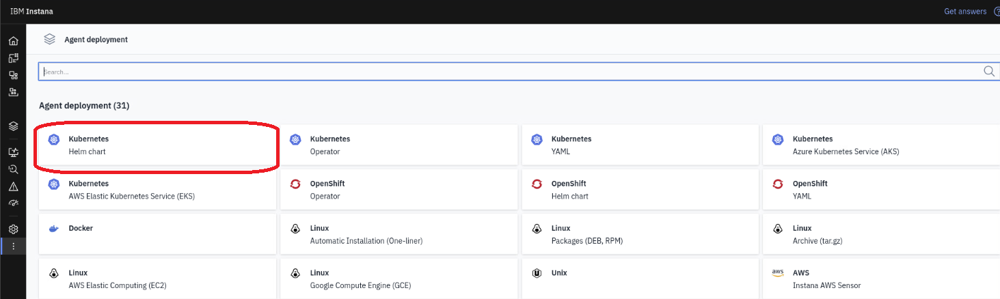

Select the tile for the **Kubernetes helm chart**

A dialog will open providing details for the helm chart.

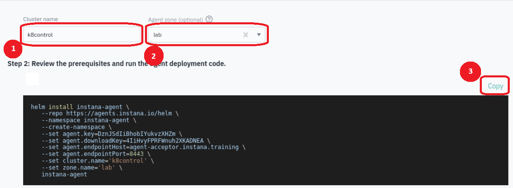

In the dialog, first enter a name for your kubernetes cluster.   We recommend specifying **k8control**.  Then, specify a **zone** name for your cluster.  

As you enter those parameters, the helm command in the black area will be updated to include the cluster name and zone name that you specified.

Next, click the **copy** button and the text for the helm command will be copied into your buffer.

Then, within the **terminal window** on the **k8control** virtual machine, **right click** and select **paste**

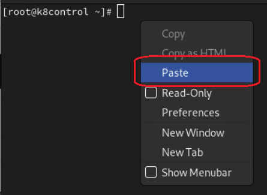

You will see the helm command pasted onto your screen. 

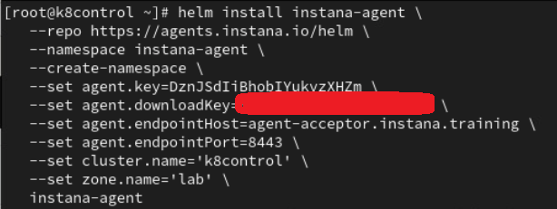

After seeing the text on the screen, press the **Enter** key to submit the helm command.

The helm chart will begin installing into the Kubernetes cluster.  It will automatically create the instana-agent namespace and then install the Agent into that namespace.

:::tip

When you install the Agent into a Kubernetes environment, it installs two componenets.  First, it installs the **Host Agent** as a daemonset so that one Agent runs as a pod on each worker node.
There are optional parameters that allow you to run the daemonset on the **Master** nodes as well.  In addition, a deployment called **k8sensor** is deployed.
It will deploy 3 replicas of the pod to ensure resilieincy.  The k8sensor is responsible for monitoring the kubernetes cluster performance and availability.

:::

To confirm that the Agent is installed and running, type:
```sh
kubectl get pods -n instana-agent
```
You should see both the **instana-agent** and **k8sensor** pods running.

After a few minutes, you will can see both the **Host Agent** and the **k8sensor** in the Instana user interface.

This completes the installation of Instana agent on Kubernetes cluster.

---

## 4.5: View Instana Agents in the Instana UI


From the welcome page, click the **Go to Instana!** button
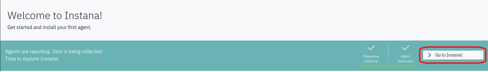


From the **Installing Instana Agents** screen, select the **Go to Instana!**
button. If you don't see the button you can move on to the next step.


Select **Infrastructure** from the left navigation menu.


You should see 3 nodes reporting. The **Instana VM**, the **middleware VM** and the
**k8control kubernetes VM**. If you don't see them yet, give the agents a
few minutes to start up.

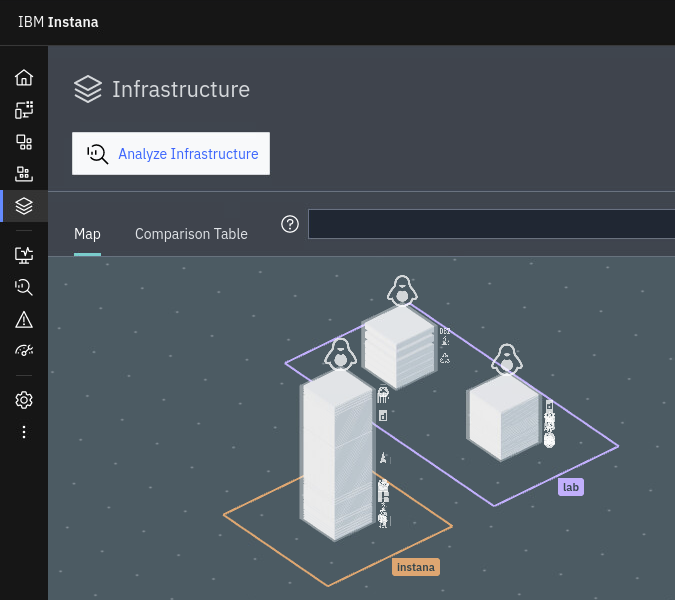

In addition, if you click on **Platformm** and then **Kubernetes**, you will see that you are monitoring two kubernetes clusters.
The first cluster is the self-monitoring for your Instana server (backend) and the other cluster is the k8control kubernetes cluster.

You can click on the blue links with the cluster names to drill into the cluster details.

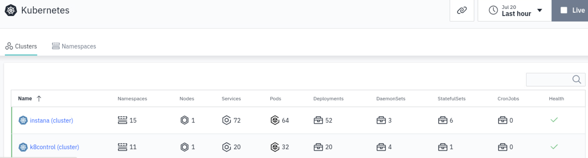

## 4.6: Troubleshooting Instana Agent Installation on Linux

If you cannot see the **middleware** hosts in the Instana UI you
should read the Instana agent logs on the respective agent host located at
`/opt/instana/agent/data/log/agent.log`. Look for the current status and any
warnings or errors that may be shown.

## 4.7: Troubleshooting Instana Agent Installation on Kubernetes Cluster

If you don't see the **Instana** node or the **k8control node after a couple of
minutes, you need to troubleshoot the Instana Agent that is running in kubernetes.  

:::caution Important

The following must be done from a terminal window on each of the kubernetes cluster nodes (instana and k8control)

:::

Check to make sure that all pods are running. Since Instana agent runs as a
DaemonSet the number of pods should be equal to number of nodes in your cluster,
in this case one.

```sh
kubectl get pods -n instana-agent
```

You can check the Instana Agent pod logs by typing the following.  Make sure to replace **<pod_name>** with the actual pod name.

```sh
kubectl logs <pod_name> -n instana-agent
```

---

## 4.8: Configuring Proxy

:::warning Information Only

This section is here for informational purposes. There are no steps to execute.

:::

If there is no direct connectivity for the Instana agent you may need to setup a
proxy. There are 2 connections with 2 different locations for configuration:

- Connection to **Instana Backend** - defined in
  _INSTANA-AGENT-DIR_/etc/instana/com.instana.agent.main.sender.Backend.cfg
- Connection to **Agent/Sensor Repository** - defined in
  _INSTANA-AGENT-DIR_/etc/mvn-settings.xml (This is used in case client wants to
  setup internal maven2 mirror repository)

Proxy configuration goes into the respective files. You can also use
[environment variables](https://www.ibm.com/docs/en/obi/current?topic=requirements-installing-host-agent-docker#agent-configuration)

For backend connectivity you have to define _INSTANA*AGENT_PROXY*_ variables.
For repository connectivity you have to define _INSTANA*REPOSITORY_PROXY*_
variables.

---

## 4.9: Configuring Instana Agent

:::warning Information Only

This section is here for informational purposes. There are no steps to execute.

:::

There are multiple ways to configure the Instana agent. These instructions apply
to the Instana Agent installed on a traditional server. Instructions would be
different for docker or kubernetes versions of the Agent. Settings related to
agent functionality reside in `configuration.yaml` file located by default in
`/opt/instana/agent/etc/instana` directory. However, other settings related to
agent environment sits in other \*.cfg files.

:::info

Agent will actually read and use ANY yaml file in that directory.

:::

Some customers choose to have separate yaml files for each key technology. For
example, you could create a mq.yaml file and an ace.yaml file in the same
directory and it would read both files. `configuration.yaml` will contain sample
configuration entries and comments for ALL available sensors at the time of your
install, **BUT** it will not automatically add new sensor config as new sensors
become available.

For host based installation you can update `configuration.yaml` and agent should
pick up changes automatically (no restart required). For Kubernetes based
installations, there is `instana-agent` configmap where you can customize the
same content that you see in the configuration.yaml file. Using kubernetes/oc
commands, you can edit the configmap.

:::info

Instana agent configuration file must be a proper YAML - if your changes are not
applied, make sure that it's not a formatting error

:::

---

## 4.10: Configuring GitOps for Agents

:::warning Information Only

This section is here for informational purposes. There are no steps to execute.

:::

If you don't want to modify the Instana agent configuration files for each agent
locally, you can setup a centralized git repository for configuration files and
instruct Instana agent to use these files. To accomplish that, follow the steps
from the
[documentation](https://www.ibm.com/docs/en/obi/current?topic=configuration-git-based-management#git-based-configuration-management).

The Instana agent fetches configuration updates from the remote repository:

1. Upon the startup or restart.
1. Through a reboot initiated over the Agent Management Dashboard.
1. Through a configuration change over the Agent Management Dashboard.
1. Through the Web API as described in the Host Agent section and the
   integrations that rely on it like the GitHub Update Agent action.

---

## 4.11: Configuring GitOps for Agents

In this section of the lab, you have learned how to install and configure 
Agents on traditional Linux VMs and kubernetes.  This includes the configuration of the **Zone** and the **DB2** sensor. 
Finally, you have viewed the monitoring Agents and sensors within the Instana user interface.
