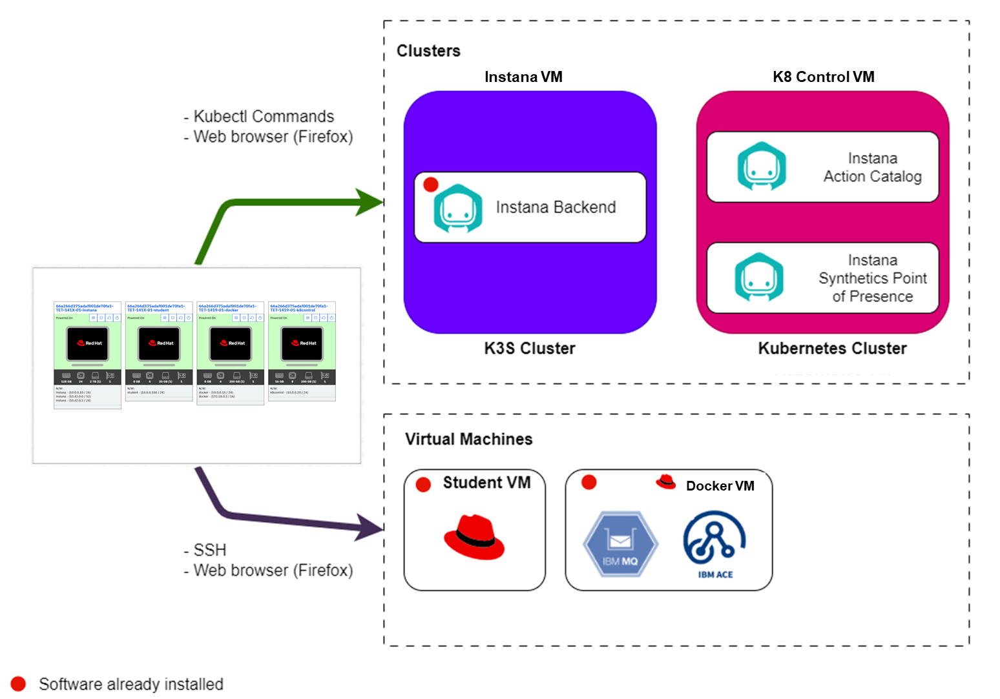

# Lab Environment

The lab environment includes 1 Kubernetes cluster, 1 K3s cluster and 2 VMs.

Kubernetes clusters:

1. **K8 Control** - Kubernetes VM - An instance of Kubernetes cluster where you will install Instana Synthetics Point of Presence and Instana Action Catalog.
2. **Instana** - RH8 VM - An instance of K3s cluster with pre-installed Instana backend.

Virtual Machines:

1. **Student VM** - A RHEL VM that will be used as the _bastion_ host into the
   lab network. Student VM has access to all lab VM's and clusters and will be
   your primary workstation for these labs. This VM is also pre-installed with Red Hat Ansible Automation Platform.
2. **Docker VM** - A RHEL VM that contains the pre-installed NFS storage, IBM ACE and MQ middleware. The Stan's Robot Shop application is also running on this node.

