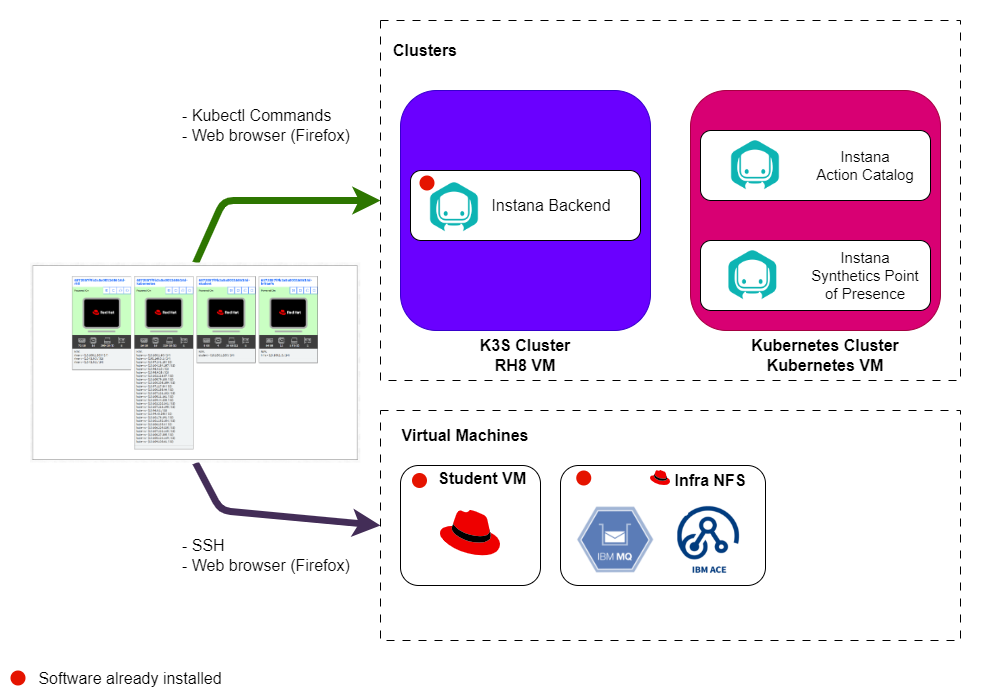

# Lab Environment

The lab environment includes 1 Kubernetes cluster, 1 K3s cluster and 3 VMs.

Kubernetes clusters:

1. **Kubernetes cluster** - An instance of Kubernetes cluster where you will install Instana Synthetics Point of Presence and Instana Action Catalog.
2. **K3s cluster** - An instance of K3s cluster with pre-installed Instana backend.

Virtual Machines:

1. **Guacamole VM** - A RHEL VM that will be used as the _bastion_ host into the
   lab network. Guacamole has access to all lab VM's and clusters and will be
   your primary workstation for these labs.
2. **Student VM** - A RHEL VM 
3. **Infra NFS** - A RHEL VM that contains the pre-installed NFS storage, IBM ACE and MQ middleware.

