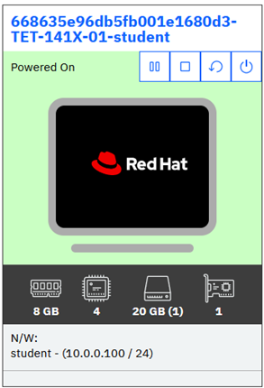
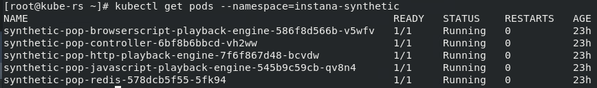

# Point of Presence

## Install Synthetic Point of Presence component

We will be installing the Synthetic Point of Presence into the **K8 Control** Kubernetes cluster. In order to do that, we'll need access to a CLI will access to the cluster.

From the browser, open **Student VM** console



Open a terminal in the Student VM


Login to the **K8 Control** Kubernetes VM using ssh command:

```bash
ssh root@10.0.0.20
```

At this point, the Instana server is capable of running and displaying synthetic tests, but you still need to setup the "Synthetic Point of Presence" component.

If Helm wasn't installed during previous labs, install it on bastion node now with command:
```bash
curl https://raw.githubusercontent.com/helm/helm/main/scripts/get-helm-3 | bash
```

In the Student VM, open the Instana UI in the browser


Click on "Synthetic Monitoring" and then on "Deploy a PoP" button:


Use **Simple** tab for Helm command. 

You will need to edit the information contained in the helm command, so copy and paste the text into a temporary file where you can use an editor such as **vi** to edit the content.

The default helm command will look as follows. Some of the parameters have been replace with "xxx" for security reasons.
```sh
helm install synthetic-pop \
	--repo "https://agents.instana.io/helm" \
	--namespace <namespace> \
	--create-namespace \
	--set downloadKey="<xxx>" \
	--set controller.location="<yourLocationName>;<yourLocationDisplayName>;<yourLocationCountry>;<yourLocationCity>;0;0;<yourLocationDescription>" \
	--set controller.clusterName="<yourClusterName>" \
	--set controller.instanaKey="4I720vhbzfjAnNS4cuKnNl" \
	--set controller.instanaSyntheticEndpoint="https://xxx" \
	--set redis.tls.enabled=false \
	--set redis.password="<yourPassword>" \
	synthetic-pop
  ```

For Synthetic Point of Presence we need to modify some of the parameters and provide one additional parameter.  


- Modify the **controller.clusterName** parameter and provide a meaningful name.
- In the **controller.location**, specify a name, display name, country, etc. for your "Point of Presence".   The "0;0" parameter represents the longituded and latitude of the "Point of Presence".  These parameters help identify the Point of Presence when  there multiples deployed.
- In the 	**controller.instanaKey**, please specify exactly this value "4I720vhbzfjAnNS4cuKnNl". This is related to the known issue with Instana backend version we are using for this lab. In the real-life scenario, the proper download and Instana key will be populated on the Instana UI.
- Finally, enter a redis password.  This can be any value since you are setting the password.

:::note
- `--set seccompDefault=true` This parameter is required for OpenShift versions 4.11 and above. This step is not required for our labs as we are using K8S environment
:::

The helm chart should now look similar the following:

```text
helm install synthetic-pop \
     --repo https://agents.instana.io/helm  \
     --namespace instana-synthetic \
     --create-namespace \
     --set downloadKey="<xxx>" \
     --set controller.location="Local;on Instana cluster;Serbia;Belgrade;39.54;116.23;A test Synthetic Point of Presence" \
     --set controller.instanaKey="xxx" \
     --set controller.clusterName="MyInstanaCluster" \
     --set controller.instanaSyntheticEndpoint="https://xxx/synthetics" \
     --set redis.tls.enabled=false \
     --set redis.password="a1fc5d01bcbb" \
     synthetic-pop
```

Copy the helm command from the text file and paste it into a terminal window on the Bastion node. This will execute the helm chart.

You should see an output similar to the following:

```sh
[root@rhserv ~]$ helm install synthetic-pop \
>     --repo https://agents.instana.io/helm  \
>     --namespace instana-synthetic \
>     --create-namespace \
>     --set downloadKey="xxx" \
>     --set controller.location="Local;on Instana cluster;Serbia;Belgrade;39.54;116.23;A test Synthetic Point of Presence" \
>     --set controller.instanaKey="4I720vhbzfjAnNS4cuKnNl" \
>     --set controller.clusterName="MyInstanaCluster" \
>     --set controller.instanaSyntheticEndpoint="https://xxx/synthetics" \
>     --set redis.tls.enabled=false \
>     --set redis.password="a1fc5d01bcbb" \
>     synthetic-pop
NAME: synthetic-pop
LAST DEPLOYED: Thu Jul 13 07:49:37 2023
NAMESPACE: instana-synthetic
STATUS: deployed
```

After the Synthetic point of presence is installed verify its appearence in the interface:


You can also confirm that the Synthetic Point of Presence is running by typing:
```sh
kubectl get pods --namespace=instana-synthetic
```

Expected results should look similar to the below:



Confirm that the pods are all running.

The last step is to adjust the internal hosts configuration of the Instana Synthetic PoP. This has to be done because of later need to run a script which will make a call to the Instana API.

Please apply the below command

```sh
kubectl patch deployment synthetic-pop-javascript-playback-engine -n instana-synthetic --patch '{"spec": {"template": {"spec": {"hostAliases": [{"hostnames": ["student-labs.instana.training"],"ip": "10.0.0.10"}]}}}}'
```

After a few minutes, the list of pods should look like the below


