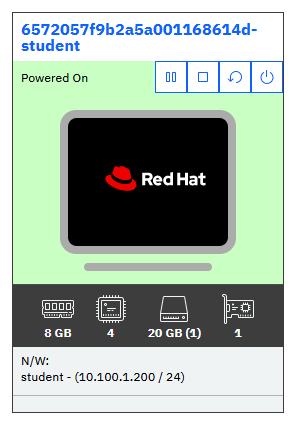
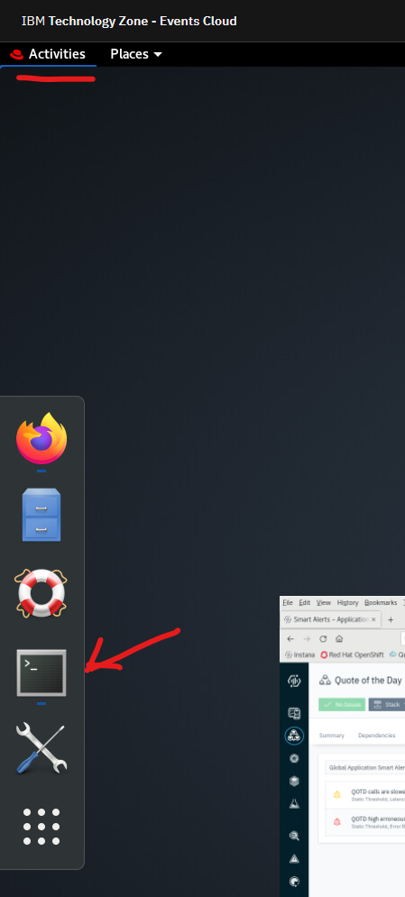
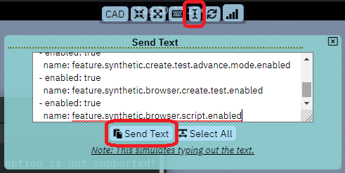
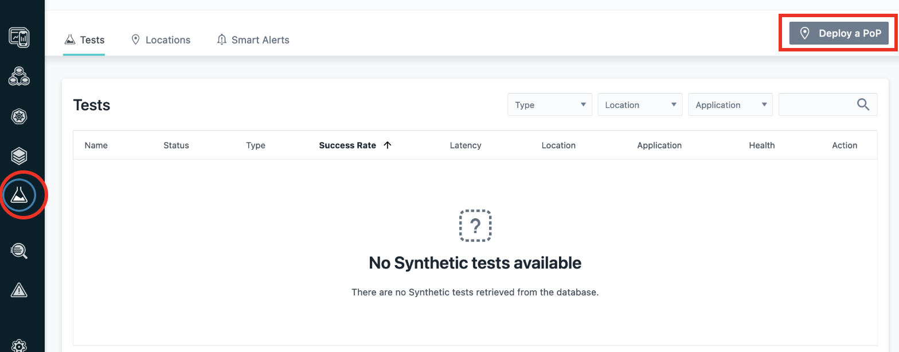
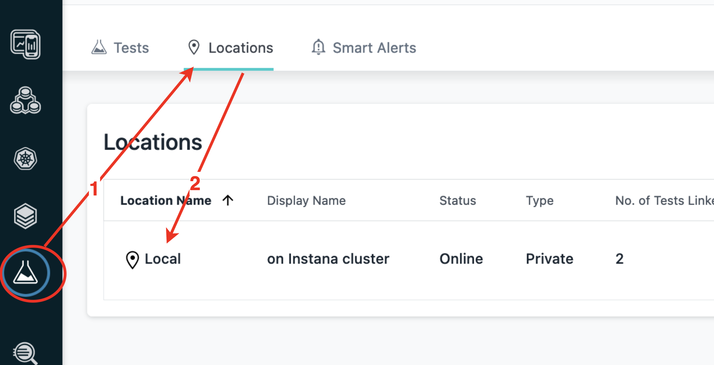

# Point of Presence

## Install Synthetic Point of Presence component

We will be installing the Synthetic Point of Presence into the Kubernetes cluster. In order to do that, we'll need access to a CLI will access to the cluster.

From the Browser, open Student VM 



Open a terminal in the Student VM



Log in to the RH9 server using ssh command

```bash
ssh root@10.100.1.203
```

In addition, some features must be enabled in the Instana server in order for you to use the synthetic features.  Follow the steps below to enable the synthetics feature within the Instana server.

Change projects to the "instana-core" namespace and edit core component of Instana backend cluster by commands:
```bash
kubectl edit core --namespace=instana-core
```

Add the following 5 feature flags into the existing spec -> featureFlags section to enable Synthetics features:
```yaml
spec:
  featureFlags:
  - enabled: true
    name: feature.synthetics.enabled
  - enabled: true
    name: feature.synthetic.smart.alerts.enabled
  - enabled: true
    name: feature.synthetic.create.test.advance.mode.enabled
  - enabled: true
    name: feature.synthetic.browser.create.test.enabled
  - enabled: true
    name: feature.synthetic.browser.script.enabled
```

You can copy/paste the yaml from the lab guide into the the Instana "core" object as seen below.



Pay attention to indentation since this is yaml.  All entries must be indented by 0, 2, 4, 6 spaces, etc.
Save and exit by typing:

```sh
:wq
```


Ensure synthetic pods have started sucessfully:
```text
[root@rhserv ~]# kubectl get pods --namespace=instana-core | grep synthetic
synthetics-acceptor-558ff84bbb-g2wxq           1/1     Running   0          5m
synthetics-health-processor-5c8c8c57fb-5fwvb   1/1     Running   0          5m
synthetics-reader-5f59b6df4f-8kn9r             1/1     Running   0          5m
synthetics-writer-579d5cf458-7tx7q             1/1     Running   0          5m
[root@rhserv ~]# 
```

At this point, the Instana server is capable of running and displaying synthetic tests, but you still need to setup the "Synthetic Point of Presence".

If Helm wasn't installed during previous labs, install it on bastion node now with command:
```bash
curl https://raw.githubusercontent.com/helm/helm/main/scripts/get-helm-3 | bash
```

Click on "Synthetic Monitoring" and then on "Deploy a PoP" button:


Use **Simple** tab for Helm command. 

You will need to edit the information contained in the helm command, so copy and paste the text into a temporary file where you can use an editor such as **vi** to edit the content.

The default helm command will look as follows.  Some of the parameters have been replace with "xxx" for security reasons.
```sh
helm install synthetic-pop \
	--repo "https://agents.instana.io/helm" \
	--namespace <namespace> \
	--create-namespace \
	--set downloadKey="xxx" \
	--set controller.location="<yourLocationName>;<yourLocationDisplayName>;<yourLocationCountry>;<yourLocationCity>;0;0;<yourLocationDescription>" \
	--set controller.clusterName="<yourClusterName>" \
	--set controller.instanaKey="xxx" \
	--set controller.instanaSyntheticEndpoint="https://xxx" \
	--set redis.tls.enabled=false \
	--set redis.password="<yourPassword>" \
	synthetic-pop
  ```

For Synthetic Point of Presence we need to modify some of the parameters and provide one additional parameter.  

- ***Add `--set seccompDefault=true \`***.  This parameter is required for OpenShift versions 4.11 and above
- Then, modify the **controller.clusterName** parameter and provide a meaningful name.
- In the **controller.location**, specify a name, display name, country, etc. for your "Point of Presence".   The "0;0" parameter represents the longituded and latitude of the "Point of Presence".  These parameters help identify the Point of Presence when  there multiples deployed.
- Finally, enter a redis password.  This can be any value since you are setting the password.

The helm chart should now look similar the following:

```text
helm install synthetic-pop \
     --repo https://agents.instana.io/helm  \
     --namespace instana-synthetic \
     --create-namespace \
    --set downloadKey="xxx" \
     --set controller.location="Local;on Instana cluster;Serbia;Belgrade;39.54;116.23;A test Synthetic Point of Presence" \
     --set controller.instanaKey="xxx" \
     --set controller.clusterName="MyInstanaCluster" \
     --set controller.instanaSyntheticEndpoint="https://xxx/synthetics" \
     --set redis.tls.enabled=false \
     --set redis.password="a1fc5d01bcbb" \
     --set seccompDefault=true \
     synthetic-pop
```

Copy the helm command from the text file and paste it into a terminal window on the Bastion node.  This will execute the helm chart.

You should see an output similar to the following:

```sh
[root@rhserv ~]$ helm install synthetic-pop \
>     --repo https://agents.instana.io/helm  \
>     --namespace instana-synthetic \
>     --create-namespace \
>     --set downloadKey="xxx" \
>     --set controller.location="Local;on Instana cluster;Serbia;Belgrade;39.54;116.23;A test Synthetic Point of Presence" \
>     --set controller.instanaKey="xxx" \
>     --set controller.clusterName="MyInstanaCluster" \
>     --set controller.instanaSyntheticEndpoint="https://xxx/synthetics" \
>     --set redis.tls.enabled=false \
>     --set redis.password="a1fc5d01bcbb" \
>     --set seccompDefault=true \
>     synthetic-pop
NAME: synthetic-pop
LAST DEPLOYED: Thu Jul 13 07:49:37 2023
NAMESPACE: instana-synthetic
STATUS: deployed
```

After the Synthetic point of presence is installed verify its appearence in the interface:



You can also confirm that the Synthetic Point of Presence is running by typing:
```sh
kubectl get pods --namespace=instana-synthetic
```
Confirm that the pods are all running.