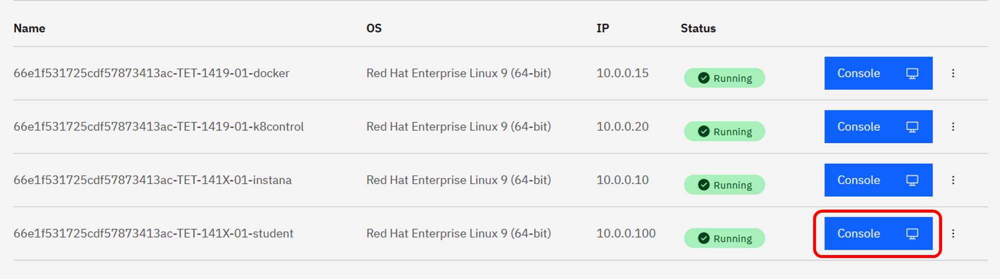
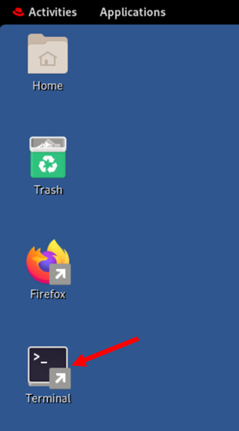
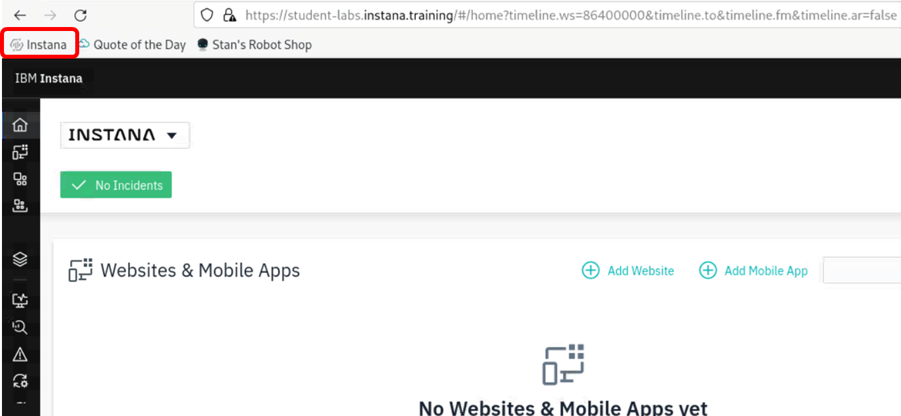
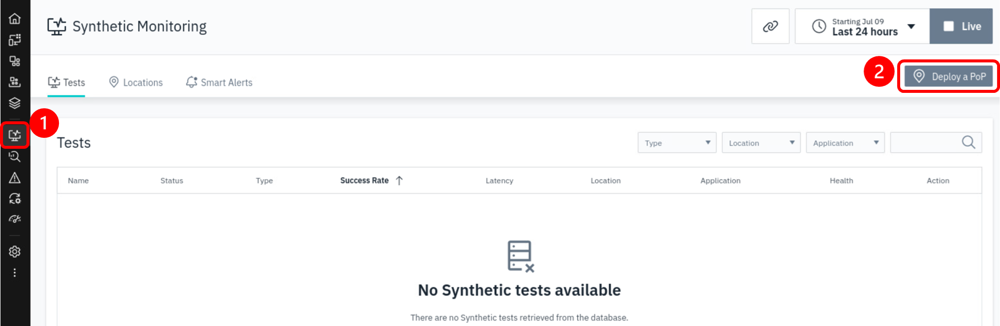
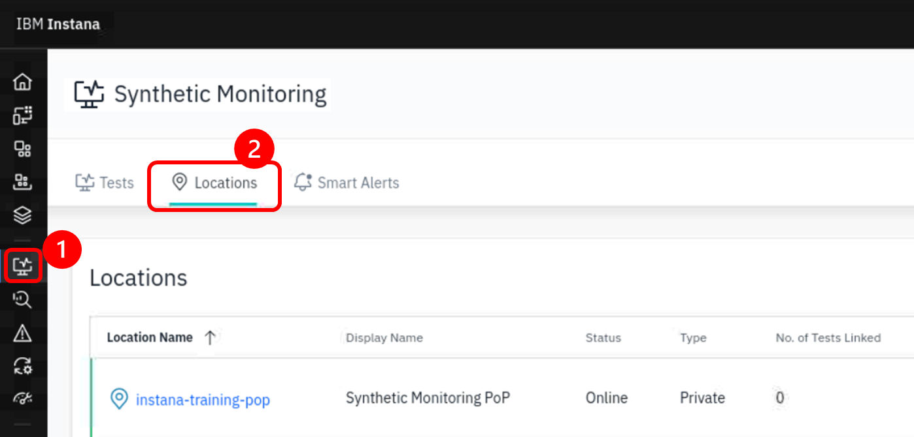
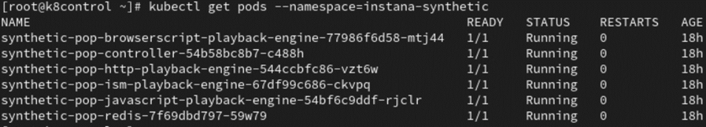

# Point of Presence

## Install Synthetic Point of Presence component

We will be installing the Synthetic Point of Presence into the **K8 Control** Kubernetes cluster. In order to do that, we'll need access to a CLI will access to the cluster.

From the browser, open **Student VM** console



Open a terminal in the Student VM



Login to the **K8 Control** Kubernetes VM using ssh command:

```bash
ssh root@10.0.0.20
```
:::note
Credential information is located in file *synthetic-monitoring-lab.txt* in folder /home/ibmuser/Documents in **Student VM**.
:::

There is already a pre-installed Point of Presence (PoP) in the **K8 Control** VM as a backup/trial PoP for this lab. We will first remove this PoP as it is taking up resources in the VM.
Issue this command at the **K8 Control** command window.

```bash
kubectl scale deployment -n synthetic-pop --replicas=0 --all
```
Next, we will install and setup the Synthetic Point of Presence component to playback the test scripts.

We are using Helm to install the Synthetic Point of Presence. Thus, install it on **K8 Control** VM with the following command:
```bash
curl https://raw.githubusercontent.com/helm/helm/main/scripts/get-helm-3 | bash
```

In the Student VM, open the Instana UI in the browser. You may click on the **Instana** quick-link on the browser.



Click on "Synthetic Monitoring" and then on "Deploy a PoP" button:



Use **Simple** tab for Helm command. 

You will need to edit the information contained in the helm command, so copy and paste the text into a temporary file where you can use an editor such as **vi** to edit the content.

The default helm command will look as follows. Some of the parameters have been replace with "xxx" as they are sensitive information, thus not shown in the lab guide.
```sh
helm install synthetic-pop \
	--repo "https://agents.instana.io/helm" \
	--namespace <namespace> \
	--create-namespace \
	--set downloadKey="xxx" \
	--set controller.location="<yourLocationName>;<yourLocationDisplayName>;<yourLocationCountry>;<yourLocationCity>;0;0;<yourLocationDescription>" \
	--set controller.clusterName="<yourClusterName>" \
	--set controller.instanaKey="xxx" \
	--set controller.instanaSyntheticEndpoint="https://xxx" \
	--set redis.tls.enabled=false \
	--set redis.password="<yourPassword>" \
	synthetic-pop
  ```

For Synthetic Point of Presence we need to modify some of the parameters.  


- Modify the **controller.clusterName** parameter and provide a meaningful name.
- For the **controller.location**, specify a location name, display name, country, etc. for your "Point of Presence".   The "0;0" parameter represents the longitude and latitude of the "Point of Presence".
These parameters help identify the Point of Presence when there are multiples deployed.
- The **controller.instanaSyntheticEndpoint** is the Synthetic acceptor in the Instana backend server. Leave this value as it is.
- Finally, enter a redis password.  This can be any value since you are setting the password. Minimum password length is 10

:::note
- `--set seccompDefault=true` This parameter is required for OpenShift versions 4.11 and above. This step is not required for our labs as we are using K8S environment
:::

The helm chart should now look similar the following:

```text
helm install synthetic-pop \
     --repo https://agents.instana.io/helm  \
     --namespace instana-synthetic \
     --create-namespace \
     --set downloadKey="xxx" \
     --set controller.location="TechX Lab VM;Lab PoP;Serbia;Belgrade;39.54;116.23;A test Synthetic Point of Presence" \
     --set controller.instanaKey="xxx" \
     --set controller.clusterName="MyInstanaCluster" \
     --set controller.instanaSyntheticEndpoint="https://xxx/synthetics" \
     --set redis.tls.enabled=false \
     --set redis.password="a1fc5d01bcbb" \
     synthetic-pop
```

Copy the helm command from the text file and paste it into a terminal window on the **K8 Control** node. This will execute the helm chart.

You should see an output similar to the following:

```sh
[root@k8control ~]$ helm install synthetic-pop \
>     --repo https://agents.instana.io/helm  \
>     --namespace instana-synthetic \
>     --create-namespace \
>     --set downloadKey="xxx" \
>     --set controller.location="TechX Lab VM;Lab PoP;Serbia;Belgrade;39.54;116.23;A test Synthetic Point of Presence" \
>     --set controller.instanaKey="xxx" \
>     --set controller.clusterName="MyInstanaCluster" \
>     --set controller.instanaSyntheticEndpoint="https://xxx/synthetics" \
>     --set redis.tls.enabled=false \
>     --set redis.password="a1fc5d01bcbb" \
>     synthetic-pop
NAME: synthetic-pop
LAST DEPLOYED: Thu Jul 13 07:49:37 2023
NAMESPACE: instana-synthetic
STATUS: deployed
```

After the Synthetic Point of Presence is installed, you can verify it listed at the **Locations** tab.
You may need to wait a few short minutes, then click again **Synthetic Monitoring** -> **Locations** for your newly installed PoP to be listed in the **Locations** tab.
Your newly created PoP named **Lab PoP** may appear offline in the first few moments, but will eventually be online.
You should be selecting this PoP in your subsequent lab exercises.



You can also confirm that the Synthetic Point of Presence is running by typing:
```sh
kubectl get pods --namespace=instana-synthetic
```

Expected results should look similar to the below:



Confirm that the pods are all running. You may need to wait a few minutes and check again that the pods' statuses are all running.

The last step is to update the internal hosts configuration of the Instana Synthetic PoP since we do not have a DNS being setup in this lab. This has to be done because in the next lab, we need to run a script which will make a call to the Instana API.

Please apply the below command

```sh
kubectl patch deployment synthetic-pop-javascript-playback-engine -n instana-synthetic --patch '{"spec": {"template": {"spec": {"hostAliases": [{"hostnames": ["student-labs.instana.training"],"ip": "10.0.0.10"}]}}}}'
```

After a few minutes, ensure all the pods are running, and the list of pods should look like the below


