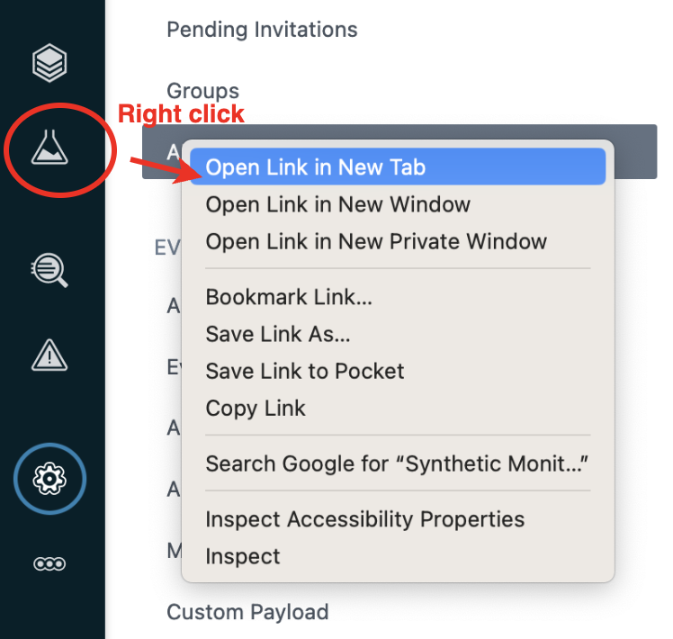
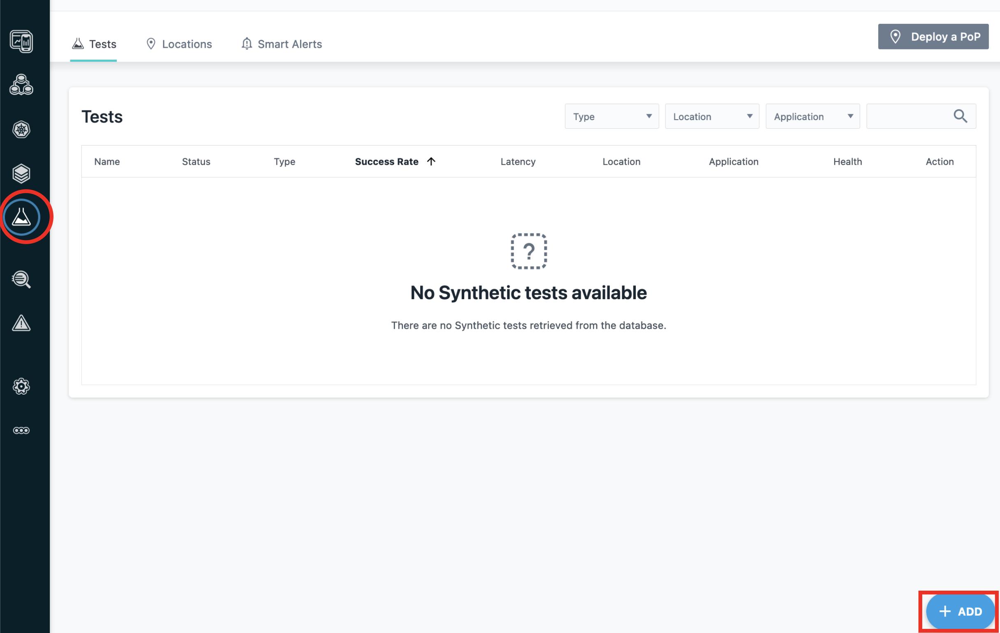
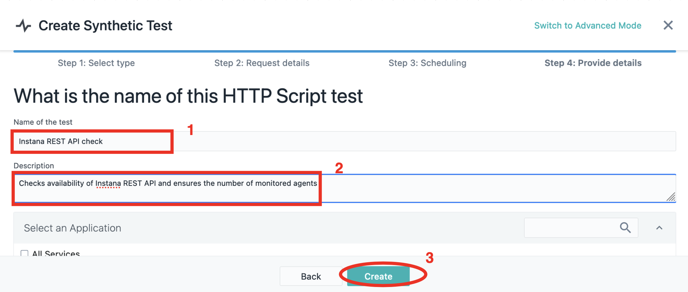

# REST API

## REST API Synthetic Tests
In the exercise we will follow creating a test of series of probes and as example will monitor number of managed objects. 

We will interrogate Instana backend as an example of external application.


### Simple REST API test
Let's begin by executing a simple REST API test.  This will be a single REST GET request.

Begin by selecting **Synthetics** and then **+ ADD** as seen below.


Then, click the **Add Synthetic Test** button.


On the dialog that opens, you will see that you have the option of an **API Simple** test or an **API Script** test.   Leave the default of **API Simple** and click the **Next** button.


A new dialog will open prompting for the REST API **GET** URL.   Enter the following URL:
```sh
http://10.100.1.60:32000/random
```

This could be any REST request. In this case, we are testing the **Random** API call within the **Quote of the Day** application.

Then, select your **Point of Presence** location and click **Next**.  This allows you to choose the location(s) where you want your synthetic script to execute.  In the lab, you only have 1 location that you can select.


The next screen allows you to specify the scheduling interval for your synthetic test.  Drag the time slider to 1 minute.  Then, select **Next**


On the next screen you will give your syntetic test a name and description.  Then, optionally, associate the synthetic test with an application.  In this case, select the checkbox next to the **Quote of the Day** application since we are testing the **Random** API call for the **Quote of the Day ** application.

Finally, click the **Create** button to finish creating your synthetic test.


At this point, you should see a synthetic test named **Random Quote**.  


Click on the **Random Quote** link to drill down into the details of the synthetic test.

It will take a couple of minutes for the synthetic tests to begin executing.

On the screen, you can see a summary of the synthetic results.  You can also click on the **Results** tab and see the detailed results of each synthetic test.


You have now created a synthetic test against a single REST API.  Next, we will be learning how to create more complex synthetics using javascript.  

The example we will be using will actually be executing against the Instana server.  In order to access the Instana REST APIs, you must first generate an API token.  That will be our next step.


### Creating an API token

Since we will be using the Instana REST APIs to test the availability of Instana backend, we need an API token to request data from Instana server. 
API Tokens are a part of authentication and authorization mechanism, that allows access to certain kinds of data. 
We will create a basic token since the APIs we are planning to use do not require special permissions.

Create token by selecting "Settings" -> "Team Settings" -> "API Token" -> "New API Token":


Give it a name:


You will notice that there are many toggles that allow you to assign additional permissions.   But, we are only accessing REST APIs with read-only permissions that do not require any additional permissions.

You will need to save your REST API Token so that you can use it in the javascript   In order to save the API Token, click on the **eye** icon.


After clicking the **eye** icon, you will see the **API Token** and you'll see an icon that allows you to copy the API Token.  Click on the **copy** icon and see the API Token.
The API Token is now in your clipboard, but it probably makes sense to save it to a file so that you can access it later.


Click "Save" at the bottom of the page. 


### Creating a scripted REST API test

**Scripted REST API synthetic tests** may include several calls and different types GET/POST/PUT/DELETE in the same test. During the lab we will be doing two GET requests:
- First, we will check if Instana backend as a target application returns success code of **200**
- Next, the script will check the number of currently reporting agents and confirm that it is less than a threshold.

Right click on "Synthetic Monitoring" and open it in a new browser tab:


To create synthetic test switch to just created browser tab with "Synthetic Monitoring" and click "+ ADD" button on the right bottom corner:



Choose "Add Synthetic Test"

Select "Script API" and click "Next" button:


:::note

Use text editor to paste the code into lab environment and than copy from that text editor to the field to avoid errors in the code while pasting directly to the lab environment and the field at once.
To open text editor: click Activities on the left top corner -> Select 9 dots (Show Applications) -> Choose "Text Editor".


:::

In order to paste content into the VM, select the **send text** icon.  Then, paste in the content and click the **Send Text** button at the bottom of the dialog.


Paste the script into a field as shown below:
```javascript
var assert=require('assert');

// Address that Synthetic PoP will use to access target host to interrogate:
var INSTANA_ADDR = 'https://unit0-tenant0.rhserv.ibm.edu';

// Target system token that allows to serve the request (As soon as we
// interrogate Instana backend, it is Instana token):
var TOKEN = "xxxxxx";

// ======================================================================
// First call
// create Object option with details of request including URI and header:
var options = {
    uri: INSTANA_ADDR+'/api/infrastructure-monitoring/monitoring-state',
    strictSSL: false,
    headers: {
                   'Content-type': 'application/json',
                   'Authorization': 'apiToken ' + TOKEN
           }
};

$http.get(options, function(error, response, body) {
    var bodyObj = JSON.parse(body);
    assert.ok(bodyObj.hostCount < 3, "We have license to monitor 2 hosts and we have reached " + bodyObj.hostCount + " already!");
});
```

In the javascript, you will need to replace the API Token shown above (xxxxxx) with the API Token you generated earlier.

As follows:


For the test we need the Instana token that we created on previous step.  If you didn't save the API Token, you can use the following steps to retrieve the token.
   - Switch to previous browser tab with Tokens: 
   - Click on eye on the right from the token and copy text.
   - Switch back to browser tab with script
   - Paste Token as value for TOKEN variable (line 9 on screenshot above)

Instana will run the script from previously installed Synthetic Point of Presence, they can be placed at multiple locations across available infrastructure. The one we will use is deployed on the same cluster with Instana, it may have different name. Select it for our test.
   
Click Next

Adjust time slider to run test every minute:


and click "Next" button.


Give the test meaningful name and description:


At the dialog under "Select an Application" you may specify the list of existing applications for which the test is relevant. The result of the test will appear at the "Synthetic Monitoring" tab of the Application dashboard and you will be able to filter tests by application on Synthetic Monitoring dashboard.

Click "Create" button.

It may take up to minute for Instana to perform the first test and show the line with results. You can refresh browser window and changing time duration for the dashboard on right top of the window to speed up the line to appear before the results of first test will be processed.

By now you should see a list of tests:


Click on the test name to access the dashboard of the synthetic test:


At the moment we have 2 agents reporting to the backend.  In the javascript, the assert parameter is checking whether there are more than 2 Hosts connected, so the check has passed. 

Next let's adjust threshold of the assert hostCount so that it fails if there are more than 1 host connected.

Now, let's edit the synthetic test and adjust the `assert.ok(bodyObj.hostCount < 2,` to cause the test to fail as shown below:

```javascript
...
$http.get(options, function(error, response, body) {
    var bodyObj = JSON.parse(body);
    assert.ok(bodyObj.hostCount < 2, "We bought license to monitor 1 host and we have reached " + bodyObj.hostCount + " already!");
});
```

To edit the existing test, click on the **Configuration** tab and then select the **edit** pencil.


Next, click on **Edit Script**.  You may need to scroll down slightly on the page.


You can now edit the javascript and change the hostCount.


When you have finished editing the javascript, click **Save** to save the javascript and then **Save** again to save the synthetic test.

Click on the **Results** tab and then click the **Live** button to view the results of the synthetic tests as they become available.


Now, wait a minute or two and you will see new test results that have a failure status.

Click on one of the failed tests and you will see text similar to the following:
```sh
Failed Run(Exception)
Error Message
We have license to monitor 1 host and we have reached 2 already! 
```