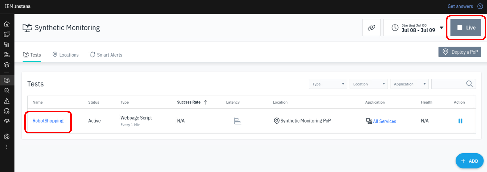

# Synthetic test with Selenium IDE script

Instana Synthetic monitoring also support synthetic testing using browser script, such as Selenium IDE scripts. The Selenium IDE is a plugin in the browser which enable recording of a test script via pointing and clicking on the website in the browser. 
You can also combined Selenium IDE scripts and Javascripts for more advanced capabilities, in which you may refer to the following URL:
 https://www.ibm.com/docs/en/instana-observability/current?topic=scripts-selenium-ide

In this lab exercise, you will learn how to include a pre-defined Selenium IDE script in a synthetic test. 

:::note
Due to the consideration of the lab content and time allocation, we had prepared an earlier recorded Selenium IDE script for use in this lab exercise. This pre-recorded script is a simple script on shopping for robots in Stan's Robot Shop.
:::

## Create a new test with Selenium IDE script

Begin by selecting **Synthetic Monitoring** and then **+ ADD** as shown below.

Then, click the **Add Synthetic Test** button.

On the dialog that opens **Step 1: Select type**, you will see that you have the option to choose any of the 4 types of test. Select **Browser Script**, and click on **Next** button.

In this **Step 2: Request details**, click on the **Choose file** icon.

In the File Upload window, select the **RobotShopping.side** file located in the Documents folder of ibmuser directory. Then, click the **Open** button.

Back at the **Step 2: Request details**, select the Point of Presence that you had just created previously in Lab3. Then click on **Next** button.

At **Step 3: Scheduling**, change the frequency to 1 minute. Then click on **Next** button.

At **Step 4: Provide details**, you will give your syntetic test a name and description.  Then, optionally, associate the synthetic test with an application. Then finally, click on the **Create** button.

At this point, you should see a synthetic test named **RobotShopping**

Click on the **RobotShopping** link to drill down into the details of the synthetic test.

It will take a couple of minutes for the synthetic tests to begin executing.

:::tip
You may need to click on the top right **Live** button, to view test results.
:::

On the screen, you can see a summary of the synthetic test results.  

Next, on the **Results** tab, and you can click on anyone of the test results in the list to see the detailed result of the synthetic test, as well as timings captured for each steps.

In summary, you have now learned how to create a synthetic test using browser script by selecting a simple pre-recorded Selenium IDE script.

For your information, you can also extend the capabilities of selenium-based scripts with more advanced features, such as 2-factor authentication, screen capture on failure, store environment variables, and more.
You can explore more on your own at this URL:   
https://www.ibm.com/docs/en/instana-observability/current?topic=scripts-selenium-ide#expanding-testing-capabilities-in-selenium-ide-scripts
