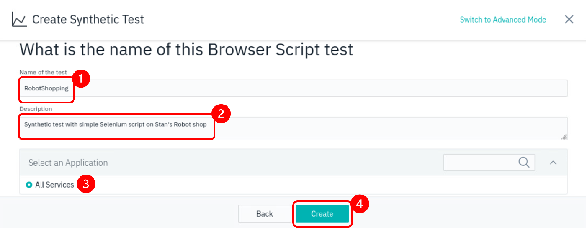

# Synthetic test with Selenium IDE script

Instana Synthetic monitoring also support synthetic testing using browser script, such as Selenium IDE scripts. 
In this lab exercise, you will learn how to include a pre-defined Selenium IDE script in a synthetic test. 

:::note
Due to the consideration of the lab content and time allocation, we had prepared an earlier recorded Selenium IDE script for use in this lab exercise. This pre-recorded script is a simple script on shopping for robots in Stan's Robot Shop. 
For more advanced and advanced configurations, you may refer to:
 https://www.ibm.com/docs/en/instana-observability/current?topic=scripts-selenium-ide
:::

## Create a new test with Selenium IDE script

Begin by selecting **Synthetic Monitoring** and then **+ ADD** as shown below.

Then, click the **Add Synthetic Test** button.

On the dialog that opens **Step 1: Select type**, you will see that you have the option to choose any of the 4 types of test. Select **Browser Script**, and click on **Next** button.

In this **Step 2: Request details**, click on the **Choose file** icon.

In the File Upload window, select the **RobotShopping.side** file located in the Documents directory of ibmuser. Then, click the **Open** button.

Back at the **Step 2: Request details**, select the Point of Presence that you have just created previously in Lab3. Then click on **Next** button.

At **Step 3: Scheduling**, change the frequency to 1 minute. Then click on **Next** button.

At **Step 4: Provide details**, you will give your syntetic test a name and description.  Then, optionally, associate the synthetic test with an application. Then finally, click on the **Create** button.

At this point, you should see a synthetic test named **RobotShopping**

Click on the **RobotShopping** link to drill down into the details of the synthetic test.

It will take a couple of minutes for the synthetic tests to begin executing.

*HINT* You may need to click on the top right **Live** button, to view test results.

On the screen, you can see a summary of the synthetic results.  You can also click on the **Results** tab and see the detailed results of each synthetic test.

You have now created a synthetic test using a simple Selenium IDE script.
