# Smart Alert for Synthetic Test

## Creating Smart Alert for a synthetic test

In this lab, we will be creating Smart Alert to detect a problem with a synthetic test, and notify the team(s) of the problem via the **Alert Channel**. 

Click "Synthetic Monitoring" -> "Add"
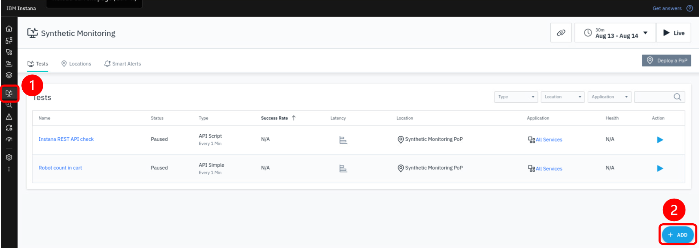

Then, select "Add Synthetic Smart Alert"

In the **Create Smart Alert** wizard, click on "Add Synthetic Test"
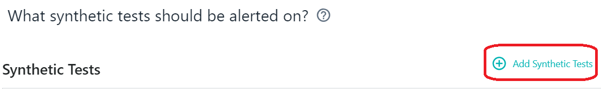

Find the test you created earlier and select the **checkbox**.  Then, click **Add 1 Test**

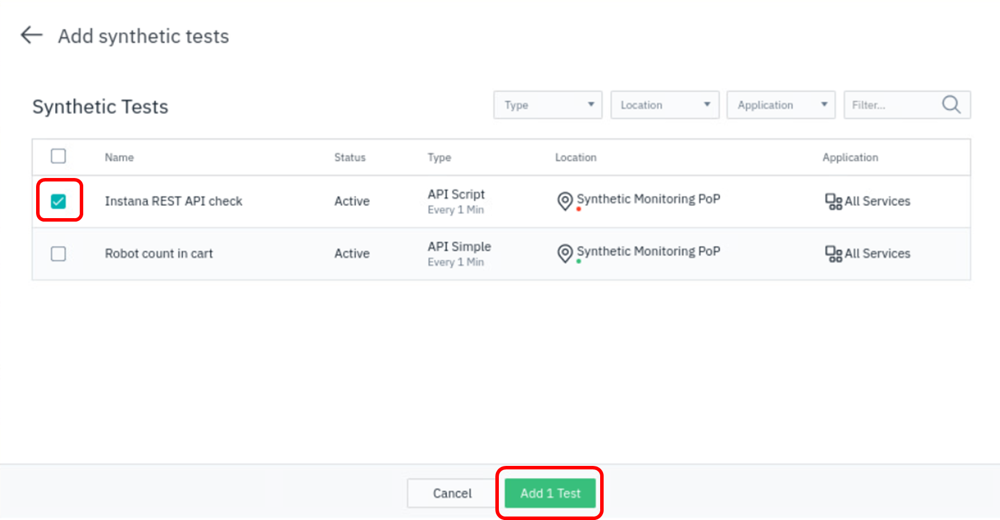

Click **Next** to go to the next screen on the dialog.

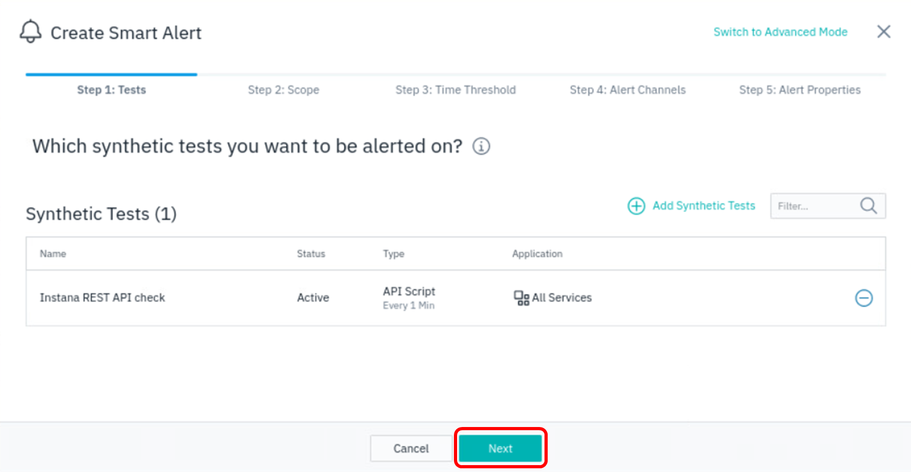

You may optionally add filters to define the scope of what is being monitored. In this case, we will not be adding any filters.  Simply click "Next".

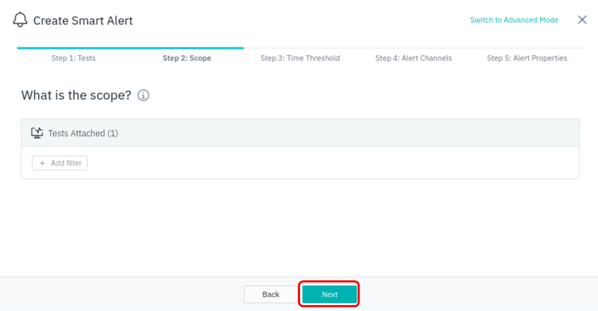

We choose 1 consecutive occurrence to fire an alert, click Next:

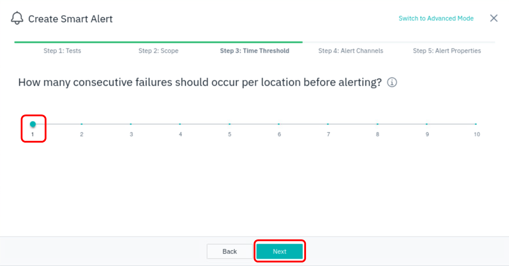

In the next step, we will be selecting an Alert Channel.  Alert Channels allow you to notify people and teams via various **channels** such as email, slack, ServiceNow, etc.

Select "Select Alert Channels"

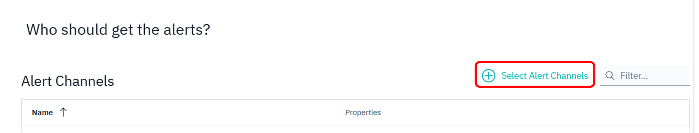

Then select "Create Alert Channel" to create a new alert channel.

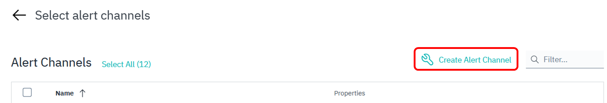

Provide a name for the channel and the list of email addresses (we will not send emails in this lab, so just populate the field with any email address):

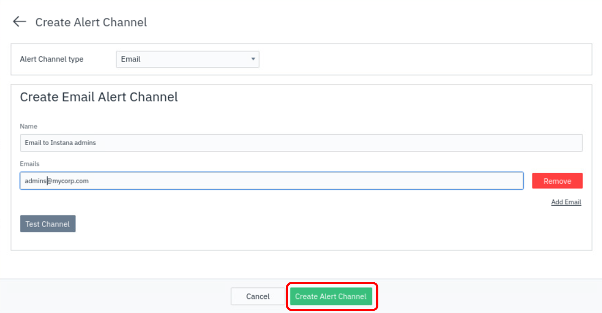

Then, click "Create Alert Channel" to finish channel creation procedure.

Select the newly created alert channel and click "Add 1 Channel":

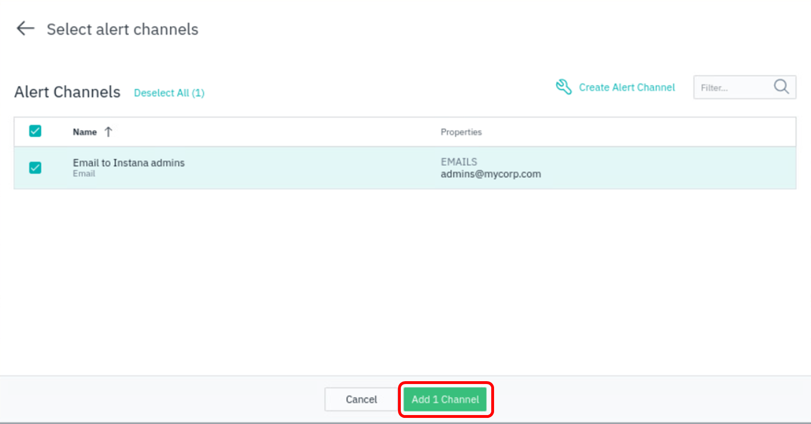

And then, click "Next":

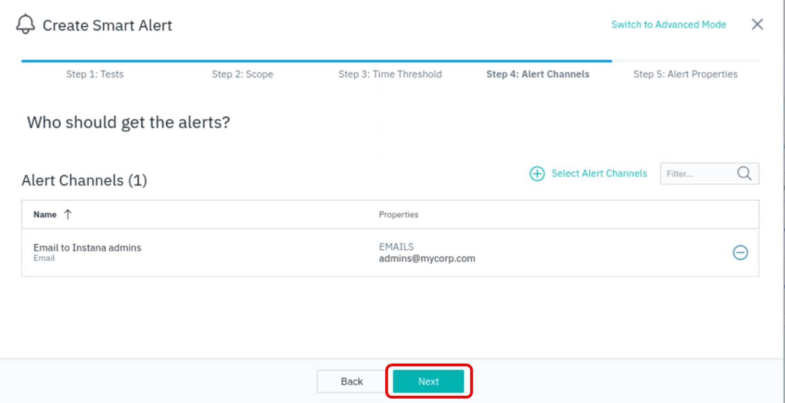

Next, we configure the alert that will be visible when the threshold is violated. Set meaningful values for Title, Alert Level and Description, then click "Create" button:

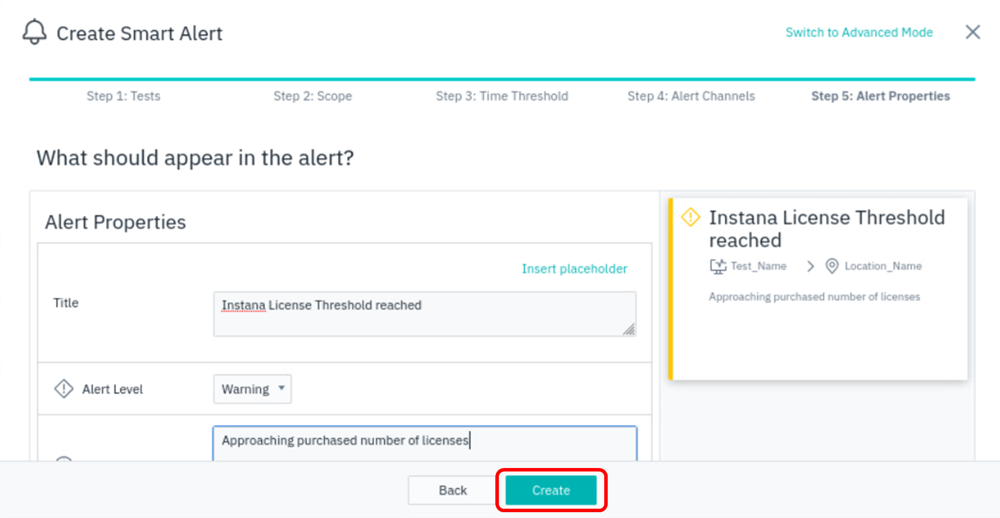

Refresh the page to show the just configured alert to appear in the **Smart Alerts** tab.

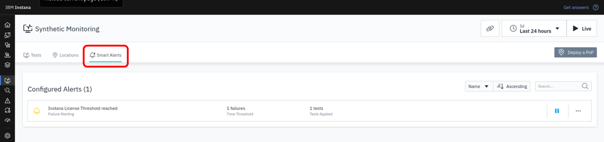

After a few moments, you can click on **Event** to see the new event appearing.

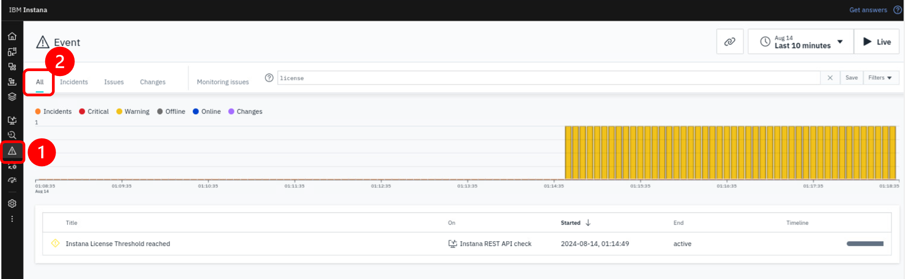

When the new event alert triggered on the synthetic test failure, an e-mail will be sent out via the **Alert Channel** notifying the people of the failure.
:::note
Email will NOT be sent out in this lab due to networking limitation
:::

In summary, you have now setup a Smart Alert that will trigger when a synthetic test fails, and a notification will be send out via an email alert channel.
