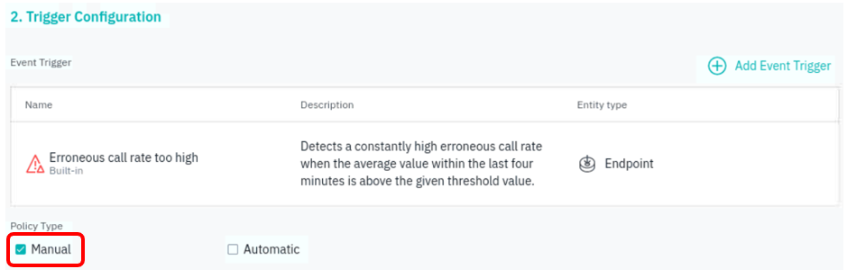
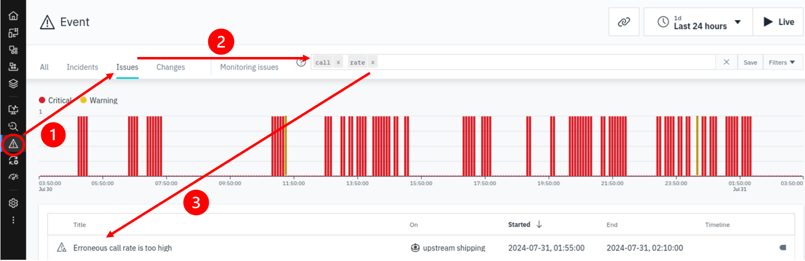
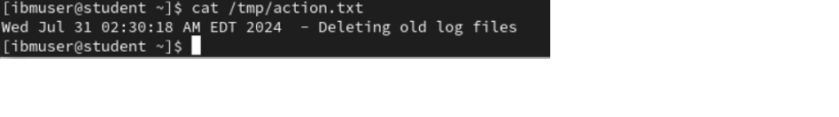

# Action Catalog

The Instana automation framework supports automating actions to diagnose and remediate events. This automation capability called the **Action Catalog** allows you to execute corrective actions in order to solve problems in an automated way.
Although the user/administrator can manually execute these actions, we can avoid possible user error as well as saving time via this scripted automation solution.
The approach allows you to reduce downtime by fixing known issues as quickly as possible. You can also have those automated actions execute automatically whenever specific Events trigger.

An example might be that when the log file of an application has consumed all available disk space, SREs may restore service by deleting logs or extending space with one click from Instana UI.

There are multiple ways to execute the Actions. Instana can be integrated with tools like Ansible to execute complex automations remotely.
It supports the integration of web pages so that you can point to a manual runbook, as well as support execution of webhooks.
It also provides the ability to execute scripts locally on the Agent machine to remediate the issue automatically.

In this lab we will do the following:

1. Create an action that SRE can run from the context of a raised event.
2. Run an action from imported Ansible playbook action list.

## 7.1 Create and Run an action from Event

First of all, let's start up the Instana agent in the **student** vm.

Open a command terminal on the **student** vm, and run these commands (as root).

```bash
sudo -i 
systemctl start instana-agent.service
```
Please allow a few minutes to allow the agent to fully started up with all running components. Meanwhile, you can continue with the lab.

Now, to create a new action, click on Automation from the left menu, select "Action catalog" and then "New Action"


Define **Name** and **Description** for the **Action**


Notice that the **Action Catalog** supports **Tags**. Tags in Instana can include metadata such as environment (for example, production, staging), location, application version, or custom attributes, which the Instana AI engine can associate the action to.
In this lab we will not be using tags.

Select the Action **Type** dropdown and choose the **Script** option.  Notice that there are a few other options.  
The **Documentation Link** is used to associate a manual runbook into Instana.  
The **HTTP** option is used to automate the execution of a REST API call.  
The **GitHub issue** is to open, close, or add comment to GitHub issue.  
The **GitLab issue** is to open, close, or add comment to GitLab issue.  
The **Jira task** is to open, close or add comment to Jira task.


Next, add your shell script content to the section labeled **Script**.  Paste in the content shown below.

```bash
#!/bin/bash
echo `date` " - Deleting old log files" >> /tmp/action.txt
```
:::note
You'll notice that this script doesn't really delete any files, but it gives you some ideas of what can be done.
:::

The results should look as follows:


We won't be using it in this lab, but notice that there is a **Parameters** section of the **Action** where you can pass parameters into your script.

Next, click on **Create** button to create your new action.


In the next task, you will decide which Events will be associated with your automation.  The idea is that you only want your automation to appear when certain event trigger.
You will need to create a Policy to associate the event with the desired action.

To create a policy, click on **Policies** tab, then **New Policy**


Key in the policy name and the description.


:::note
You'll notice that it is also possible to configure to use tags in the policy.
Apart from selecting Events to be associated with the trigger, another option is to use tags which allow Instana AI engine to automatically associate relevant automations.
Tags is optional in this Policy configuration, and not used in this lab.
:::

Then, scroll down to **2. Trigger Configuration** and click on **Add Event Trigger**.  
:::info
It is a 1-to-1 correlation between Events, Automation and Policy. For example, you cannot assigned 2 Events to a Policy.
:::


Here in the **Add Event Trigger**, you can choose which Event or Smart Alert to associate with the action.

Let's assume that we have high erroneous calls due to the filesystem filling up.
From the **Select Event Trigger** window, click on **Event**, and then on the right, filter by **Built-in** and search event using keyword **Erroneous**. You will notice there are numerous results return with different entity, but we will choose the **Erroneous call rate too high** for entity type **Endpoint**


Then scroll down and click on **Add Event Trigger** button.


Next, choose **Manual** for Policy Type. The policy type determines how a policy is run.

Manual: The policy is run manually when an event is raised.  
Automatic: The policy is run automatically when an event is raised.

In this lab, we will manually run the associated action.



Scrolling down to **3. Action Configuration**, click on **Add Action**.


Then select the action **Delete old log files** that you had just created earlier, and click on **Add Action** button.


Finally, click on **Create** button to create the policy.


You will now see the policy that you had just created listed in the **Policies** tab.


By default, the Instana Agents will not allow you to execute Actions.  This features must be enabled on each Agent where you want to execute Actions.  This is done by editing the `configuration.yaml` file for the agent.

The `configuration.yaml` file of the agent running on your **student** node had already enabled for Actions. Thus, you do not need to do any editing to the yaml file.
Optionally, you can view the configuration.yaml file from this directory:
```bash
vi /opt/instana/agent/etc/instana/configuration.yaml
```

You can see that the Actions plugin is enabled via setting *enabled: true* :
```yml
# Action Catalog
com.instana.plugin.action.script:
  enabled: true    # by default is false
  scriptExecutionHome: /tmp
  runAs: ibmuser
```

Notice that you can specify any directory where you want the script to execute.

You can specify the user account that you want the script to run-as. Please note that you CANNOT specify root user, and the user must have permissions to create/execute files in the specified directory.

Next, go back to the Instana user interface.  Within the Action Catalog, you will see your Action that you had just created (Action: Delete old log files).
Notice that you can manually execute the Action by selecting the 3dot icon, followed by **Test** BUT don't click on it as we are not executing the action manually now.


In addition, the Action has now been associated with the Event that you selected.  

Get back to Instana dashboard and open Event -> Issues:
Select issue "Erroneous call rate too high":



Scrolling down to the section **Automation Policies**, click "Run" on the "Policy Delete old log files":


Select Agent on which to run the command and click **Run action**:


Note: The target agent **student** should appear on the dropdown list as we had started it in the beginning of this lab exercise.

To ensure the script has been executed, you can check the content of the file `/tmp/action.txt` on your **student** node:

```bash
cat /tmp/action.txt
```

The results should look similar to the image below:


## 7.2 Run action via Ansible

The Instana agent includes the Automation Action Ansible sensor, but is disabled by default. One can easily enable this sensor via editing the agent's configuration.yaml file as shown below. 
Recalling to our setup diagram for this lab, we had already installed/configured RedHat Ansible Automation Platform on the **student** node, and also had edited the agent's `configuration.yaml` file in the **student** node (ip_addr 10.0.0.100) to communicate with the Red Hat Ansible Automation Controller.

:::info
For your information, this is the edited `configuration.yaml` file on the **student** node. You do NOT need to make any changes.

```yml
com.instana.plugin.action.ansible:
  enabled: true  # by default is false
  url: https://10.0.0.100  # Ansible url
  token: XXXXXXXXXXXXXXXXX # Ansible connection token, generated from the Ansible UI for the Ansible user that Instana will use for connection
#    configuration_from: 
#    type: vault
#    secret_key:
#       path: <secret_path>
#       key: <secret_key>
#  maxConcurrentActions: <number> # optional, default value is 10
  connector:
     container_mgmt_engine: docker  # the container management engine for automation connector
     host_port: 9080 # the port on the host to bind the connector to
#       ready_timeout: 60 # optional, default timeout is 300s
#       offline: false|true # optional, default is false
```

We did not use vault for the token since this is just a lab exercise, but vault should be used in a production environment as a security best practice.   
Also, although you are not making any changes to the `configuration.yaml` here in this lab, but in the future, you should be very careful when editing yaml file as it is very sensitive to spacing.
:::

When this Automation Action Ansible sensor is enabled, it will automatically create a docker container which will host the automation connector to communicate with the Ansible controller.
Making use of the token in the configuration as the user to login to Ansible, it will then sync from Ansible, whichever playbooks the token user has authorized access to, into Instana's Action Catalog.
Any subsequent new playbooks in Ansible that are accessible by the token user, will also be automatically sync over to Instana from time to time.


Let's view the playbooks that were synced over from Ansible. From the **Action Catalog**, filter the type using **Ansible** to list all the playbook actions that was synced over from Ansible. These Ansible playbook actions in this list are just 3 simple actions with docker commands :- list containers, stop the RobotShop Catalog container, and start the RobotShop Catalog container.


Now let's try to run some of these Ansible playbook actions.

Let's do a quick test to execute the **Stop RobotShop Catalog**, and then **Start RobotShop Catalog**.

First, open a new browser tab, and click on the quicklink **Stan's Robot Shop**. You can see that the **Categories** section is up and running, listing the 2 categories, Artifical Intelligence and Robot.


Next, from the Ansible action list, click on the 3dots icon at the far right of  **Stop RobotShop Catalog**, and select **Test**


From the **Target agent** drop-down list, select the host where the configured agent with enabled Automation Action Ansible sensor, which is the **student** node. Then, click on **Test action** to initiate the action.


The next dialog box will informed that the action has been initiated. Click on **OK** to close the dialog window.


Back to Automation view, you can click on **Action History** to view the just initiated action.


Now, let's verify the RobotShop catalog is indeed stopped by refreshing the homepage of **Stan's Robot Shop**. You will notice that the all the Categories listing is missing, as the catalog's docker container is down.


Next, let's start back the RobotShop catalog container again. From the **Action Catalog**, click on the 3dots icon at the far right of **Start RobotShop Catalog**, and select **Test**


Then, Similarly, select **student** for the **Target Agent**, and click **Test action**.


Click on **OK** to close the dialog window informing that the **Start RobotShop Catalog** action has been initiated.


Back to Automation view, you can click on **Action History** to view the just initiated **Start RobotShop Catalog** action.


You can now refresh the homepage of **Stan's Robot Shop**, and the Categories catalog listing is online again.

FYI, any changes or new updates to the Ansible playbook actions will automatically sync over to Instana's Action Catalog. This Instana-Ansible integration lab is just a small and simple lab exercise, but you can explore more of Instana's powerful SmartAlert with Ansible's playbook actions for a very comprehensive automation capability.

In Summary, you had just completed the following in this lab exercise:

1. Create an action that can be manually executed in the context of a associated event.
2. Reviewed and understood how the Instana and Ansible integration works.
3. Run an action from imported Ansible playbook action list.


